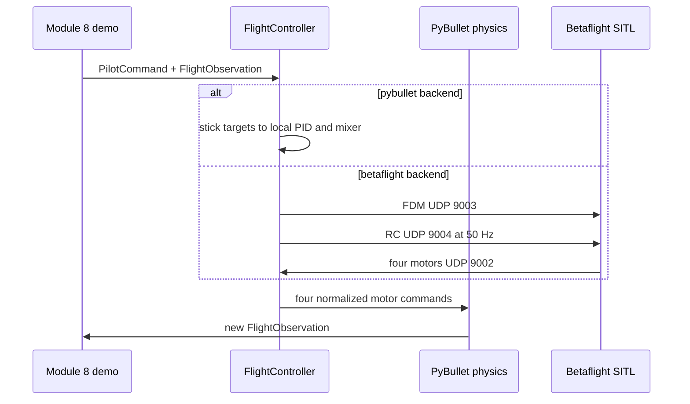

# Dual controller API: PyBullet or Betaflight

## Goal

Support two selectable low-level controller backends in one future Module 8
demo without changing existing Module 6 examples:

```bash
--flight-controller pybullet
--flight-controller betaflight
```

`pybullet` means the current in-process course controller. `betaflight` means
the pinned external Betaflight 2026.6.2 SITL controller. Backend selection is
made before the flight begins; mid-flight handover is not supported.

## Ownership boundary

```mermaid
flowchart LR
    app[PilotCommand] --> select{Controller backend}

    select --> local[PyBullet controller]
    local --> pid[Existing AttitudeController]
    pid --> mixer[Existing motor mixer]

    select --> bf[Betaflight controller]
    bf --> rc[Virtual RC UDP 9004]
    sensors[PyBullet sensor snapshot] --> fdm[FDM UDP 9003]
    fdm --> sitl[Betaflight SITL]
    rc --> sitl
    sitl --> motors[Motor UDP 9002]
    motors --> bf

    mixer --> command[Four normalized motor commands]
    bf --> command
    command --> engine[PhysicsEngine direct-motor step]
    engine --> physics[PyBullet forces and motion]
    physics --> sensors
```



The application never commands individual motors. Both controller backends
produce four normalized motor commands. PyBullet remains responsible for
motor lag, thrust, reaction torque, drag, and rigid-body motion.

## Future common API

Add `examples/common/flight_controllers.py` with these types:

| Type | Responsibility |
| --- | --- |
| `PilotCommand` | Normalized roll, pitch, yaw in `[-1, 1]`; throttle in `[0, 1]`; `armed` and `angle_mode` flags. |
| `FlightObservation` | Timestamp, state, IMU, body specific force, and pressure for either backend. |
| `MotorCommand` | Four normalized motor values plus health/reason information. |
| `FlightController` | Small protocol: `update(observation, command)`, `reset()`, and `close()`. |
| `PyBulletFlightController` | Reuses the current attitude PID and mixer, mapping pilot sticks to Angle-style targets. |
| `BetaflightFlightController` | Composes the Betaflight protocol API and exposes the same output contract. |

`PilotCommand` is shared by both backends. Roll and pitch map to bounded
Angle-style attitude targets. Yaw maps to an integrated yaw target. Throttle
maps to collective PWM in the PyBullet backend and to the throttle RC channel
in the Betaflight backend. An unarmed command always yields zero motors.

## Betaflight protocol API

Add `examples/common/betaflight_api.py` for the pinned 2026.6.2 wire protocol:

| Link | Behavior |
| --- | --- |
| UDP `9003` | Send FDM sensor data at the 240 Hz physics cadence. |
| UDP `9004` | Send AETR/AUX virtual RC data at 50 Hz. AUX1 arms; AUX2 selects Angle mode. |
| UDP `9002` | Receive four normalized motor commands. |
| TCP `5761` | MSP lifecycle, setup, status, and diagnostics only—not real-time flight commands. |

If no valid motor packet arrives for 100 ms, the Betaflight backend returns
four zero motors and an unhealthy reason. It must never reuse stale thrust.

## Physics-engine change

Extend `PhysicsEngine` with a direct-motor step that accepts four normalized
motor commands. It converts each command using the existing squared
PWM-to-thrust relationship, keeps the existing motor time constant and drag,
then applies the four forces in the fixed QUADX-to-URDF motor order.

Refactor the existing `step(collective_pwm_us, body_torque_nm)` only enough to
mix its current command into four motor values and call this shared direct-motor
path. Existing behavior and Module 6 examples must remain unchanged.

## Future execution sequence



## First adopter and tests

Create a new `examples/08-betaflight-sitl/controller_switch_demo.py`; do not
modify current Module 6 examples. It defaults to `--flight-controller pybullet`
and provides a deterministic pilot-command sequence.

Before any Betaflight flight, verify:

1. Existing collective-PWM `PhysicsEngine.step()` behavior is unchanged.
2. Unarmed, invalid, and timed-out commands produce zero motor output.
3. Packet sizes and 50 Hz RC timing match the pinned SITL protocol.
4. Frame checks pass for level rest, 90° yaw, and a known body rotation.
5. A four-motor calibration proves the fixed QUADX-to-URDF mapping.
6. MkDocs renders the future Module 8 controller-switch lesson and diagrams.

## Deferred work

Do not add runtime controller handover, GPS navigation, altitude targets,
automatic landing, manual GUI controls, configurable mixers, or runtime MSP
flight commands until the two backends and actuator mapping pass deterministic
checks.
