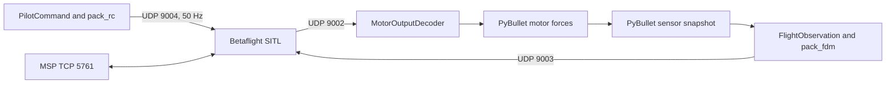

# Betaflight 2026.6.2 SITL bridge design

**Last updated:** 2026-10-09
**Status:** Partly implemented
**Description:** Verified standalone bridge, UDP protocol, configuration, and remaining shared-engine integration work.

## Goal

Connect the course PyBullet quadcopter to Betaflight SITL without duplicating
Betaflight’s low-level flight controller. PyBullet supplies vehicle motion and
sensors; Betaflight calculates motor commands; a Python application supplies
pilot-style virtual RC commands.

The [embedded PyBullet bridge design](../../docs/betaflight/index.md) explains
this ownership boundary and the complete control loop for course readers. This
note remains the protocol and implementation contract.

## Pinned compatibility contract

| Item | Decision |
| --- | --- |
| Firmware | Betaflight `2026.6.2` |
| Source commit | `e0b7bb01b17b21351057e9ead2d1ab39dd44fa16` |
| Build | native `make TARGET=SITL EXTRA_FLAGS="-DSITL_EXTERNAL_BAROMETER"` plus the checked-in course receiver patch |
| First mode | Angle on AUX1, tied to Arm in the tested config; bridge also transmits an AUX2 Angle flag |
| Arm control | AUX1 |
| RC loss | `DROP` / disarm |
| Active sensors | IMU and barometer |
| GPS/navigation | Six FDM velocity/position slots are reserved zeros; patched receiver skips virtual GPS and reads pressure directly |
| Inner yaw | `yaw_motors_reversed=ON`, P=10, I=0, feedforward=0 |
| Outer yaw | Python normalized RC gains `(0.15, 0, 0.02)`, no extra yaw sign inversion |

## Message boundary

### Protocol table

| Link | Layout | Meaning |
| --- | --- | --- |
| PyBullet → SITL UDP `9003` | `<18d`, 144 bytes | FDM: time, body rate, body specific force, WXYZ quaternion, velocity, position, pressure |
| SITL → PyBullet UDP `9002` | `<4f`, 16 bytes | four normalized motor commands `[0, 1]` |
| Application → SITL UDP `9004` | `<d16H`, 40 bytes | timestamp plus AETR and AUX channels |
| Bridge ↔ SITL TCP `5761` | MSP | setup, status, diagnostics only |

This contract is taken from the [official Betaflight SITL packet reference](https://betaflight.com/docs/development/autopilot/SITL_Autopilot_Testing_Gazebo) and must be re-audited if the release tag changes.

## Implemented standalone modules and future boundary

| Module | Responsibility |
| --- | --- |
| `bridge/types.py` | Immutable `PilotCommand`, home-relative `FlightObservation`, and validated `MotorCommand` data. |
| `bridge/protocol.py` | Encode FDM and virtual RC; validate normalized motor packets. |
| `bridge/sensors.py` | Compose home-relative odometry with independent IMU and barometer sensor models. |
| `bridge/control.py` | Module 04 outer position/velocity PID and heading correction to normalized RC. |
| `bridge/client.py` | Own UDP sockets and latest valid motor packet; return zero commands after 100 ms without fresh output. No runtime MSP implementation. |
| `bridge/simulation.py` | Map QUADX motors, apply motor lag and forces, step PyBullet, and send observations. |
| `PhysicsEngine.step_motor_commands` | Future shared-engine path that applies four independent motor commands without the course PID/mixer. |

The first standalone bridge implementation is now in
`examples/08-betaflight-sitl/bridge/` with
`position_bridge_demo.py` as its composition root. It reuses Module 04's outer
position/velocity PID cascade, converts its result to virtual RC, and lets
Betaflight replace only the attitude, rate, and mixer layers. The shared
`PhysicsEngine` integration remains future work.

`PilotCommand` is the application-facing inner-flight interface. The outer
controller receives home-relative XYZ/yaw targets. The application
must not set per-motor forces. MSP does not command the vehicle in real time.

## Frame and force rules

- Keep all PyBullet-to-Betaflight frame and quaternion conversion in `bridge/protocol.py`.
- Convert PyBullet quaternion order XYZW to FDM WXYZ and undo the pinned Gazebo quaternion convention; reordering alone is insufficient.
- Compute accelerometer **specific force**, not raw world acceleration: remove gravity before rotating into the sensor/body convention required by the pinned SITL source.
- Calculate barometric pressure from simulated altitude; preserve pressure in Pa. The course receiver reads this pressure rather than deriving it from FDM position.
- `ImuSensor` and `BarometerSensor` accept immutable bias/noise configs. Bias is additive and Gaussian sample noise is zero-mean; zero-valued defaults preserve the deterministic baseline.
- IMU bias/noise units are `rad/s` for gyro and `m/s²` for accelerometer. Barometer bias/noise units are `Pa`.
- Use a fixed, documented QUADX output-to-URDF motor permutation, then prove it with a four-motor calibration check.
- Convert normalized SITL motor commands to RPM then squared RPM/thrust; retain 50 ms motor lag and rotor reaction torque. The standalone Module 04 plant has no aerodynamic drag model.

## Configuration and lifecycle

`tools/setup_betaflight_sitl.sh` builds the pinned source tree under ignored
`.sitl/`. `tools/provision_betaflight_sitl.sh` removes only that run directory’s
`eeprom.bin` and invokes SITL’s `--config` option. The checked-in configuration
sets QUADX, AETR, AUX1 Arm and Angle together, reversed yaw motor mixing,
inner yaw P=10/I=0/feedforward=0, and `DROP` failsafe. `run_betaflight_sitl.sh`
provisions then starts normal SITL. Provisioning first verifies that UDP
`9003`/`9004` and TCP `5761` are free: config-only SITL must never share those
fixed ports with another simulator.

The setup script applies
`tools/patches/betaflight-sitl-external-barometer.patch` idempotently before
building with `SITL_EXTERNAL_BAROMETER`. This leaves one expected source
modification on top of the pinned revision. See
[FDM without velocity or position](sitl_sensor_only_fdm.md). An unpatched
Gazebo receiver would ignore pressure and see zero altitude with the new
reserved fields; rebuild and restart firmware when adopting this encoder.

The [machine setup instructions](../../docs/betaflight/setup-on-another-machine.md)
and [dated parameter backup](../../examples/08-betaflight-sitl/config/backups/2026-10-08/README.md)
record the exact replay contract. The backup uses pinned firmware defaults plus
explicit overrides; it does not claim to contain a full CLI dump or the test's
temporary binary EEPROM.

## Acceptance sequence

1. Packet self-check validates FDM, RC, and motor byte layouts.
2. Setup script verifies tag `2026.6.2`, commit `e0b7bb0`, and the SITL executable.
3. Provisioner creates a fresh EEPROM from the checked-in config.
4. Pure bridge checks validate the encoded level quaternion, IMU signs, and QUADX-to-URDF permutation. Exhaustive attitude-frame and individual motor calibration tests remain future work.
5. `hover_self_check.py` provisions its own temporary EEPROM and runs 30 s at `(0, 0, 3)`, injecting +0.5 rad/s yaw at 15 s and measuring hover from 12 s onward.
6. The last successful run reported maximum altitude error 0.016 m, XY error 0.026 m, tilt 0.002 rad, and final yaw 0.012 rad. All four acceptance bounds passed.

The scheduled demo takes off, holds the same X/Y origin, and disarms. It has no
lateral step and no controlled landing phase. The GUI uses the same bridge
with sliders. These are implemented standalone paths; selecting controller
backends through a common `PhysicsEngine` remains planned.

## Deferred work

Do not add GPS navigation, automated landing failsafe, runtime MSP flight
commands, wind/noise, or a configurable mixer until the sensor frames and
motor map pass their deterministic checks. The implemented PyBullet slider UI
only supplies bounded home-relative targets and an explicit arm switch; it does
not bypass the PID, RC, or Betaflight control boundaries.
