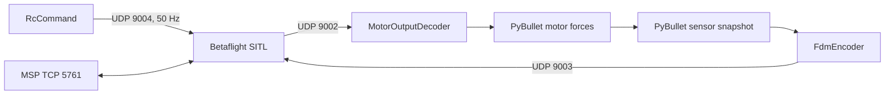

# Betaflight 2026.6.2 SITL bridge design

**Last updated:** 2026-09-27
**Status:** Planned
**Description:** UDP protocol and setup contract for Module 8.

## Goal

Connect the course PyBullet quadcopter to Betaflight SITL without duplicating
Betaflight’s low-level flight controller. PyBullet supplies vehicle motion and
sensors; Betaflight calculates motor commands; a Python application supplies
pilot-style virtual RC commands.

## Pinned compatibility contract

| Item | Decision |
| --- | --- |
| Firmware | Betaflight `2026.6.2` |
| Source commit | `e0b7bb0` |
| Build | native `make TARGET=SITL` |
| First mode | Angle mode on AUX2 |
| Arm control | AUX1 |
| RC loss | `DROP` / disarm |
| Active sensors | IMU and barometer |
| GPS/navigation | packet fields populated but modes disabled |

## Message boundary

### Protocol table

| Link | Layout | Meaning |
| --- | --- | --- |
| PyBullet → SITL UDP `9003` | `<18d`, 144 bytes | FDM: time, body rate, body specific force, WXYZ quaternion, velocity, position, pressure |
| SITL → PyBullet UDP `9002` | `<4f`, 16 bytes | four normalized motor commands `[0, 1]` |
| Application → SITL UDP `9004` | `<d16H`, 40 bytes | timestamp plus AETR and AUX channels |
| Bridge ↔ SITL TCP `5761` | MSP | setup, status, diagnostics only |

This contract is taken from the [official Betaflight SITL packet reference](https://betaflight.com/docs/development/autopilot/SITL_Autopilot_Testing_Gazebo) and must be re-audited if the release tag changes.

## Future implementation modules

| Module | Responsibility |
| --- | --- |
| `RcCommand` | Store roll, pitch, throttle, yaw, arm, and mode; encode exactly one 16-channel RC packet. |
| `FdmEncoder` | Convert PyBullet state/sensors to the pinned FDM fields and frame conventions. |
| `MotorOutputDecoder` | Validate four SITL outputs and map their fixed QUADX order to the course URDF rotor links. |
| `BetaflightBridge` | Own sockets, timing, latest commands, lifecycle, and MSP status; compose the three small adapters. |
| `PhysicsEngine.step_motor_commands` | Future shared-engine path that applies four independent motor commands without the course PID/mixer. |

`RcCommand` is the only application-facing flight interface. The application
must not set per-motor forces. MSP does not command the vehicle in real time.

## Frame and force rules

- Keep all PyBullet-to-Betaflight frame and quaternion conversion in `FdmEncoder`.
- Convert PyBullet quaternion order XYZW to FDM WXYZ.
- Compute accelerometer **specific force**, not raw world acceleration: remove gravity before rotating into the sensor/body convention required by the pinned SITL source.
- Calculate barometric pressure from simulated altitude; preserve pressure in Pa.
- Use a fixed, documented QUADX output-to-URDF motor permutation, then prove it with a four-motor calibration check.
- Convert normalized SITL motor commands through the existing squared PWM/thrust relationship; retain motor lag and drag in PyBullet.

## Configuration and lifecycle

`tools/setup_betaflight_sitl.sh` builds the pinned source tree under ignored
`.sitl/`. `tools/provision_betaflight_sitl.sh` removes only that run directory’s
`eeprom.bin` and invokes SITL’s `--config` option. The checked-in configuration
sets QUADX, AETR, AUX1 arm, AUX2 Angle, and `DROP` failsafe. `run_betaflight_sitl.sh`
provisions then starts normal SITL. Provisioning first verifies that UDP
`9003`/`9004` and TCP `5761` are free: config-only SITL must never share those
fixed ports with another simulator.

## Acceptance sequence

1. Packet self-check validates FDM, RC, and motor byte layouts.
2. Setup script verifies tag `2026.6.2`, commit `e0b7bb0`, and the SITL executable.
3. Provisioner creates a fresh EEPROM from the checked-in config.
4. Future frame tests validate level rest, 90° yaw, and known rotation signs.
5. Future motor calibration maps each SITL output to the intended URDF rotor.
6. Only then run a scripted RC arm, climb, yaw, throttle-down, and disarm scenario.

## Deferred work

Do not add GPS navigation, automated landing failsafe, manual GUI controls,
runtime MSP flight commands, wind/noise, or a configurable mixer until the
sensor frames and motor map pass their deterministic checks.
