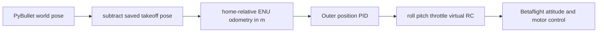

# SITL home-relative odometry design

**Created:** 2026-10-08  
**Status:** Implemented  
**Description:** Preserve a metre-based takeoff-relative odometry frame owned by the PyBullet outer controller.

## Decision

The application-facing pose is local ENU displacement from the PyBullet base
position captured before a run:

\[
p_{home} = p_{world} - p_{world,0} = (E, N, U)\ \mathrm{m}.
\]

`(0, 0, 0)` therefore always denotes the takeoff point. The outer PID uses
this pose and all position targets are specified in the same metre-based frame.

SITL does not own or consume this position feedback. The bridge converts the
outer PID's roll, pitch, and throttle commands to virtual RC; SITL stabilizes
attitude and produces motor outputs. The fixed-size FDM packet still requires
three position and three velocity fields, so the bridge sends six reserved
zeros. The course-patched SITL target reads the transmitted pressure directly
and skips the virtual GPS update; it receives no local position or velocity.
See [the sensor FDM decision](sitl_sensor_only_fdm.md) for the receiver patch.

## Consequences

- A request of `(0, 0, z)` holds the horizontal takeoff point.
- The default deterministic scenario takes off to `(0, 0, 3)` and continues
  holding that same target; it does not inject a lateral step command.
- SITL never receives the outer PID's X/Y odometry as a navigation input.
- The periodic SITL `pos=(...)` diagnostic is a packet-side implementation
  detail, not the home-relative odometry display.

## Related implementation

- [Observation adapter](../../examples/08-betaflight-sitl/bridge/sensors.py)
- [FDM encoder](../../examples/08-betaflight-sitl/bridge/protocol.py)
- [Simulation runner](../../examples/08-betaflight-sitl/bridge/simulation.py)
- [Position demo](../../examples/08-betaflight-sitl/position_bridge_demo.py)
- [Reproduction guide and backup](sitl_machine_reproduction.md)

## Verified baseline

The successful 30 s disturbed-hover check held `(0, 0, 3)` from the initial
PyBullet base pose. Its maximum altitude and XY errors were 0.016 m and
0.026 m respectively. This uses exact simulated base state; it is not a
validation of a noisy odometry estimator or of SITL GPS navigation.
