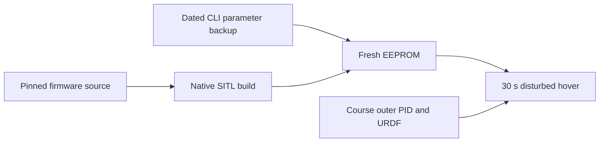

# Reproduce the verified SITL machine setup

**Created:** 2026-10-08  
**Status:** Documented against the successful live disturbed-hover run  
**Description:** Portable parameter backup and installation instructions for the tested Module 8 bridge.

## Key decisions

- Preserve the exact tested CLI configuration as a dated snapshot, including
  AUX1 selecting both Arm and Angle. Changing that wiring needs a new flight test.
- Back up explicit parameter overrides and the complete firmware revision;
  untouched firmware parameters come from that revision's defaults.
- Also record Python outer-loop gains and the physics model: copying only SITL
  settings does not reproduce the flight.
- Recreate EEPROM from the text configuration on another machine. Do not use
  an EEPROM from the earlier unstable run as the verified backup.
- The current FDM revision also requires the checked-in external-barometer
  receiver patch and build flag. The dated backup records the earlier clean
  firmware baseline; its parameter commands remain applicable. Follow
  [FDM without velocity or position](sitl_sensor_only_fdm.md) for this revision.
- Clearly distinguish the current standalone bridge from the planned shared
  `PhysicsEngine` dual-backend API.

## Instructions and backup

- [Betaflight installation and configuration restore](../../docs/betaflight/betaflight_install.md)
- [Setup on another machine](../../docs/betaflight/setup-on-another-machine.md)
- [Backup manifest](../../examples/08-betaflight-sitl/config/backups/2026-10-08/README.md)
- [Exact CLI snapshot](../../examples/08-betaflight-sitl/config/backups/2026-10-08/course_angle_mode.config)
- [Outer controller and plant snapshot](../../examples/08-betaflight-sitl/config/backups/2026-10-08/controller-and-plant.json)
- [Live verification](../../examples/08-betaflight-sitl/hover_self_check.py)

## Review scope

Reviewed every Markdown note in `design/integration/` against the bridge source,
the provision scripts, the pinned firmware source, and the last successful
flight output. Updated implemented responsibilities, packet placeholders, mode
wiring, yaw conventions, acceptance evidence, and future-work boundaries.
