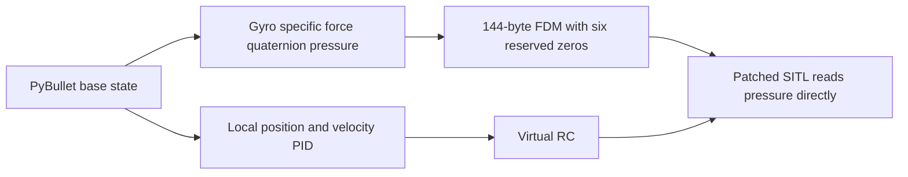

# FDM without velocity or position measurements

**Created:** 2026-10-08  
**Status:** Implemented and verified with live hover and receiver altitude
**Description:** Remove ground-truth velocity and position from the wire payload while retaining the pinned packet layout.

## Key decisions

- Preserve `<18d` / 144 bytes. The pinned receiver accepts only this exact
  length; the six velocity/position doubles become reserved zero placeholders.
- Continue using full PyBullet state locally in the outer position/velocity
  PID. Removing wire state does not remove local odometry.
- Add a checked-in firmware patch, applied idempotently by the setup script,
  with `SITL_EXTERNAL_BAROMETER` selecting the transmitted pressure and
  suppressing the virtual GPS update from reserved fields. Preserve Gazebo
  gyro and quaternion conversions.
- Keep gyro, specific force, quaternion, and pressure in FDM. Quaternion and
  its virtual magnetometer use remain; this request removes velocity/position,
  not the quaternion or magnetometer.
- Preserve the earlier dated parameter backup as historical evidence. Document
  the patched build separately and run the same 30 s disturbed-hover check.

## Verification plan

The protocol check must assert six reserved zeros even for nonzero local
position and velocity, and prove the pressure survives encoding. Build the
pinned source with the course patch and run `hover_self_check.py`, checking
altitude/XY/tilt/yaw against the existing acceptance limits.

## Verification results

The patched native build and both protocol checks passed. The final 30 s live
disturbed-hover check measured maximum altitude error 0.016 m, XY error 0.017 m,
tilt 0.002 rad, and final yaw 0.011 rad. MSP altitude at 14 s was 3.080 m with
all six FDM position/velocity slots zero, confirming receiver altitude response
from the transmitted sensor pressure. The test retains a separate 1–5 m bound
for that estimator response at the 3 m target.

## Related files

- [Encoder](../../examples/08-betaflight-sitl/bridge/protocol.py)
- [Build script](../../tools/setup_betaflight_sitl.sh)
- [Hover regression](../../examples/08-betaflight-sitl/hover_self_check.py)
- [Previous backup](../../examples/08-betaflight-sitl/config/backups/2026-10-08/README.md)
- [Machine setup](../../docs/betaflight/setup-on-another-machine.md)
