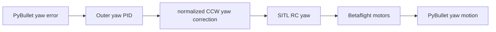

# SITL yaw RC-sign convention

**Created:** 2026-10-08  
**Status:** Implemented and verified against live SITL
**Description:** Match outer RC yaw, inner mixer direction, and inner gains to the course plant; validated by disturbed hover.

## Decision

Revision 2026-10-08: a read-only MSP_MIXER_CONFIG query of the running
firmware returned QUADX with `yaw_motors_reversed=OFF`. The bare TARGET=SITL
build defaults this setting to OFF, unlike the named Gazebo configuration.
The course must explicitly provision `yaw_motors_reversed=ON` to match the
URDF reaction-torque signs `(+, -, -, +)` in front-left, front-right,
rear-left, rear-right order. For a positive PyBullet yaw rate, the SITL gyro
reports a negative yaw rate; its restoring positive PID output must therefore
produce negative PyBullet torque. With ON, QUADX does so. With OFF the torque
reinforces the disturbance. Test a 30-second origin hover with an injected
positive yaw-rate disturbance and check position, attitude, and recovery.

The outer yaw PID's output is a normalized RC stick, not a rate in rad/s.
Use normalized-stick gains `(0.15, 0, 0.02)` with inner `p_yaw=10`, `i_yaw=0`,
and `f_yaw=0`. Disable inner yaw feedforward when the transmitter input is
itself a continuously changing outer feedback-controller output. The default
firmware settings produced sustained yaw oscillations after a disturbance;
the mixer increased collective to maintain yaw authority, causing an altitude
offset even though the outer altitude controller reduced throttle. The isolated
comparison with inner P=10 and I=20 sustained approximately +/-4 rad/s yaw
oscillations; reducing I to zero recovered smoothly. This teaching baseline
does not model a steady external yaw torque; integral compensation for such a
torque requires retuning and another disturbance test.

The outer PID measures yaw in the PyBullet FLU frame, where positive Z yaw is
counter-clockwise when viewed from above. The pinned Betaflight SITL target
uses its FRD gyro/motor convention. Betaflight negates RC yaw in
`updateRcCommands()`. With the corrected mixer setting a positive virtual-RC
yaw stick produces counter-clockwise acceleration in the course URDF.

The bridge computes normalized RC yaw directly from heading error and rate:

\[
u_{yaw,RC} = \operatorname{clip}(0.15\,e_\psi - 0.02\,\dot\psi, -1, 1).
\]

Here \(e_\psi\) is the shortest signed heading error in rad, \(\dot\psi\)
is PyBullet body-Z angular velocity in rad/s, and \(u_{yaw,RC}\) is a
dimensionless stick fraction. For a heading error of `0.1 rad` at rest, the
output is `+0.015`, requesting positive PyBullet yaw to reduce the error.



## Evidence and consequence

Before this conversion, the vehicle could hold altitude near 3 m initially,
then amplify a small yaw disturbance into a spin, flip, and subsequent climb.
The explicit mixer setting, matching RC sign, and tuned inner yaw gains make
both yaw loops restoring. Position and vertical control remain owned by the
separate home-relative outer PID.

Validation command:

```bash
uv run python examples/08-betaflight-sitl/hover_self_check.py
```

The 30-second live test provisions a fresh course EEPROM, holds `(0, 0, 3)`,
and injects +0.5 rad/s world-Z angular velocity at 15 seconds. It checks maximum
altitude error below 0.3 m, horizontal displacement below 0.3 m, tilt below
0.2 rad, and final heading error below 0.1 rad. The world spawn height is
0.05 m, so the expected world altitude is 3.05 m.

The last successful run reported maximum altitude error 0.016 m, maximum XY
error 0.026 m, tilt 0.002 rad, and final yaw 0.012 rad. See the
[reproduction guide and dated backup](sitl_machine_reproduction.md) for the
exact settings and the test's measured baseline.

## Related implementation

- [Outer PID and yaw mapping](../../examples/08-betaflight-sitl/bridge/control.py)
- [Controller gains](../../examples/08-betaflight-sitl/position_bridge_demo.py)
- [SITL configuration](../../examples/08-betaflight-sitl/config/course_angle_mode.config)
- [Live hover check](../../examples/08-betaflight-sitl/hover_self_check.py)
