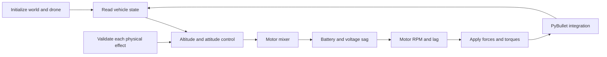
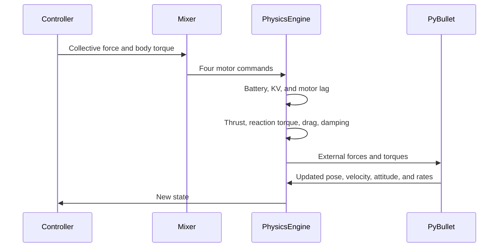

# Module 6: Autonomous takeoff and precision hover

**Last updated:** 2026-10-07
**Status:** Partly implemented (Topics 0–4 and 11)
**Description:** Capstone module that assembles the course drone model into a
validated autonomous flight. Each topic owns a cumulative simulation loop and
adds one force, behavior, or control method while common utilities keep the
vehicle data, sensing, integration, and output consistent.

## Goal

Build one complete flight path from a high-level command to a new PyBullet
state. Learners first isolate each physical effect, then combine the validated
effects in an autonomous takeoff, hover, yaw turn, and landing.



## Module structure and planned files

The module will use one lesson folder per learning topic. Topic 0 defines the
real vehicle first; the remaining topics add one physical effect at a time and
end with the integrated capstone.

```text
docs/modules/06-autonomous-hover/
├── index.md
├── 00-real-drone-specification/index.md
├── 01-initialize-environment/index.md
├── 02-gravity-and-contact/index.md
├── 03-rotor-thrust/index.md
├── 03-rotor-thrust/motor-lag/index.md
├── 04-roll-pitch-torque/index.md
├── 05-reaction-yaw-torque/index.md
├── 06-body-drag/index.md
├── 07-rotor-drag/index.md
├── 08-wind/index.md
├── 09-angular-damping/index.md
├── 10-battery-and-motor-dynamics/index.md
├── 11-control-and-mixing/index.md
├── 12-advanced-forces/index.md
├── 13-physics-engine-validation/index.md
├── 14-autonomous-flight/index.md
└── images/
    ├── reference-drone.jpg
    └── reference-drone-dimensions.svg

examples/06-autonomous-hover/
├── 00-real-drone-specification/
│   ├── inspect_real_drone.py
│   └── measure_vehicle.py
├── 01-initialize-environment/
│   └── initialize_environment.py
├── 02-gravity-and-contact/
│   └── gravity_contact.py
├── 03-rotor-thrust/
│   ├── rotor_thrust.py
│   ├── reduced_order_simulation.py
│   └── motor_lag.py
├── 04-roll-pitch-torque/
│   └── roll_pitch_torque.py
├── 05-reaction-yaw-torque/
│   └── reaction_yaw_torque.py
├── 06-body-drag/
│   └── body_drag.py
├── 07-rotor-drag/
│   └── rotor_drag.py
├── 08-wind/
│   └── wind.py
├── 09-angular-damping/
│   └── angular_damping.py
├── 10-battery-and-motor-dynamics/
│   └── battery_motor_dynamics.py
├── 11-control-and-mixing/
│   └── control_and_mixing.py
├── 12-advanced-forces/
│   └── advanced_forces.py
├── 13-physics-engine-validation/
│   └── physics_engine_validation.py
└── 14-autonomous-flight/
    ├── auto_takeoff_and_hover.py
    └── pid_tuning_hover.py

examples/common/
├── assets/full_drone.urdf
├── assets/real_reference_drone.urdf
├── drone_profiles/default.yaml
├── drone_profiles/real_reference.yaml
├── cli.py
├── pybullet_recording.py
├── runner.py
├── simulation_utils.py
└── telemetry.py
```

Each topic owns a runnable example folder. The example in Topic N starts from
the working simulation produced by Topic N-1 and adds exactly one new force,
behavior, or control method to the shared simulation loop. A learner can run
every topic example independently and observe the cumulative vehicle model at
that point in the course.

The topic folders contain entry points and lesson-specific experiments. Shared
vehicle data, backend utilities, sensing, integration, and output helpers remain
in `examples/common/`; the cumulative force sequence is intentionally visible
and copied into each topic loop for learning readability. Each topic owns the
command, scenario, graph, force-method comments, Markdown explanation, and
integration check that demonstrates its new behavior.

### Learning-topic to lesson mapping

| Topic | Learning topic | Lesson folder |
| ---: | --- | --- |
| 0 | Real drone specification | `00-real-drone-specification` |
| 1 | Simulation initialization | `01-initialize-environment` |
| 2 | Gravity and contact | `02-gravity-and-contact` |
| 3 | Rotor thrust | `03-rotor-thrust` |
| 4 | Roll and pitch torque | `04-roll-pitch-torque` |
| 5 | Rotor reaction yaw torque | `05-reaction-yaw-torque` |
| 6 | Body drag | `06-body-drag` |
| 7 | Rotor-dependent linear drag | `07-rotor-drag` |
| 8 | Wind and air-relative velocity | `08-wind` |
| 9 | Angular damping | `09-angular-damping` |
| 10 | Battery limits and motor dynamics | `10-battery-and-motor-dynamics` |
| 11 | Control loop and motor mixing, including PID | `11-control-and-mixing` |
| 12 | Optional advanced forces | `12-advanced-forces` |
| 13 | Physics-engine validation | `13-physics-engine-validation` |
| 14 | Integrated autonomous flight | `14-autonomous-flight` |

### `index.md` design and requirements

`docs/modules/06-autonomous-hover/index.md` is the module map, not another
detailed lesson. Its job is to explain the capstone as one system and route the
learner to the numbered lessons.

#### Required content order

1. the capstone title and a short intuition-first introduction;
2. a “By the end, you will be able to” list;
3. prerequisite and next-module links;
4. a Mermaid diagram of the complete command-to-physics execution path;
5. the Topic 0 real-drone summary and links to the full specification lesson;
6. a force inventory showing each force, equation, status, and lesson link;
7. a compact topic map linking Topics 0–14 in learning order;
8. the final autonomous-flight scenario and success criteria;
9. the shared code ownership table for URDF, profile, physics, battery, and
   controller responsibilities;
10. commands for the full headless validation and autonomous-flight checks.

#### Content requirements

- Use the title **Module 6: Autonomous takeoff and precision hover**.
- Put the Mermaid execution diagram near the module header, before the force
  inventory and detailed topic map.
- Link every Topic 0–14 entry to its child `index.md`; do not leave planned
  topics as plain text.
- Summarize the real drone specification without duplicating the complete BOM;
  link Topic 0 for mass, inertia, motors, battery, propellers, and image
  attribution.
- Show the force inventory with physical source, equation or model, status, and
  lesson link.
- Every physics lesson must introduce its formula before the code, define every
  symbol in a table, show SI units, and include one small numerical example.
- Distinguish forces and torques from model inputs such as mass, inertia, motor
  KV, battery voltage, timestep, and collision geometry.
- State that the final capstone is a 3 m takeoff, altitude hold, 180-degree yaw
  turn, and landing.
- Keep code blocks copyable under MkDocs Material.
- End with prerequisite and next-topic navigation links.

#### Scope boundary

The overview will avoid duplicating the full mathematics, runnable code,
exercises, and review questions from child lessons. Each child `index.md` owns
its intuition, equations, Mermaid diagram, runnable example, hands-on exercise,
review questions, and previous/next navigation.

#### `index.md` acceptance checks

- A learner can identify the complete flight path from the overview diagram.
- Every planned lesson has one visible link from the topic map.
- Every force in the inventory is classified as core, recommended, optional, or
  deferred.
- The overview links to the real-drone specification and the final validation
  command.
- The page passes `uv run mkdocs build --strict`.

## Topic 0 — Specify the real reference drone

Before adding another force, freeze a physical reference vehicle. The first
simulation target is a conventional 5-inch X-frame quadcopter using a 6S
battery and a measured all-up mass near 600–650 g. The simulation mass remains
an explicit measured/calibrated value, not an assumed sum of catalog weights.

### Reference specification

| Subsystem | Reference choice | Values used by the model |
| --- | --- | --- |
| Frame | TBS Source One V6 5-inch | 240 mm wheelbase; 136.5 g frame weight; 30.5×30.5 and 20×20 mm stack patterns |
| Motors | 4× T-Motor Velox V2208 V2, 1750 KV | 6S; 36.9 g each including cable; 4 mm shaft; manufacturer test data with T5143S propellers |
| ESC | Holybro Tekko32 F4 4-in-1 50A | 4–6S; 50 A continuous ×4; 60 A burst ×4; 45×37×6 mm; 13.8 g |
| Flight controller | Holybro Kakute H7 v1.5 | 3–8S input; 30.5×30.5 mm; 8 g; barometer and microSD blackbox |
| Propellers | T-Motor T5143S tri-blade | 5.1×4.3-inch; two CW and two CCW; use the motor manufacturer's matched test data |
| Battery | CNHL MiniStar 1300 mAh 6S 120C XT60 | 22.2 V nominal; approximately 214 g; 39×36×81 mm |
| Target all-up mass | Frame, electronics, motors, props, battery, wiring, and payload | Working model value: 0.62 kg; replace with a scale measurement after assembly |

The listed frame, motors, ESC, flight controller, and battery account for
approximately `519.9 g` before propellers, wiring, fasteners, straps, and
payload. A `0.62 kg` working value leaves roughly `100 g` for those remaining
items while staying inside the expected 600–650 g all-up range. This is a
budgeted estimate, not a substitute for weighing the completed vehicle.

The selected motor test data reports 536.79 g thrust at 50% throttle and
1,460.13 g at 100% for one V2208 V2 1750 KV / T5143S / 6S configuration. These
are manufacturer bench values used as calibration references, not guarantees
for a different build or battery.

### Minimum buy list

| Qty. | Item | Purpose |
| ---: | --- | --- |
| 1 | TBS Source One V6 5-inch frame kit | Real geometry, arm length, mounting, and frame mass |
| 4 | T-Motor Velox V2208 V2 1750 KV motors | Four identical propulsion actuators |
| 1 | Holybro Tekko32 F4 4-in-1 50A ESC | Four motor power stages and current measurement |
| 1 | Holybro Kakute H7 v1.5 flight controller | IMU, barometer, logging, and future real-flight controller |
| 2 packs | T-Motor T5143S propellers, CW/CCW sets | One installed set plus crash/spin-direction spares |
| 2 | CNHL MiniStar 1300 mAh 6S 120C XT60 LiPo batteries | Flight packs for repeatable experiments |
| 1 | 6S balance LiPo charger with XT60-compatible charge lead | Safe charging and storage preparation |
| 1 | LiPo-safe charging/storage bag | Battery handling and storage |
| 1 | XT60-compatible smoke stopper/current limiter | First-power-up protection |
| 1 | 4S–6S-compatible radio receiver and transmitter | Optional physical-flight control link; not needed for simulation |
| 1 | Soldering, wiring, heat-shrink, battery straps, and spare hardware kit | Assembly and repair consumables |

The camera, video transmitter, GPS, and receiver are not required for this
module's simulation capstone. Buy them only when the physical vehicle or
Module 7 navigation work begins.

### Model ownership

Store rigid-body mass, center of mass, inertia, collision, and rotor attachment
locations in the URDF. Store motor KV, thrust/torque calibration, time
constant, yaw signs, battery parameters, propeller dimensions, and aerodynamic
coefficients in the vehicle profile YAML. The profile must record the source or
measurement method for every non-derived value.

The URDF visual geometry is deliberately allowed to remain a simple box, arm,
and motor-marker representation. Visual similarity is not the physics target.
The physics target is the assembled vehicle's measured mass properties and
force locations:

- total mass is measured on a scale with the selected battery and payload state;
- center of mass is measured or calculated from component positions;
- inertia is calculated from component masses and verified where practical;
- rotor coordinates come from the measured motor-center locations;
- the 240 mm frame wheelbase is a reference constraint, not a substitute for
  measuring the actual assembled motor pattern;
- collision geometry is kept simple but must cover the real frame envelope.

For an X frame whose wheelbase is the diagonal motor-to-motor distance, the
initial symmetric rotor coordinate is:

\[
a=\frac{d_{diagonal}}{2\sqrt{2}},\qquad
\mathbf r_i\in\{(+a,+a),(+a,-a),(-a,+a),(-a,-a)\}.
\]

`measure_vehicle.py` will print the measured geometry and the provisional
inertia values used to update `full_drone.urdf`. It will not silently replace
measured values with catalog dimensions.

### Reference image and diagram

Add a reference image showing the assembled drone's physical layout, with an
attribution link to the source. Prefer a user-owned photograph of the actual
build. If a manufacturer image is used temporarily, keep it as a linked
reference or use it only where the license permits redistribution; do not copy
product photography into the repository without permission.

The module will also include an original SVG dimension diagram showing:

- body-frame `+X`, `+Y`, and `+Z`;
- front, rear, left, and right motor labels;
- rotor coordinates and diagonal wheelbase;
- battery and center-of-mass location;
- CW/CCW rotation directions;
- the force and torque sign convention.

The image explains what the real drone looks like. The SVG explains what the
URDF and force model mean. Neither image is used to infer mass or inertia.

### Topic 0 acceptance checks

- weigh the assembled vehicle without and with the selected battery;
- measure the motor-to-motor wheelbase and rotor coordinates;
- add the reference photograph and dimension diagram with attribution;
- verify the four motor mounting and spin directions;
- record battery nominal/full/empty voltage and connector type;
- inspect the generated URDF/profile summary with
  `00-real-drone-specification/inspect_real_drone.py` and
  `00-real-drone-specification/measure_vehicle.py`;
- update the model mass and inertia from measured hardware before flight tests.

### Topic 0 sources

- [TBS Source One V6 5-inch specifications](https://www.team-blacksheep.com/products/product%3A8547)
- [T-Motor Velox V2208 V2 1750 KV specifications and bench data](https://store.tmotor.com/product/v2208-v2-fpv-motor.html)
- [Holybro Tekko32 F4 4-in-1 50A specifications](https://holybro.com/products/kakute-h7-v2-stacks)
- [Holybro Kakute H7 v1.5 specifications](https://holybro.com/collections/fpv-electronics/products/kakute-h7)
- [CNHL MiniStar 1300 mAh 6S 120C specifications](https://chinahobbyline.com/collections/6s-1300mah-lipo-battery)

## Learning outcomes

By the end of the module, learners can:

- identify every force, torque, and model input in the course drone;
- predict the direction and approximate size of each physical effect;
- connect motor commands to RPM, thrust, torque, and vehicle motion;
- validate the physics engine before tuning a controller;
- run an autonomous 3 m takeoff, precision hover, yaw turn, and landing.

## Visualization and reduced-order simulation

Every topic must include one visual that shows the behavior changing over time
or as a physical input changes. The graphs are part of the explanation, not
just output decoration.

| Topic | Required visual |
| ---: | --- |
| 0 | Mass budget and rotor-geometry diagram for the real vehicle |
| 1 | Initial position, velocity, attitude, and coordinate-frame diagram |
| 2 | Altitude, vertical velocity, acceleration, and contact-force timeline |
| 3 | PWM/throttle → RPM → thrust curve with the hover-weight line |
| 4 | Applied roll/pitch torque, angular rate, and attitude versus time |
| 5 | CW/CCW thrust difference, reaction yaw torque, and yaw rate versus time |
| 6 | Body velocity and quadratic drag force with drag enabled/disabled |
| 7 | Total rotor speed, rotor drag, and terminal-velocity comparison |
| 8 | Wind velocity, air-relative velocity, and lateral displacement |
| 9 | Angular-rate decay and damping torque versus time |
| 10 | Battery voltage, current, state of charge, RPM, and available thrust |
| 11 | Target altitude, measured altitude, PID P/I/D terms, thrust, and PWM |
| 12 | Before/after comparison for each optional aerodynamic effect |
| 13 | Expected versus measured values and validation residuals |
| 14 | Flight-phase timeline with altitude, velocity, attitude, yaw, and battery |

Use clear units, labels, legends, and shared time axes. Do not compare values
with different units on one unlabeled scale. Each graph should answer one
question, such as “does drag oppose motion?” or “does voltage sag reduce
available thrust?”

### PyBullet-independent simulation

Add a small reduced-order simulator that uses the Topic 0 vehicle profile but
does not import or require PyBullet. It will use NumPy for vector math and
Matplotlib for saved graphs, both already project dependencies.

Planned file:

```text
examples/06-autonomous-hover/03-rotor-thrust/reduced_order_simulation.py
```

The simulator will support named scenarios for gravity, thrust, torque, drag,
wind, battery sag, motor lag, and altitude PID. It will use the same measured
mass, inertia, rotor coordinates, motor KV, thrust/torque calibration, battery
parameters, and timestep as the PyBullet profile.

The reduced model will:

- integrate translational and rotational state with semi-implicit Euler;
- apply one selected force or torque at a time before combining effects;
- record state, force, torque, voltage, RPM, and controller terms to CSV;
- save one focused PNG per scenario;
- provide `--self-check` assertions for the simplest predictions.

### Incremental simulation integration

The reduced-order experiment is not the end of a topic. Each force or behavior
lesson must finish by adding its corresponding implementation method to the
topic-owned cumulative simulation loop. The PyBullet and reduced-order loops
use the same topic force equation; their backend adapters may differ where the
physics engine supplies a native solver, such as ground contact.

The topic workflow is:

```mermaid
flowchart LR
    intuition[Intuition and equation] --> reduced[Reduced-order experiment]
    reduced --> graph[Graph and prediction check]
    graph --> method[Topic-owned force method]
    method --> loops[PyBullet and reduced-order loops]
    loops --> validation[Cross-backend validation]
```

For each relevant topic and its folder-owned working example:

1. explain the physical effect and governing equation;
2. implement one topic-owned force or behavior method;
3. document that method with a docstring, equation comments, frame/sign
   comments, and a Markdown implementation link;
4. call the method at the correct point in both topic simulation loops;
5. expose its measured force, torque, or state when the lesson needs to graph it;
6. add one focused integration check that can enable or isolate the behavior;
7. compare the PyBullet result with the reduced-order prediction and explain the
   backend difference.

The cumulative sequence is:

| Topic | Working example adds to the previous loop |
| ---: | --- |
| 0 | Load and inspect the real vehicle mass properties and geometry |
| 1 | Create the PyBullet world and step the rigid body |
| 2 | Add gravity and contact observation |
| 3 | Add rotor thrust and motor lag |
| 4 | Add roll and pitch torque from unequal rotor thrust |
| 5 | Add CW/CCW reaction yaw torque |
| 6 | Add quadratic body drag |
| 7 | Add rotor-dependent drag |
| 8 | Add wind through air-relative velocity |
| 9 | Add angular damping |
| 10 | Add battery voltage, current, and motor dynamics |
| 11 | Add motor mixing and PID control |
| 12 | Add optional advanced forces |
| 13 | Validate the cumulative engine against predictions |
| 14 | Run autonomous takeoff, hover, yaw, and landing |

No topic example may silently start from a fresh simplified drone that omits
previously taught effects. A reduced-order-only example is allowed for a
specific prediction, but each topic must also identify and run its cumulative
PyBullet example.

Motor lag is the first control-relevant example: the lesson models
\(\dot{\omega}=(\omega_{cmd}-\omega)/\tau_m\), each cumulative topic loop
advances actual RPM, and thrust and torque are calculated from actual RPM rather
than the command. Later force lessons follow the same pattern. The intentional
topic-local copies make the cumulative force sequence visible; cross-backend
self-checks protect the copied equations from drifting.

### Interactive physical-property playground

Add an optional GUI mode to the reduced-order simulator so learners can change
one physical property and immediately see its effect on the graphs. The GUI
will use Matplotlib sliders and existing controls rather than adding a new UI
dependency.

The first playground should expose:

| Control | Graph behavior to observe |
| --- | --- |
| Mass | Hover thrust, vertical acceleration, climb rate, and altitude response |
| Inertia `Ixx`, `Iyy`, `Izz` | Roll, pitch, and yaw angular acceleration and settling |
| Motor KV | Available RPM, thrust, current, and voltage sensitivity |
| Thrust coefficient `kT` | Total thrust and hover PWM |
| Reaction-torque coefficient `kQ` | Yaw torque and yaw-rate response |
| Motor time constant | Spin-up delay and altitude overshoot |
| Battery capacity and resistance | State of charge, voltage sag, RPM, and thrust |
| Body drag coefficient/area | Horizontal velocity, drag force, and terminal behavior |
| Wind velocity | Air-relative velocity and lateral displacement |
| PID gains | Rise time, overshoot, settling time, and control effort |

The GUI must show the baseline parameter values and the active values, so the
learner can compare “before” and “after” runs. A reset button returns to the
reference drone specification. The interactive mode is exploratory only; the
same scenario must also run from the command line with explicit parameters and
produce deterministic CSV/PNG results.

Planned interface:

```bash
uv run python examples/06-autonomous-hover/03-rotor-thrust/reduced_order_simulation.py \
  --scenario altitude-pid --interactive
```

The GUI will not replace the lesson examples or PyBullet validation. It is a
thin view over the same reduced-order calculation used by the headless mode.

### Learning-experience requirements

Each experiment should follow the same small loop:

```text
predict → run → compare → explain
```

Before running, the learner records the expected direction, shape, or
equilibrium value. The example then overlays the prediction and measurement,
reports the difference, and asks the learner to explain the result.

The interactive and graph-based examples should also provide:

- a reference-drone curve alongside the changed-parameter curve;
- a visible panel with the active parameter values, units, and governing
  equation;
- simple arrows for gravity, thrust, drag, wind, and applied torque where a
  force diagram clarifies the graph;
- one intentional failure mode, such as doubled mass, reversed wind, disabled
  damping, low battery voltage, or excessive `Kp`;
- a reset action that returns to the reference vehicle values.

Each lesson ends with a compact experiment report containing:

1. prediction;
2. parameter values;
3. generated graph or force diagram;
4. measured result and error;
5. physical explanation;
6. one-sentence conclusion.

Do not build a separate report application. Markdown, CSV, and PNG outputs are
enough for the learner to record the result.

This model is a teaching and prediction tool, not a second flight engine. The
PyBullet engine remains the final rigid-body implementation. Each relevant
lesson will compare the reduced-order prediction with the corresponding
PyBullet result and explain differences caused by contact solving, attitude
integration, collision geometry, or engine details.

### Visualization acceptance checks

- Every Topic 0–14 lesson includes at least one focused graph or diagram.
- Every time-series graph labels time and every measured quantity has units.
- The same vehicle profile drives the reduced-order and PyBullet examples.
- Reduced-order examples run with `--self-check` without opening a GUI.
- Interactive mode changes physical properties and updates the displayed
  behavior without changing source code.
- Reset restores the reference vehicle values and command-line mode remains
  deterministic.
- Each experiment supports prediction, reference-versus-change comparison,
  measured error, and a physical explanation.
- At least one intentional failure mode is demonstrated before the final
  autonomous-flight lesson.
- Graphs are saved under `outputs/06-autonomous-hover/`; stable teaching
  figures are stored under `docs/modules/06-autonomous-hover/images/`.
- `uv run mkdocs build --strict` passes after figures and links are added.

## Topics and experiments

### 1. Simulation initialization

Set up the PyBullet connection, fixed 240 Hz timestep, gravity, ground plane,
drone URDF, initial pose, velocity, attitude, and body rates. Provide GUI and
headless runs so the learner can inspect the initial state and automate checks.

### 2. Gravity and contact

Teach gravity with \(F_g=mg\). Measure motor-off free fall, compare measured
acceleration with \(-9.81\ \mathrm{m/s^2}\), then explain contact normal force and
friction when the drone reaches the ground.

### 3. Rotor thrust

Teach the quadratic rotor model:

\[
T_i=k_T\omega_i^2
\]

The lesson will introduce the equation before the simulation and define its
symbols explicitly:

| Symbol | Meaning | SI unit |
| --- | --- | --- |
| $T_i$ | Thrust produced by rotor $i$ | N |
| $k_T$ | Propeller/motor thrust coefficient | N·s²/rad², or calibrated N/RPM² in the simplified model |
| $\omega_i$ | Rotor angular speed | rad/s, or RPM in the simplified model |
| $i$ | Rotor index from 0 to 3 | dimensionless |

The worked example will calculate the thrust of one rotor from a measured RPM
and then multiply by four for equal collective thrust. It will compare the
result with drone weight:

\[
W=mg,\qquad T_{hover,total}\approx W
\]

Implement PWM-to-command conversion, motor KV, battery-voltage influence on
RPM, motor lag, four individual thrust forces, total thrust, and hover balance:

\[
\sum_i T_i=mg
\]

Experiment with thrust below, near, and above hover equilibrium.

The motor-lag subtopic will model
\(\dot{\omega}=(\omega_{cmd}-\omega)/\tau_m\), show commanded versus actual
RPM and thrust, and explain how actuator delay changes altitude, attitude, and
PID tuning.

### 4. Roll and pitch torque

Teach the lever-arm relationship:

\[
\boldsymbol{\tau}_i=\mathbf r_i\times\mathbf F_i
\]

Use rotor positions and unequal thrust to create and validate roll and pitch
torque. Compare measured body rates with the URDF inertia response.

### 5. Rotor reaction yaw torque

Teach propeller reaction torque:

\[
\tau_i=k_Q\omega_i^2
\]

Model CW and CCW rotor directions, show cancellation during equal hover, and
validate yaw rotation from unequal CW/CCW commands while collective thrust stays
approximately constant.

### 6. Body drag

Teach quadratic air resistance:

\[
\mathbf F_D=-\frac{1}{2}\rho C_D A
\lvert\mathbf v_{air}\rvert\mathbf v_{air}
\]

Implement body-frame projected area, drag coefficient, air density, and
per-axis drag. Compare motion with drag disabled and enabled.

### 7. Rotor-dependent linear drag

Retain the course's simplified rotor-air model:

\[
\mathbf F_R=-k_r\left(\sum_i\omega_i\right)\mathbf v_{air}
\]

Show that rotor speed changes the translational resistance and that available
resistance changes with battery voltage and RPM.

### 8. Wind and air-relative velocity

Use:

\[
\mathbf v_{air}=\mathbf v_{drone}-\mathbf v_{wind}
\]

Configure world-frame wind, run a crosswind experiment, reverse the wind, and
measure the corresponding change in lateral drift. Wind is an input to
air-relative velocity, not an extra force added independently.

### 9. Angular damping

Implement rotational drag:

\[
\boldsymbol{\tau}_D=-k_\omega\boldsymbol{\omega}
\]

Validate that damping opposes roll, pitch, and yaw rates and reduces rotational
overshoot without generating lift or translation.

### 10. Battery limits and motor dynamics

Reuse the Module 5 battery model for current draw, state of charge, open-circuit
voltage, internal-resistance sag, and reduced available RPM and thrust. Show how
low voltage reduces attitude and yaw authority. Keep motor lag in the physics
engine so thrust changes are delayed after command changes.

### 11. Control loop and motor mixing

Integrate altitude PID, roll/pitch/yaw PID, X-frame mixing, PWM limits, and the
120 Hz controller running against the 240 Hz physics loop.



The controller calculates commands; the shared physics engine owns force
calculation and application. Rendering and telemetry remain separate from both.

### 12. Optional advanced forces

Plan these as independently configurable extensions, disabled by default:

- rotor inflow;
- blade flapping;
- ground effect;
- propeller gyroscopic torque;
- induced airflow or prop wash as future work.

Enable one effect at a time and validate it with a focused experiment before
using it in the integrated hover scenario.

### 13. Physics-engine validation

Create deterministic headless checks for gravity, hover balance, vertical
thrust, roll, pitch, yaw, body drag, wind, angular damping, mixer geometry,
battery response, and optional-force behavior.

Every check records its setup, measurement, unit, expected result, and assertion
threshold. Motor RPM is primed for the hover-balance check so it measures force
balance rather than motor spin-up.

### 14. Integrated autonomous flight

The final scenario will:

1. initialize above the ground;
2. arm at a safe minimum command;
3. take off under altitude control;
4. climb to approximately 3 m;
5. hold altitude for a fixed interval;
6. rotate 180 degrees in yaw while maintaining altitude;
7. continue hovering;
8. descend and land;
9. report peak altitude, settling behavior, final attitude, landing state, and
   battery state.

#### Wind experiment in the final PyBullet flight

Wind will be configured as a world-frame air velocity, not as a directly added
force:

\[
\mathbf v_{air}=\mathbf v_{drone}-\mathbf v_{wind}
\]

The final flight will support three repeatable runs:

1. **Calm reference:** `wind_world_mps = (0, 0, 0)`.
2. **Constant crosswind:** `wind_world_mps = (0, 5, 0)` to show lateral drift.
3. **Wind reversal or gust:** change the wind vector at a documented time to
   show the drag response changing direction.

The PyBullet telemetry will plot wind velocity, air-relative velocity, body
drag, altitude, attitude, and horizontal displacement on shared time axes. The
interactive reduced-order playground may change wind continuously, while the
final PyBullet runs use explicit command-line or YAML values so they remain
reproducible.

#### Wind-control GUI scope

Add the wind GUI only to the final autonomous-flight PyBullet example. It is
not required in the individual force lessons or the reduced-order playground.
The final example will provide a `--wind-gui` mode, for example:

```bash
uv run python examples/06-autonomous-hover/14-autonomous-flight/auto_takeoff_and_hover.py --wind-gui
```

The GUI will include:

- Start, Pause, Reset, and Exit controls;
- an Enable Wind toggle;
- sliders for world-frame wind `X`, `Y`, and `Z` velocity in m/s;
- a numeric display of the active wind vector;
- preset buttons for Calm, Crosswind `+Y`, Crosswind `-Y`, and Gust;
- a “hold current wind” action for the commit phase of the flight;
- live readouts for air-relative velocity, body drag, altitude, attitude, and
  horizontal displacement;
- a timeline marker showing when the wind vector changed.

Changing a slider will update `wind_world_mps` in the shared physics settings;
the engine will then recompute air-relative velocity and drag on the next
physics step. The GUI must not apply an extra wind force directly.

Every wind change will be recorded in telemetry with simulation time, old wind
vector, new wind vector, air-relative velocity, and drag force. A headless mode
will accept the same wind presets or an explicit vector so the GUI experiment
can be reproduced without a GUI.

The current capstone controller holds altitude and attitude. It does not yet
hold world `x/y` position, so a crosswind run is expected to show horizontal
drift while the drone continues to regulate height and attitude. The acceptance
criterion is correct drift direction and bounded flight, not zero lateral drift.
Adding horizontal position hold would require a separate position/velocity
controller and is outside this module's minimum capstone.

## Implementation boundaries

- Keep force calculations in the shared physics engine.
- Keep vehicle constants and switches in model/settings objects.
- Keep controller calculations separate from PyBullet and rendering.
- Reuse the existing battery, mixer, PID, URDF, and physics helpers.
- Keep GUI visualization optional; every lesson gets a headless check.
- Add no new abstraction unless it supports a real force model, configuration
  boundary, or test seam.

## Acceptance criteria

- Each core force has intuition, a minimal equation, a runnable experiment, and
  a validation result.
- Core forces are active in the integrated simulation.
- Optional forces are independently switchable and documented as optional.
- The autonomous flight completes without uncontrolled attitude drift or large
  altitude overshoot.
- The validation suite passes in headless mode.
- Module documentation contains prerequisites, next topic, diagrams, exercises,
  review questions, and code-copyable runnable examples.
- `uv run mkdocs build --strict` passes.

## Related material

- [Module 6 documentation](../../docs/modules/06-autonomous-hover/index.md)
- [Module 6 examples](../../examples/06-autonomous-hover/)
- [Reusable flight-forces model](../physics/missing_flight_forces_plan.md)
- [Module 5 battery plan](../../docs/modules/05-battery-voltage-sag/index.md)
- [Module 7 optical navigation](../../docs/modules/07-optical-navigation/index.md)

## Deferred work

Do not add full CFD, prop-wash field simulation, raw camera learning, SITL
integration, or randomized reinforcement learning to this module. Those belong
to later extensions after the deterministic capstone is stable.
