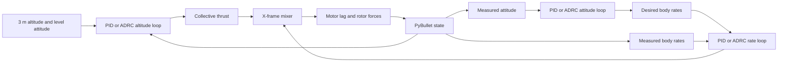

# Module 04 motor mixer with PID and ADRC controllers

Date: 2026-10-07

Status: Implemented

## Description

Module 04 is a standalone PyBullet control example. It teaches the signal path
from altitude and attitude targets through interchangeable cascaded PID or
linear ADRC loops and an X-frame motor mixer to rotor thrusts.

## Key decisions

- Keep the example in `examples/04-mix-control/` instead of changing the
  shared physics engine or the later cumulative module-06 examples.
- Keep the mixer and PyBullet simulation in `common/`; expose PID and ADRC as
  interchangeable controller packages selected by `--controller`.
- Load mass, inertia, and rotor positions from the existing
  `full_drone.urdf`; keep teaching gains and actuator limits as constants in
  `main.py`.
- Use a bounded step target to 3 m, then hold it for six seconds.
- Keep mixer, controller calculations, and PyBullet integration separate.

## Related files

- [Module 04 example](../../examples/04-mix-control/main.py)
- [Module 04 lesson](../../docs/modules/04-motor-mixer-pid/index.md)
