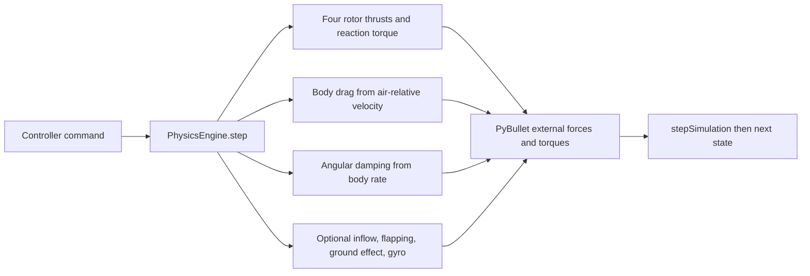

# Reusable flight-forces model

## Goal

Make aerodynamic forces a shared part of `PhysicsEngine`, so Module 6 hover,
Module 7 TTC strike, and later flight-controller bridges use the same physics.
Guidance supplies thrust and attitude targets; it never calculates drag or
external torque.



## Implemented forces

| Force | Equation / model | Applied in | Default |
| --- | --- | --- | --- |
| Body drag | `-0.5 rho CdA |v_air| v_air` per body axis | `_apply_body_drag()` | On |
| Angular damping | `-C omega` per body axis | `_apply_angular_damping()` | On |
| Constant wind | `v_air = v_world - wind_world` | `_air_velocity_body()` | On, zero wind |
| Inflow and blade flapping | Bounded advance-ratio thrust loss and in-plane opposing force | `_apply_rotor_forces()` | Off |
| Ground effect | Bounded thrust multiplier from ray-cast height below each rotor | `_ground_effect_multiplier()` | Off |
| Gyroscopic torque | Body rate crossed with signed rotor angular momentum | `_apply_gyroscopic_torque()` | Off |

The existing rotor-dependent linear drag remains alongside frame drag for
backward compatibility with earlier course examples.

## Configuration boundary

`PhysicsSettings` owns reusable physical-force switches and coefficients.
TTC maps `simulation.physical_forces` YAML into that shared type, then passes
the same resolved settings to `create_world()` and `PhysicsEngine()`.

```yaml
simulation:
  physical_forces:
    body_drag: {enabled: true, cd_area_m2: [0.012, 0.012, 0.020]}
    angular_damping: {enabled: true}
    wind: {enabled: true, world_velocity_mps: [0.0, 0.0, 0.0]}
    rotor_aerodynamics: {enabled: false}
    ground_effect: {enabled: false}
    gyroscopic: {enabled: false}
```

The full commented schema is
`examples/07-optical-navigation/ttc_strike_inputs/template.yaml`.

## Tuning and validation

Start with body drag and angular damping only. Compare TTC runs using the
force columns in `telemetry.csv`; forward drag should be negative during
forward flight and damping torque should oppose measured pitch rate. Enable
one advanced effect at a time and retune controller gains only after checking
the shared Module 6 validation script.
