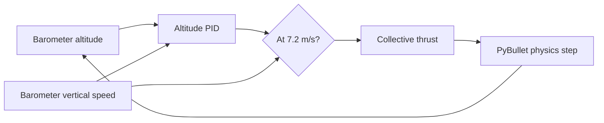

# Aggressive default TTC takeoff

**Created:** 2026-09-29
**Status:** Implemented; 3.5 s target deferred
**Description:** A bounded climb-rate guard reduces time to stable TTC tracking without mixing launch motion with visual tracking.

**Related:** [TTC strike implementation](../../examples/07-optical-navigation/ttc_strike/README.md)

## Decision

The TTC strike takes off to 15 m with a `7.2 m/s` measured climb-rate guard.
The 30 Hz sensor delay means this limits the physical peak to about `8.0 m/s`.
The existing altitude PID supplies collective thrust and, if measured climb
speed reaches the guard, collective thrust is capped at hover thrust so gravity
and drag brake the vehicle. Pitch remains zero. Tracking still begins only
when the existing altitude and vertical-speed settled conditions are satisfied.

## Measured result

The known-working default 30 m strike enters stable tracking in `4.05 s`,
reaches a takeoff peak of `15.09 m`, and still contacts the target at
`7.4 m/s`. This is a 17% improvement over the previous `4.87 s` handoff and
meets the 0.3 m overshoot limit.

At 3.5 s, the vehicle is at `14.74 m` and still climbing at `0.84 m/s`, above
the required 0.5 m/s calm-handoff limit. Reaching the original 3.5 s target
requires either a higher-rate vertical-velocity estimate or a deliberate
relaxation of that handoff limit; neither is included in this tuning change.
