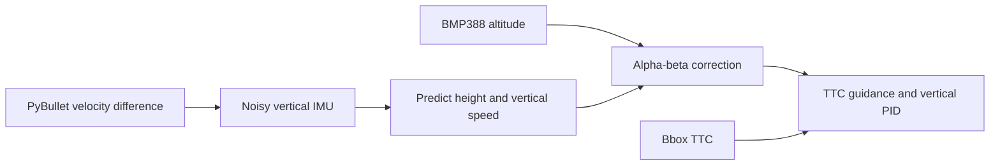

# IMU-barometer vertical fusion

**Date:** 2026-09-29  
**Status:** Implemented  
**Description:** Fuse noisy vertical acceleration with BMP388 altitude for TTC guidance.

## Decision

The TTC example uses an ICM-42688-P-inspired vertical IMU at 240 Hz and a
BMP388 barometer at 40 Hz. The first version keeps PyBullet attitude ideal and
models only accelerometer white noise, startup bias, and slow bias drift.

The estimator propagates with acceleration, then on each barometer update
applies `height += alpha * error` and `velocity += beta * error / dt`.
TTC remains time-to-go only; it does not measure altitude.

## Sensor model

The ICM-42688-P reports a Z-axis accelerometer noise density of `70 µg/√Hz`.
At 240 Hz, the course model uses `0.0075 m/s²` per-sample noise. Startup bias
and bias random walk are visible teaching assumptions, not direct datasheet
random-walk specifications.

- [TDK ICM-42688-P product page](https://www.invensense.tdk.com/en-us/products/6-axis/icm-42688-p)
- [Betaflight IMU recommendation](https://betaflight.com/docs/development/manufacturer/manufacturer-design-guidelines)
