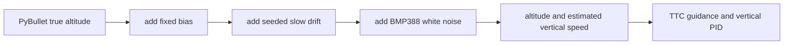

# BMP388 barometer sensor model

**Date:** 2026-09-29  
**Status:** Implemented  
**Description:** A minimal, datasheet-grounded altitude sensor model for the Module 7 TTC strike simulation.

## Decision

The TTC example uses a Bosch BMP388-inspired barometer at 40 Hz. Its runtime
defaults use `0.10 m` altitude RMS white noise, a zero fixed bias, and a
disabled slow-drift random walk. The seed remains simulator configuration so a
noisy run can be repeated exactly.

Bosch specifies `1.2 Pa` pressure noise at full bandwidth and highest
resolution. Near sea level, one pascal corresponds to roughly `0.085 m` of
altitude, so the example rounds `1.2 Pa` to `0.10 m`. Bosch also identifies the
BMP388 as suitable for drone altitude tracking, while Betaflight supports the
chip on both I2C and SPI.

## Model

```text
measured altitude = true altitude + fixed bias + slow drift + white noise
```



`altitude_bias_m` represents the takeoff reference or calibration offset.
`drift_sigma_m_per_sqrt_s` is a seeded random walk for temperature, mounting,
or airflow experiments and defaults to zero. It deliberately does not claim to
be a measured prop-wash model. That effect needs flight data and is deferred.

## Configuration

```yaml
runtime:
  sensors:
    barometer:
      sample_hz: 40.0
      altitude_noise_sigma_m: 0.10
      altitude_bias_m: 0.0
      drift_sigma_m_per_sqrt_s: 0.0
      altitude_old_weight: 0.80
      velocity_old_weight: 0.95
```

The 40 Hz choice divides the simulation's 240 Hz physics loop exactly and is
separate from the 30 Hz camera detector. The `0.95` velocity filter is needed
because finite-differencing 0.10 m of 40 Hz altitude noise would otherwise
produce several metres per second of false vertical speed.

The barometer first applies an altitude EMA with `altitude_old_weight: 0.80`.
Guidance consumes this filtered altitude, then the existing velocity EMA
suppresses the remaining differentiated noise. The final telemetry subplot
records raw, filtered, and true altitude; the offline replay command can
reconstruct those lines from a prior run's CSV and settings without PyBullet.

## Sources and related work

- [Bosch BMP388 datasheet](https://www.bosch-sensortec.com/media/boschsensortec/downloads/datasheets/bst-bmp388-ds001.pdf)
- [Bosch BMP388 product page](https://www.bosch-sensortec.com/products/environmental-sensors/pressure-sensors/bmp388/)
- [Betaflight barometer guide](https://betaflight.com/docs/wiki/guides/current/Barometer)
- [TTC strike implementation](../../examples/07-optical-navigation/ttc_strike/)
