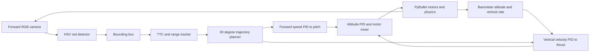

# TTC BBox Diagonal Strike POC

## Purpose

This Module 7 proof of concept drives a simulated drone into the red cube using
the cube's camera bounding box. Roll and yaw remain zero. Pitch controls forward
motion and collective thrust controls vertical motion.

The strike camera is stabilized on the fixed target so a steep body pitch does
not move the cube out of the narrow image during this first POC. A later lesson
will remove this simplifying gimbal assumption and solve full camera/body-frame
tracking.

## Scenario

| Item | Value |
| --- | --- |
| Cube center | `(20, 0, 1) m` |
| Cube near face | `x = 19 m` |
| Drone launch | `(-5.25, 0, 0.05) m` |
| Takeoff altitude | `15 m` |
| Descent angle | `30°` downward |
| Target impact speed | `15 m/s` |
| Accepted impact speed | `10–20 m/s` |

The drone first climbs vertically. It then follows the diagonal toward the
cube, ending with about `13 m/s` forward and `-7.5 m/s` vertical velocity.

## Visual TTC math

| Quantity | Calculation | Meaning |
| --- | --- | --- |
| Box scale | `sqrt(width_px × height_px)` | One pixel-size value from the bbox. |
| Scale growth | `(scale_now - scale_previous) / dt` | Positive while approaching. |
| TTC | `scale / scale_growth` | Estimated seconds until visual contact. |
| Range | `focal_pixels × 2 m / scale` | Approximate range using the known cube size. |
| Forward velocity | `range / TTC` | Visual forward closing-speed estimate. |

The first valid range becomes the reference scale for the path. This avoids
pretending that an uncalibrated pixel measurement is exact world distance.

## Command flow

## Flight phases

| Phase | Condition | Command |
| --- | --- | --- |
| Takeoff | Start until 15 m | Level attitude and altitude PID. |
| Track | Valid bbox/TTC | Update pitch and vertical command from visual range. |
| Commit | Large bbox was seen, then bbox disappears | Hold the last pitch and thrust until contact or TTC deadline. |
| Abort | Bbox disappears before commit | Neutral pitch and hold current barometer altitude. |
| Finish | Cube contact or commit deadline | Record impact result and stop. |

The intended commit threshold is a bbox height of 50% of the image. The code
keeps the last valid command only in this terminal phase, never after ordinary
early target loss.

## Code boundaries

- `Barometer` owns sampled altitude, configurable noise/bias, and filtered
  vertical velocity.
- `BboxTtcTracker` owns HSV-bbox temporal state and never commands motors.
- `DiagonalTrajectory` owns the terminal-speed path only.
- `run()` owns phase transitions and connects the narrow components to existing
  shared PID, mixer, actuator, and PyBullet functions.

These responsibilities keep the POC readable without adding a framework of
single-use interfaces. Each class has one reason to change and receives plain,
typed data records.
