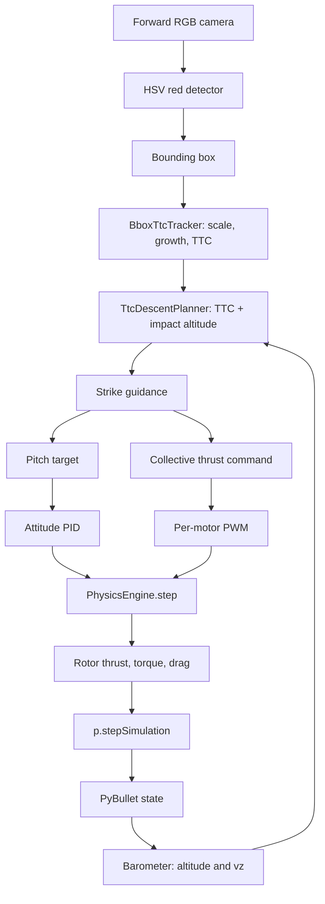

# TTC BBox Diagonal Strike POC

## Purpose

This Module 7 proof of concept drives a simulated drone into a red cube using
only image bbox growth, a barometer, and a known desired impact altitude. The
controller does not use target size, target centre, focal length, or metric
visual range. Roll and yaw remain zero; pitch provides forward motion and
collective thrust provides vertical motion.

## Scene fixture versus controller inputs

The simulator places a cube at `(20, 0, 1) m` with a 2 m edge through
`SceneConfig`. This is rendering/scenario setup, not a control input. The
controller knows only `impact_altitude_m = 1.0` and the camera measurements.

## Visual TTC math

For a detected box, `s = sqrt(width_px × height_px)`. Filter its positive
growth `g = (s_now - s_previous) / dt`, then estimate
`TTC = s / g`. TTC is a time-to-go estimate and does not require a calibrated
camera or known target dimensions.

The altitude planner uses
`v_z* = clamp((impact_altitude - measured_altitude) / max(TTC, min_TTC), limits)`.
Forward velocity stays nominal while TTC is invalid, so the vehicle keeps
moving until bbox growth becomes measurable.

## Command flow

## Flight phases

| Phase | Condition | Command |
| --- | --- | --- |
| Takeoff | Until 15 m and stable vertical speed | Level attitude and altitude PID. |
| Track | Valid bbox/TTC | Nominal forward velocity and TTC-synchronised vertical velocity. |
| Commit | Target was large, then leaves the image | Hold the last valid pitch/thrust until contact or TTC deadline. |
| Abort | Target disappears before commit | Neutral pitch and hold altitude. |
| Finish | Cube contact or timeout | Record impact speed and stop. |

Contact is the success condition; impact speed is telemetry so simulator tuning
does not turn a physical collision into a false failure.

The initial tracking command uses a forward-speed PID while commanding the
takeoff altitude. Descent begins only after a valid TTC arrives. Collective
thrust is tilt-compensated, so the pitched rotor disk keeps its required
world-vertical force.
world-vertical force. The default descent limit is 4.5 m/s, with stronger
vertical-velocity feedback to reduce overshoot.

## Code boundaries

- `ttc_strike/sensing.py`: barometer noise/bias and filtered vertical velocity.
- `ttc_strike/ttc.py`: bbox temporal state and TTC only.
- `ttc_strike/trajectory.py`: TTC-to-altitude/velocity command only.
- `ttc_strike/guidance.py`: phase transitions and pitch/thrust commands.
- `ttc_strike/simulation.py`: PyBullet/OpenCV adapter and shared motor helpers.

See `examples/07-optical-navigation/ttc_strike/README.md` for the complete
package diagram, configuration reference, and runnable flow diagrams.
