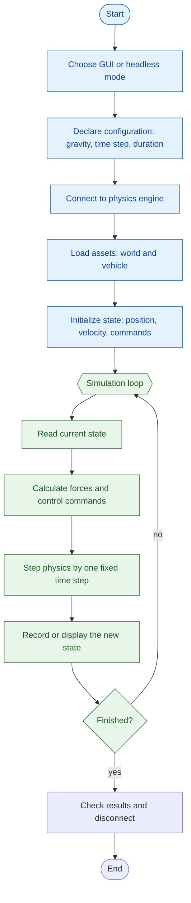
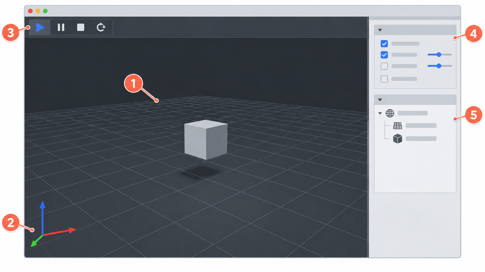

# Module 0: Install PyBullet and run the GUI

## By the end, you will be able to

- Install this course's Python environment with `uv`.
- Open and inspect a small PyBullet scene.
- Run the same scene without a GUI when a display is unavailable.

---

## Install

This course uses [uv](https://docs.astral.sh/uv/) to keep every lesson in one reproducible Python environment. From the repository root, run:

```bash
uv sync
```

### What gets installed

The simulator needs `pybullet`, which provides the physics engine, GUI, URDF
loader, and bundled example assets. It also needs `numpy`, which PyBullet uses
for its array interface. Both are declared once in `pyproject.toml`:

```toml
dependencies = [
    "numpy>=1.26",
    "pybullet>=3.2.7",
]
```

`uv sync` reads that dependency list, creates or updates the local `.venv`
virtual environment, installs the required versions, and records the exact
resolved versions in `uv.lock`. Every command beginning with `uv run` then
uses that same environment—there is no separate global `pip install` step.

On Ubuntu, the GUI needs a running desktop session and graphics driver. If you are connected through a terminal without a display, use the headless command below instead.

---

## Run the first simulation

```bash
uv run python examples/00-pybullet-setup/sandbox.py
```

The script opens a window, creates a ground plane and a cube, then steps the world at 240 Hz. The cube falls because the world has gravity.

For a terminal-only run:

```bash
uv run python examples/00-pybullet-setup/sandbox.py --headless
```

Headless mode uses PyBullet's `DIRECT` connection. It does not open a window, but it reports the cube's final height and checks that it fell.

---

## Before the 240 Hz loop

This is the general shape of every simulator in the course. The blue setup
widgets run once; the green widgets repeat 240 times per simulated second.



The starter script uses a plane and cube for its assets and only gravity for
its force. Later modules replace those simple pieces with a drone, motors,
sensors, battery state, and PID control without changing the flowchart.

---

## The complete sandbox

This is the exact file you ran above. It is included from
`examples/00-pybullet-setup/sandbox.py`, so the lesson always matches the
runnable code.

```python
--8<-- "examples/00-pybullet-setup/sandbox.py"
```

### What each part does

- **Constants** set a deliberately visible experiment: Earth gravity, a cube
  starting 2 m high, a 240 Hz time step, and 480 simulation steps.
- **Arguments** make `--headless` an explicit choice, so the same program can
  run on a desktop or a terminal-only machine.
- **Scene setup** loads PyBullet's bundled `plane.urdf` and `cube_small.urdf`.
  The plane is static; the cube is a dynamic body affected by gravity.
- **Measurement** reads the cube's final position. In headless mode the
  assertion is a small automated check that gravity actually moved the cube.
- **Cleanup** disconnects from PyBullet even if the script fails midway.

---

## Open the PyBullet GUI

This line selects the interactive visualizer by default:

```python
client = p.connect(p.DIRECT if args.headless else p.GUI)
```

Without `--headless`, the expression selects `p.GUI` and opens the PyBullet
window. With `--headless`, it selects `p.DIRECT`; the same physics runs, but no
window is created. The returned `client` identifies this connection and is used
by `p.disconnect(client)` at the end.

---

## Code walkthrough: the 240 Hz simulation loop

Physics does not run continuously in a computer. We advance it in tiny fixed steps:

```python
TIME_STEP = 1 / 240
STEPS = 480

p.setTimeStep(TIME_STEP)
for _ in range(STEPS):
    p.stepSimulation()
    if not args.headless:
        time.sleep(TIME_STEP)
```

`1 / 240` seconds is about `0.00417` seconds, so the physics world updates
240 times per simulated second. `stepSimulation()` computes one update: gravity
changes the cube's velocity, then its new velocity changes its position.

The example takes 480 steps, which is `480 / 240 = 2` simulated seconds. In
GUI mode, `time.sleep(TIME_STEP)` slows the loop so those two simulated seconds
also take about two real seconds and are easy to watch. Headless mode skips the
sleep: it computes the same physics as quickly as possible, which is useful for
automated checks and later experiments.

---

## Inside the GUI



This is an instructional map of the PyBullet GUI. Your version may arrange the
controls differently, but the same areas are present:

1. **3D viewport** — the main simulated world. Here you see the ground plane,
   cube, drone later in the course, contact points, and debug drawings.
2. **World axes and camera navigation** — the red, green, and blue arrows show
   the world coordinate directions. Drag in the viewport to orbit and use the
   mouse wheel to zoom; use these axes to reason about position and forces.
3. **Simulation controls** — start, pause, reset, and single-step controls
   when available. Our script drives the simulation with `stepSimulation()`;
   these controls are mainly useful while inspecting an experiment manually.
4. **Debug visualizer/settings pane** — toggles for visual aids such as the
   grid, coordinate frames, wireframes, shadows, and camera display. Enable
   only the aids that help answer the current question.
5. **World/object pane** — the loaded scene objects: the plane, cube, and
   later the drone. This is where you identify what exists in the simulation
   and inspect the selected body's properties.

The simulator advances only when the script calls `stepSimulation()`: this is
the loop that later applies forces and reads the drone state.

The plane and cube are deliberately simple. Before modelling a drone, we need to trust the world, gravity, time step, and visual inspection tools.

---

## Hands-on: change the experiment

1. Run the GUI script and watch the cube reach the plane.
2. In `examples/00-pybullet-setup/sandbox.py`, change `CUBE_START_HEIGHT`.
3. Run it again and compare how long the cube takes to reach the plane.
4. Change `GRAVITY_Z` to `-3.0`; predict the result before rerunning it.

The next module explains why those changes affect motion: [Module 1: Mass and external forces](../01-mass-and-forces/index.md).

---

## Review quiz

<form class="quiz" data-answer="a" data-explanation="It installs the dependencies declared for this project.">
  <fieldset><legend>1. What does <code>uv sync</code> do for this course?</legend>
    <label><input type="radio" name="q1" value="a"> Installs this project's dependencies</label><br>
    <label><input type="radio" name="q1" value="b"> Opens the PyBullet GUI</label><br>
    <label><input type="radio" name="q1" value="c"> Sets gravity to Earth gravity</label>
  </fieldset><button type="button" class="quiz-check">Check answer</button><p class="quiz-result" aria-live="polite"></p>
</form>

<form class="quiz" data-answer="b" data-explanation="GUI connects PyBullet to its interactive visualizer.">
  <fieldset><legend>2. Which connection opens the interactive PyBullet window?</legend>
    <label><input type="radio" name="q2" value="a"> DIRECT</label><br>
    <label><input type="radio" name="q2" value="b"> GUI</label><br>
    <label><input type="radio" name="q2" value="c"> UDP</label>
  </fieldset><button type="button" class="quiz-check">Check answer</button><p class="quiz-result" aria-live="polite"></p>
</form>

<form class="quiz" data-answer="a" data-explanation="The script sets downward gravity and advances the simulation.">
  <fieldset><legend>3. Why does the cube move in the starter scene?</legend>
    <label><input type="radio" name="q3" value="a"> Gravity acts while the simulation steps</label><br>
    <label><input type="radio" name="q3" value="b"> The plane pulls it down</label><br>
    <label><input type="radio" name="q3" value="c"> A motor pushes it down</label>
  </fieldset><button type="button" class="quiz-check">Check answer</button><p class="quiz-result" aria-live="polite"></p>
</form>

<form class="quiz" data-answer="b" data-explanation="Each call advances the physics world by one configured time step.">
  <fieldset><legend>4. What does <code>stepSimulation()</code> do?</legend>
    <label><input type="radio" name="q4" value="a"> Loads a drone model</label><br>
    <label><input type="radio" name="q4" value="b"> Advances the physics world one time step</label><br>
    <label><input type="radio" name="q4" value="c"> Moves the camera</label>
  </fieldset><button type="button" class="quiz-check">Check answer</button><p class="quiz-result" aria-live="polite"></p>
</form>

<form class="quiz" data-answer="b" data-explanation="Headless mode is for a terminal-only environment without a usable display.">
  <fieldset><legend>5. When should you use <code>--headless</code>?</legend>
    <label><input type="radio" name="q5" value="a"> Whenever you want to inspect the GUI</label><br>
    <label><input type="radio" name="q5" value="b"> When no usable display is available</label><br>
    <label><input type="radio" name="q5" value="c"> Only after Module 6</label>
  </fieldset><button type="button" class="quiz-check">Check answer</button><p class="quiz-result" aria-live="polite"></p>
</form>
