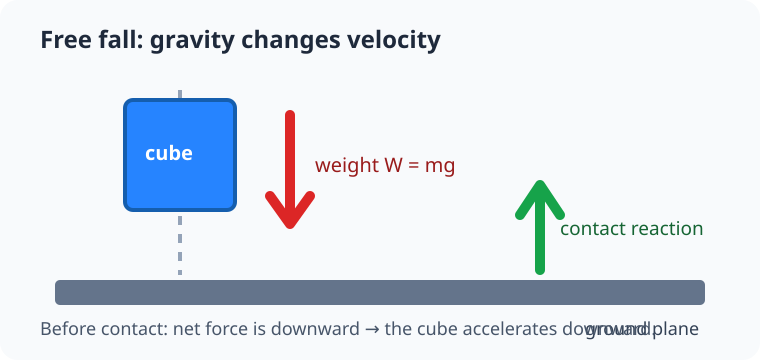
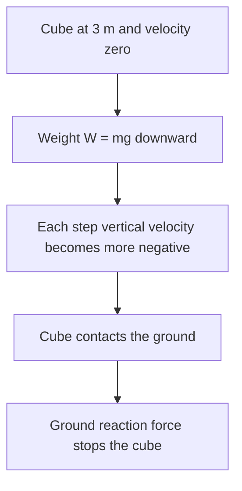

# Experiment 1: Free fall

## By the end, you will be able to

- Predict why an unsupported object accelerates downward.
- Separate gravity from the ground-contact force.
- Run a visible and headless PyBullet free-fall experiment.

---

## The scene

Run one blue cube above a ground plane:

```bash
uv run python examples/01-mass-and-forces/free_fall.py
```

The 1 m cube starts at 3 m. Gravity pulls it down until the ground stops it.





---

## Run and inspect the code

Use headless mode for the repeatable check:

```bash
uv run python examples/01-mass-and-forces/free_fall.py --headless
```

```python
--8<-- "examples/01-mass-and-forces/free_fall.py"
```

The ground plane is a collision surface. Before contact, gravity is the only
external force changing the cube's velocity.

---

## Newton's laws in this scene

- **First law:** the cube starts at rest and would remain at rest without a net force.
- **Second law:** weight gives downward acceleration near `−9.81 m/s²`.
- **Third law:** at contact, the cube pushes the plane down and the plane pushes the cube up.

---

## Hands-on

Change the starting height in `free_fall.py`, predict whether the cube reaches
the ground with more speed, then run the GUI to check your prediction.

## Review quiz

<form class="quiz" data-answer="a" data-explanation="Before contact, gravity is the external force that changes the cube's velocity.">
  <fieldset><legend>1. What changes the cube's velocity before it reaches the plane?</legend>
    <label><input type="radio" name="free-fall-q1" value="a"> Gravity</label><br>
    <label><input type="radio" name="free-fall-q1" value="b"> The ground reaction force</label><br>
    <label><input type="radio" name="free-fall-q1" value="c"> A motor force</label>
  </fieldset><button type="button" class="quiz-check">Check answer</button><p class="quiz-result" aria-live="polite"></p>
</form>

<form class="quiz" data-answer="b" data-explanation="The collision solver creates an upward contact force that prevents penetration.">
  <fieldset><legend>2. Why does the cube stop at the ground?</legend>
    <label><input type="radio" name="free-fall-q2" value="a"> Gravity switches off</label><br>
    <label><input type="radio" name="free-fall-q2" value="b"> The ground applies a contact force upward</label><br>
    <label><input type="radio" name="free-fall-q2" value="c"> Its mass becomes zero</label>
  </fieldset><button type="button" class="quiz-check">Check answer</button><p class="quiz-result" aria-live="polite"></p>
</form>

<form class="quiz" data-answer="c" data-explanation="The course world frame uses positive Z upward, so falling velocity is negative Z.">
  <fieldset><legend>3. What sign does vertical velocity have while the cube falls?</legend>
    <label><input type="radio" name="free-fall-q3" value="a"> Positive</label><br>
    <label><input type="radio" name="free-fall-q3" value="b"> Always zero</label><br>
    <label><input type="radio" name="free-fall-q3" value="c"> Negative</label>
  </fieldset><button type="button" class="quiz-check">Check answer</button><p class="quiz-result" aria-live="polite"></p>
</form>

---

Previous: [Module 1 overview](../index.md). Next: [Track linear velocity](../02-track-linear-velocity/index.md).
