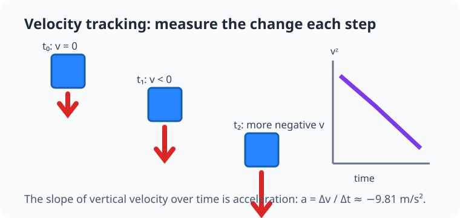
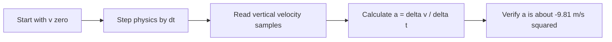

# Experiment 2: Track linear velocity

## By the end, you will be able to

- Read vertical velocity from PyBullet state.
- Estimate acceleration from changes in velocity.
- Verify Earth gravity with a short free-flight measurement.

---

## Why velocity matters

Position says where the cube is. **Linear velocity** says how fast and in which
direction it moves. During free fall, vertical velocity starts near `0 m/s` and
becomes more negative each step.





---

## Run and inspect the code

```bash
uv run python examples/01-mass-and-forces/velocity_tracking.py --headless
```

```python
--8<-- "examples/01-mass-and-forces/velocity_tracking.py"
```

The script starts a cube at 10 m without a ground plane and samples only 0.5 s
of free flight:

```text
acceleration = (final_velocity - initial_velocity) / elapsed_time
```

Damping is disabled so this experiment measures gravity rather than artificial
air resistance.

---

## Newton's laws in this scene

- **First law:** without gravity, the zero vertical velocity would remain zero.
- **Second law:** the slope of vertical velocity is acceleration, so it tests `F = ma`.
- **Third law:** the cube pulls Earth upward with the same force that Earth pulls it down.

---

## Hands-on

Change the measurement duration from 0.5 s to 1.0 s. Predict the final vertical
velocity before running it, then compare the prediction with the printed value.

## Review quiz

<form class="quiz" data-answer="b" data-explanation="Acceleration is the change in velocity divided by elapsed time.">
  <fieldset><legend>1. Which measurement lets this experiment estimate acceleration?</legend>
    <label><input type="radio" name="velocity-q1" value="a"> Cube colour</label><br>
    <label><input type="radio" name="velocity-q1" value="b"> Vertical velocity samples</label><br>
    <label><input type="radio" name="velocity-q1" value="c"> Camera field of view</label>
  </fieldset><button type="button" class="quiz-check">Check answer</button><p class="quiz-result" aria-live="polite"></p>
</form>

<form class="quiz" data-answer="a" data-explanation="Positive Z is upward, so downward free-fall velocity is negative.">
  <fieldset><legend>2. Why is vertical velocity negative during free fall?</legend>
    <label><input type="radio" name="velocity-q2" value="a"> The cube moves in negative Z</label><br>
    <label><input type="radio" name="velocity-q2" value="b"> Its mass is negative</label><br>
    <label><input type="radio" name="velocity-q2" value="c"> PyBullet reverses gravity</label>
  </fieldset><button type="button" class="quiz-check">Check answer</button><p class="quiz-result" aria-live="polite"></p>
</form>

<form class="quiz" data-answer="c" data-explanation="Damping would add another force and change the measured acceleration.">
  <fieldset><legend>3. Why is damping disabled?</legend>
    <label><input type="radio" name="velocity-q3" value="a"> To make the cube invisible</label><br>
    <label><input type="radio" name="velocity-q3" value="b"> To increase Earth gravity</label><br>
    <label><input type="radio" name="velocity-q3" value="c"> To measure gravity without artificial drag</label>
  </fieldset><button type="button" class="quiz-check">Check answer</button><p class="quiz-result" aria-live="polite"></p>
</form>

---

Previous: [Free fall](../01-free-fall/index.md). Next: [Force and hover](../03-hover-force/index.md).
