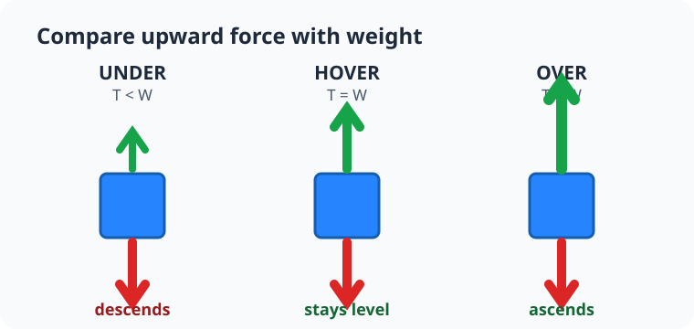
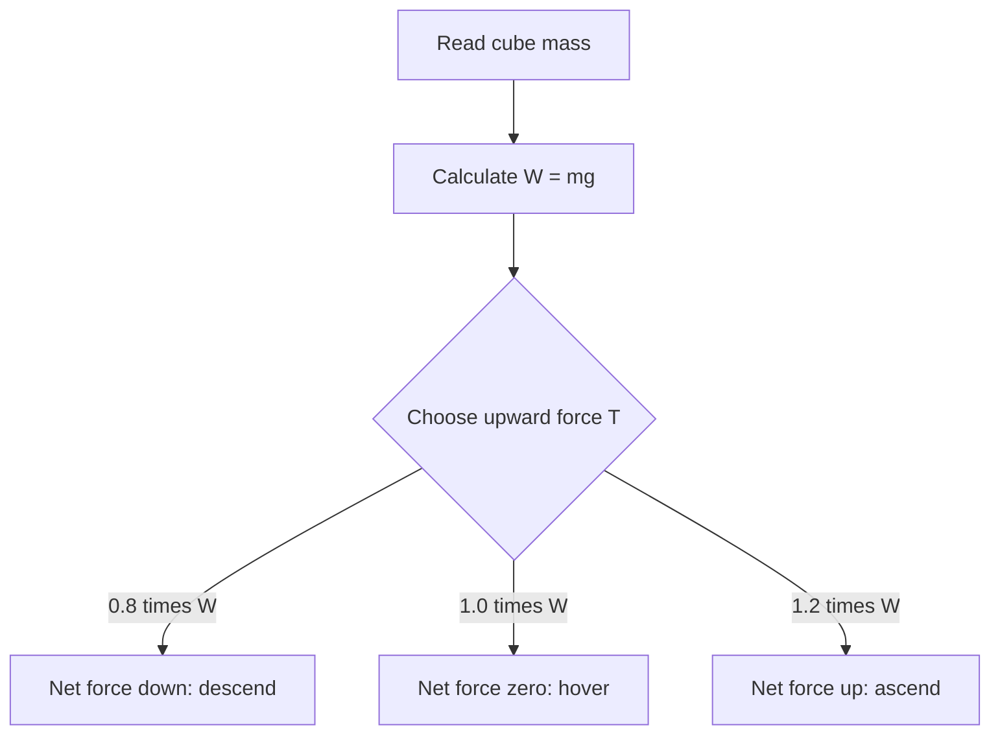

# Experiment 3: Force below, at, and above hover

## By the end, you will be able to

- Calculate the upward force needed to balance weight.
- Predict motion when thrust is below, equal to, or above `mg`.
- Apply a continuous force with `p.applyExternalForce()`.

---

## Three upward-force trials

```bash
uv run python examples/01-mass-and-forces/hover_force.py
```

The script reads the cube mass from PyBullet, calculates its weight with `mass ×
9.81`, and tests three upward forces.





| Trial | Upward force | Expected motion |
| --- | --- | --- |
| Under | `0.8 × mg` | Descends |
| Hover | `1.0 × mg` | Stays at the same height |
| Over | `1.2 × mg` | Ascends |

This is the simplest drone motor model: later, four propellers replace one
upward force.

---

## Run and inspect the code

```python
--8<-- "examples/01-mass-and-forces/hover_force.py"
```

`p.applyExternalForce()` applies force for **one** simulation step, so the code
calls it inside the loop immediately before `p.stepSimulation()`:

```python
p.applyExternalForce(
    cube,
    -1,
    (0, 0, upward_force),
    (0, 0, 0),
    p.WORLD_FRAME,
)
```

The vector is `(X, Y, Z)` in newtons. The final positive Z value is upward
thrust. Calling this only once creates one short push, not continuous lift.

---

## Newton's laws in this scene

- **First law:** at hover, net force is zero, so a cube starting still stays still.
- **Second law:** under-thrust accelerates down; over-thrust accelerates up.
- **Third law:** the simplified upward force represents air pushing a propeller up after the propeller pushes air down.

---

## Hands-on

1. Change `(0, 0, upward_force)` to `(1.0, 0, upward_force)` and observe the sideways drift.
2. Change the hover multiplier from `1.0` to `0.9`; predict the result before running it.
3. Double the cube mass mentally. What hover force is required by `T = mg`?

## Review quiz

<form class="quiz" data-answer="b" data-explanation="Equal upward thrust and weight give zero net force, so a still cube remains still.">
  <fieldset><legend>1. What happens when upward force equals weight?</legend>
    <label><input type="radio" name="hover-q1" value="a"> The cube climbs</label><br>
    <label><input type="radio" name="hover-q1" value="b"> The cube can hover</label><br>
    <label><input type="radio" name="hover-q1" value="c"> The cube must fall</label>
  </fieldset><button type="button" class="quiz-check">Check answer</button><p class="quiz-result" aria-live="polite"></p>
</form>

<form class="quiz" data-answer="a" data-explanation="PyBullet applies this external force for one physics step, so continuous thrust needs a call each step.">
  <fieldset><legend>2. Why is applyExternalForce inside the loop?</legend>
    <label><input type="radio" name="hover-q2" value="a"> Continuous thrust must be applied every step</label><br>
    <label><input type="radio" name="hover-q2" value="b"> It changes the cube mass</label><br>
    <label><input type="radio" name="hover-q2" value="c"> It draws the ground plane</label>
  </fieldset><button type="button" class="quiz-check">Check answer</button><p class="quiz-result" aria-live="polite"></p>
</form>

<form class="quiz" data-answer="c" data-explanation="Weight is mg, so doubling mass doubles the force needed to balance it.">
  <fieldset><legend>3. If cube mass doubles, what hover thrust is needed?</legend>
    <label><input type="radio" name="hover-q3" value="a"> Half as much</label><br>
    <label><input type="radio" name="hover-q3" value="b"> The same amount</label><br>
    <label><input type="radio" name="hover-q3" value="c"> Twice as much</label>
  </fieldset><button type="button" class="quiz-check">Check answer</button><p class="quiz-result" aria-live="polite"></p>
</form>

---

Previous: [Track linear velocity](../02-track-linear-velocity/index.md). Next: [Module 2: URDF engine](../../02-urdf-engine/index.md).
