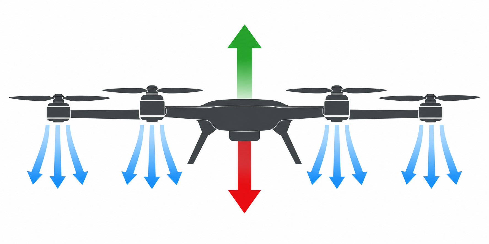
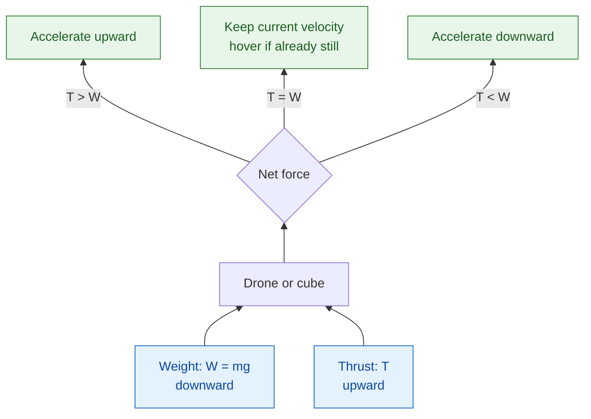
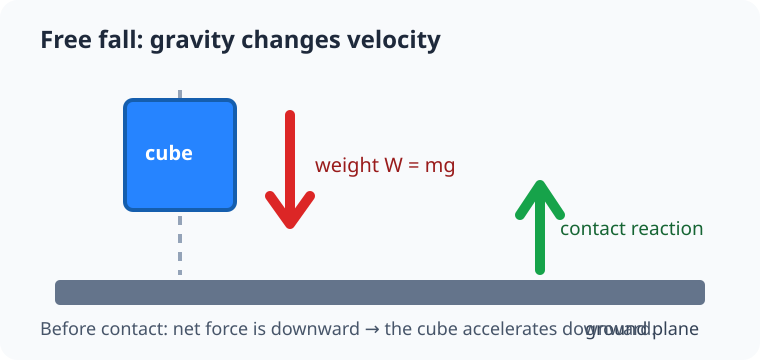
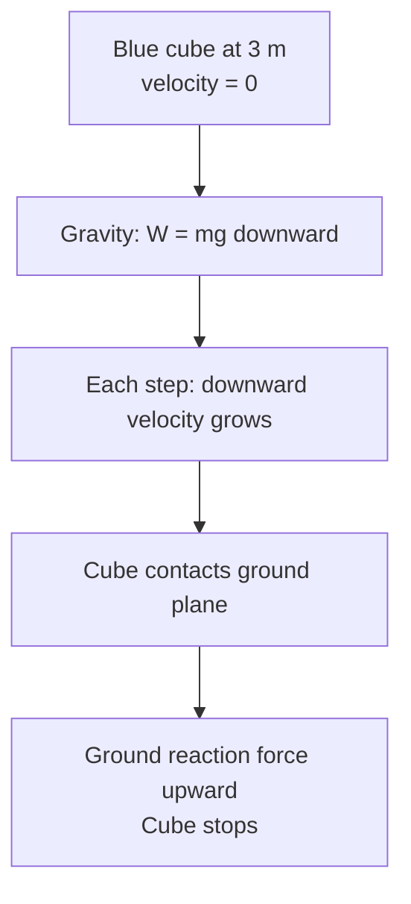
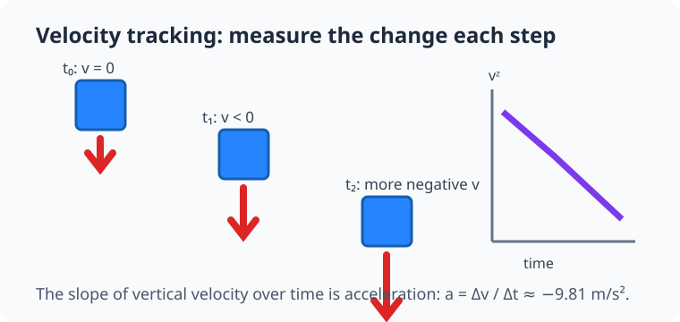
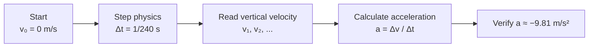
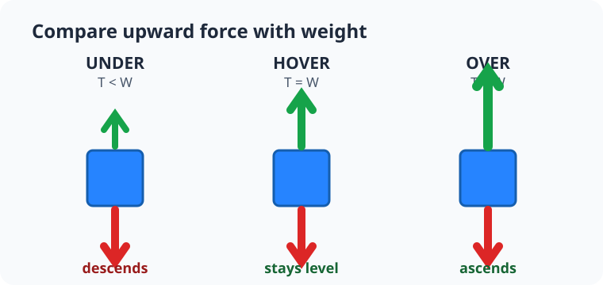
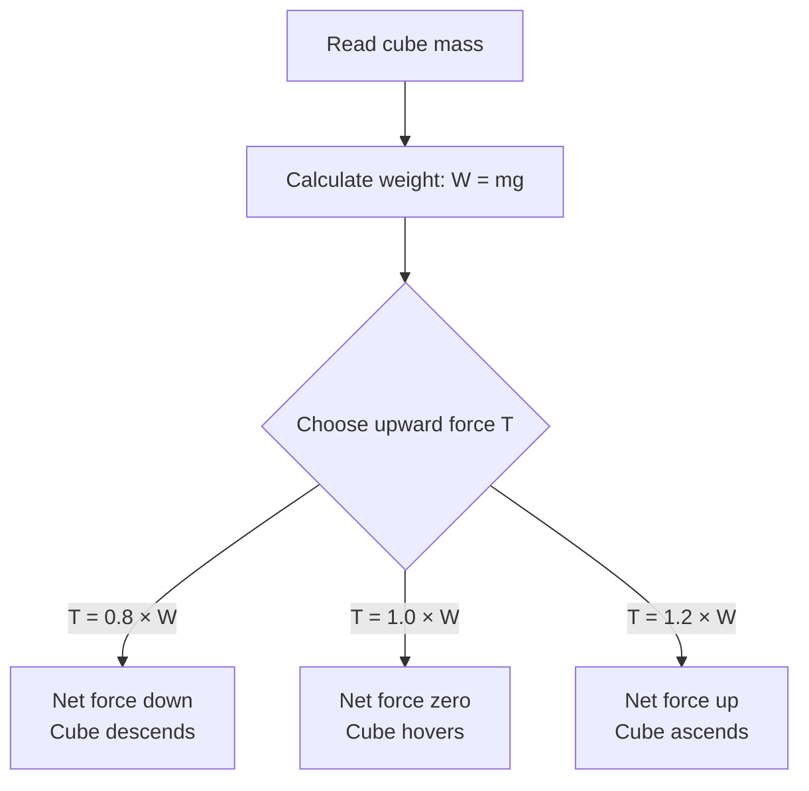

# Module 1: Mass and external forces

## By the end, you will be able to

- Explain Newton's three laws with drone examples.
- Measure free fall and estimate Earth gravity from vertical velocity.
- Calculate the upward force needed to hover with `T = mg`.

---

## PyBullet methods at a glance

| Method | Short description |
| --- | --- |
| `p.connect()` | Connect to the GUI or headless physics engine. |
| `p.setGravity()` | Set the world gravity vector in `m/s²`. |
| `p.setTimeStep()` | Set the duration of one physics update. |
| `p.loadURDF()` | Load a plane, cube, drone, or other physical body. |
| `p.stepSimulation()` | Advance the physics world by one time step. |
| `p.getBaseVelocity()` | Read a body's linear and angular velocity. |
| `p.getDynamicsInfo()` | Read properties such as the body's mass. |
| `p.applyExternalForce()` | Apply a force vector for the next simulation step. |
| `p.disconnect()` | Close the connection to the physics engine. |

---

## SI units used in this course

PyBullet uses SI units. Keep every value in these units so the equations and
simulation agree with real-world physics.

| Quantity | Symbol | SI unit | Example |
| --- | --- | --- | --- |
| Position / distance | `p`, `x`, `y`, `z` | metre (`m`) | A drone hovers at `5 m`. |
| Time | `t` | second (`s`) | One 240 Hz step is `1/240 s`. |
| Mass | `m` | kilogram (`kg`) | A small drone may weigh `0.65 kg`. |
| Velocity | `v` | metres per second (`m/s`) | Falling velocity is `−4.9 m/s`. |
| Acceleration | `a` | metres per second squared (`m/s²`) | Earth gravity is `−9.81 m/s²`. |
| Force / thrust / weight | `F`, `T`, `W` | newton (`N`) | A 0.65 kg drone weighs about `6.38 N`. |

A newton is a derived unit:

```text
1 N = 1 kg × 1 m/s²
```

That definition is why `F = ma` produces force in newtons when mass is in
kilograms and acceleration is in metres per second squared.

---

## Intuition: a drone obeys forces

A drone does not move because a motor command says “go up.” A motor produces
an upward force, gravity produces a downward force, and the **net force** decides
how its velocity changes. When the forces balance, the drone keeps doing what it
was already doing. A still drone stays still; a moving drone keeps moving unless
another force changes that motion.

---

## Newton's three laws

### First law: inertia

**Short rule:** an object's velocity stays the same unless a net force acts on
it. “The same velocity” includes zero velocity, so a stationary drone stays
still when its forces balance.

```text
ΣF = 0  →  a = 0  →  velocity stays constant
```

**On a drone:** if total thrust equals weight and the drone starts still, it
hovers. If it was already drifting sideways, balanced vertical forces do not
magically stop that drift; it needs a sideways force in the opposite direction.

### Second law: force changes motion

**Short rule:** net force produces acceleration, and a heavier object needs
more force for the same acceleration.

```text
ΣF = ma
weight = mg
vertical acceleration: a_z = (T - mg) / m
```

**On a drone:** `T` is total propeller thrust. When `T > mg`, the drone climbs;
when `T < mg`, it descends. Doubling mass doubles the hover thrust needed.
Tilting a drone later redirects some thrust sideways, creating horizontal
acceleration.

### Third law: action and reaction

**Short rule:** every force has an equal-size, opposite-direction partner on a
different object.

```text
force on air from propellers = −force on propellers from air
```

**On a drone:** each propeller accelerates air downward. The air reacts by
pushing the propeller—and therefore the drone—upward. This upward reaction is
the thrust represented by `T` in the second-law equation.



The **blue arrows** show the propellers accelerating air downward. That force is
applied to the air. By Newton's third law, the air applies an equal and opposite
force upward on the propellers and drone: the **green arrow**. The **red arrow**
is weight, caused by Earth's gravity acting on the drone's mass. At hover, the
total upward green force equals the downward red force: `T = mg`.

---

## The force-and-motion loop



The simulator repeats this idea every time step: calculate forces, find the net
force, update velocity, then update position.

---

## Mass and weight

**Mass** is how much matter an object has. It is measured in kilograms (`kg`)
and does not change when you move the object from one planet to another.

**Weight** is the gravitational force acting on that mass. It is measured in
newtons (`N`) and depends on local gravity:

```text
W = mg
```

On Earth, `g ≈ 9.81 m/s²`. A `0.65 kg` drone therefore has a weight of about
`0.65 × 9.81 = 6.38 N`. To hover, its four propellers together must create about
`6.38 N` upward thrust. Each motor would supply roughly one quarter in a level
hover, before accounting for real losses.

PyBullet stores mass as a body property. The hover example reads it instead of
guessing it:

```python
mass = p.getDynamicsInfo(cube, -1)[0]
weight = mass * abs(GRAVITY_Z)
```

The `-1` means the body's base link. In a future multi-link drone URDF, each
link can have its own mass, while the total vehicle weight is the sum of all
those masses multiplied by gravity.

---

## Experiment 1: free fall

Run one cube above a ground plane:

```bash
uv run python examples/01-mass-and-forces/free_fall.py
```

The script spawns a large 1 m blue cube at 3 m, making its motion easy to see.
It falls until the plane stops it. In headless mode, the script checks that the
final height is lower than the starting height:





```bash
uv run python examples/01-mass-and-forces/free_fall.py --headless
```

```python
--8<-- "examples/01-mass-and-forces/free_fall.py"
```

The plane is only a collision surface. Gravity is the external force that
changes the cube's velocity before it reaches the plane.

### Newton's laws in this scene

- **First law:** the cube starts at rest and stays at rest only until a net
  force acts. With gravity enabled, there is no balanced-force hover state.
- **Second law:** gravity creates downward weight `W = mg`. The net force is
  downward, so `a = F / m` gives the familiar acceleration near `−9.81 m/s²`.
  The next experiment measures this from the cube's velocity.
- **Third law:** when the cube reaches the plane, it pushes the plane down.
  The plane pushes the cube up with an equal and opposite contact force, which
  stops it from falling through the ground.

---

## Experiment 2: track linear velocity

Position tells you where the cube is. **Linear velocity** tells you how fast
and in which direction it moves. Its vertical component starts near `0 m/s`,
then becomes more negative each step during free fall.





```bash
uv run python examples/01-mass-and-forces/velocity_tracking.py --headless
```

```python
--8<-- "examples/01-mass-and-forces/velocity_tracking.py"
```

The script starts the cube at 10 m with no ground plane and samples only 0.5 s
of free flight. It calculates:

```text
acceleration = (final_velocity - initial_velocity) / elapsed_time
```

The result should be close to `−9.81 m/s²`. Damping is disabled so the estimate
measures gravity rather than artificial air resistance.

### Newton's laws in this scene

- **First law:** the cube begins with zero vertical velocity. It would keep
  that velocity if no net force acted on it, but gravity immediately changes it.
- **Second law:** every velocity sample becomes more negative by about
  `9.81 m/s` each second. The calculated slope `Δv / Δt` is acceleration, so
  this experiment checks `F = ma` against the real-world value of `g`.
- **Third law:** Earth pulls the cube downward, while the cube pulls Earth
  upward with equal force. Earth is so massive that its acceleration is too
  small to see; the light cube's acceleration is easy to measure.

---

## Experiment 3: force below, at, and above hover

```bash
uv run python examples/01-mass-and-forces/hover_force.py
```

```python
--8<-- "examples/01-mass-and-forces/hover_force.py"
```

The script asks PyBullet for the cube's mass, calculates its weight with
`mass × 9.81`, and runs three trials:





| Trial | Upward force | Expected motion |
| --- | --- | --- |
| Under | `0.8 × mg` | Descends |
| Hover | `1.0 × mg` | Stays at the same height |
| Over | `1.2 × mg` | Ascends |

This is the first version of a drone motor model: a propeller's thrust will
eventually replace the simple upward force.

### Newton's laws in this scene

- **First law:** in the `hover` trial, net force is zero. The cube keeps its
  existing velocity; because it starts still, it stays at the same height.
- **Second law:** the `under` force gives a negative net force and downward
  acceleration. The `over` force gives a positive net force and upward
  acceleration. The same change in force would accelerate a heavier body less.
- **Third law:** `applyExternalForce()` represents the upward reaction that a
  real propeller gets by pushing air downward. In later modules, individual
  motor forces will replace this one simplified force.

---

## Important method: `applyExternalForce`

`p.applyExternalForce()` is how the hover example gives the cube a temporary
upward push. Its important arguments are:

```python
p.applyExternalForce(
    cube,                  # body unique ID returned by loadURDF
    -1,                    # base link; a drone's motors later use real links
    (0, 0, upward_force),  # force vector in newtons: +Z means upward
    (0, 0, 0),             # point where the force is applied
    p.WORLD_FRAME,         # interpret the vector in world coordinates
)
```

The force exists for **one** simulation step. That is why the script calls it
inside the `for` loop, immediately before `p.stepSimulation()`. Calling it once
would create only one tiny impulse-like effect, not continuous thrust.

In the hover experiment, `upward_force = multiplier × mass × 9.81`. With a
multiplier of `1.0`, the upward force cancels weight. In a later drone model,
each motor contributes its own force at a different point, which can also create
rotation.

---

## Hands-on: use `applyExternalForce()` yourself

1. Run the hover experiment and observe the three trials:

   ```bash
   uv run python examples/01-mass-and-forces/hover_force.py
   ```

2. Open `examples/01-mass-and-forces/hover_force.py`. Find this force vector:

   ```python
   (0, 0, upward_force)
   ```

   The three values mean `(X, Y, Z)`. The zeros apply no sideways force; the
   final value applies thrust upward.

3. Change it to the following, then rerun the GUI example:

   ```python
   (1.0, 0, upward_force)
   ```

   You now apply a 1 N force in positive X as well as the upward force. The
   cube should drift sideways while the `hover` trial remains near its original
   height. This is the same method a future drone model uses for every motor
   force—only the force direction and application point will differ.

4. Restore `(0, 0, upward_force)`, then change the `"hover"` multiplier from
   `1.0` to `0.9`. Predict the result and run it: it descends because upward
   force is below weight.

5. Multiply the cube mass by two mentally. What must happen to `T = mg` to
   keep the same hover? Explain before changing any code.

---

## Review quiz

<form class="quiz" data-answer="b" data-explanation="A net force is required to change velocity; this is Newton's first law.">
  <fieldset><legend>1. What happens to a still drone when thrust exactly equals weight?</legend>
    <label><input type="radio" name="q1" value="a"> It starts climbing</label><br>
    <label><input type="radio" name="q1" value="b"> It remains at the same height</label><br>
    <label><input type="radio" name="q1" value="c"> It immediately falls</label>
  </fieldset><button type="button" class="quiz-check">Check answer</button><p class="quiz-result" aria-live="polite"></p>
</form>

<form class="quiz" data-answer="a" data-explanation="Newton's second law relates net force, mass, and acceleration.">
  <fieldset><legend>2. Which equation describes how net force changes motion?</legend>
    <label><input type="radio" name="q2" value="a"> <code>F = ma</code></label><br>
    <label><input type="radio" name="q2" value="b"> <code>F = m / a</code></label><br>
    <label><input type="radio" name="q2" value="c"> <code>F = a / m</code></label>
  </fieldset><button type="button" class="quiz-check">Check answer</button><p class="quiz-result" aria-live="polite"></p>
</form>

<form class="quiz" data-answer="c" data-explanation="Gravity changes vertical velocity by about −9.81 m/s every second.">
  <fieldset><legend>3. During free fall, what should happen to vertical velocity?</legend>
    <label><input type="radio" name="q3" value="a"> It stays zero</label><br>
    <label><input type="radio" name="q3" value="b"> It becomes more positive</label><br>
    <label><input type="radio" name="q3" value="c"> It becomes more negative</label>
  </fieldset><button type="button" class="quiz-check">Check answer</button><p class="quiz-result" aria-live="polite"></p>
</form>

<form class="quiz" data-answer="b" data-explanation="The propeller pushes air down, and the air pushes the propeller and drone up.">
  <fieldset><legend>4. Which pair illustrates Newton's third law for a propeller?</legend>
    <label><input type="radio" name="q4" value="a"> Gravity and mass</label><br>
    <label><input type="radio" name="q4" value="b"> Propeller pushing air down and air pushing drone up</label><br>
    <label><input type="radio" name="q4" value="c"> Position and velocity</label>
  </fieldset><button type="button" class="quiz-check">Check answer</button><p class="quiz-result" aria-live="polite"></p>
</form>

<form class="quiz" data-answer="a" data-explanation="Doubling mass doubles weight, so the hover thrust must also double.">
  <fieldset><legend>5. If a drone's mass doubles, what hover thrust does it need?</legend>
    <label><input type="radio" name="q5" value="a"> Twice as much</label><br>
    <label><input type="radio" name="q5" value="b"> The same amount</label><br>
    <label><input type="radio" name="q5" value="c"> Half as much</label>
  </fieldset><button type="button" class="quiz-check">Check answer</button><p class="quiz-result" aria-live="polite"></p>
</form>

---

## Advanced quiz

<form class="quiz" data-answer="c" data-explanation="With thrust unchanged and mass doubled, weight doubles. The upward force is now below weight, so the drone accelerates downward.">
  <fieldset><legend>1. A drone doubles its mass but keeps the same total thrust. What happens?</legend>
    <label><input type="radio" name="advanced-q1" value="a"> It keeps hovering because thrust is unchanged</label><br>
    <label><input type="radio" name="advanced-q1" value="b"> It climbs because more mass creates more lift</label><br>
    <label><input type="radio" name="advanced-q1" value="c"> It accelerates downward because its weight increased</label>
  </fieldset><button type="button" class="quiz-check">Check answer</button><p class="quiz-result" aria-live="polite"></p>
</form>

<form class="quiz" data-answer="b" data-explanation="A force applied once affects only one physics step. Continuous thrust requires applying the force before every step.">
  <fieldset><legend>2. Why is <code>applyExternalForce()</code> inside the simulation loop?</legend>
    <label><input type="radio" name="advanced-q2" value="a"> It changes the cube color every step</label><br>
    <label><input type="radio" name="advanced-q2" value="b"> Continuous thrust must be applied for each physics step</label><br>
    <label><input type="radio" name="advanced-q2" value="c"> PyBullet otherwise forgets the cube's mass</label>
  </fieldset><button type="button" class="quiz-check">Check answer</button><p class="quiz-result" aria-live="polite"></p>
</form>

<form class="quiz" data-answer="a" data-explanation="Starting from rest, velocity is v = at = −9.81 × 0.5 ≈ −4.905 m/s.">
  <fieldset><legend>3. A cube starts at rest and falls for 0.5 s. About what is its vertical velocity?</legend>
    <label><input type="radio" name="advanced-q3" value="a"> <code>−4.9 m/s</code></label><br>
    <label><input type="radio" name="advanced-q3" value="b"> <code>0 m/s</code></label><br>
    <label><input type="radio" name="advanced-q3" value="c"> <code>+4.9 m/s</code></label>
  </fieldset><button type="button" class="quiz-check">Check answer</button><p class="quiz-result" aria-live="polite"></p>
</form>

<form class="quiz" data-answer="b" data-explanation="Balanced vertical forces do not remove an existing horizontal velocity. A horizontal force is needed to stop the drift.">
  <fieldset><legend>4. A drone hovers vertically but is already moving east. With no horizontal force, what happens?</legend>
    <label><input type="radio" name="advanced-q4" value="a"> It instantly stops moving east</label><br>
    <label><input type="radio" name="advanced-q4" value="b"> It continues drifting east at the same speed</label><br>
    <label><input type="radio" name="advanced-q4" value="c"> It begins moving west</label>
  </fieldset><button type="button" class="quiz-check">Check answer</button><p class="quiz-result" aria-live="polite"></p>
</form>

<form class="quiz" data-answer="c" data-explanation="The equal-and-opposite force pair is propeller-on-air and air-on-propeller. Weight acts between Earth and the drone, so it is not the paired reaction to thrust.">
  <fieldset><legend>5. Which force is the reaction partner of a propeller's downward force on air?</legend>
    <label><input type="radio" name="advanced-q5" value="a"> The drone's downward weight</label><br>
    <label><input type="radio" name="advanced-q5" value="b"> The ground's contact force</label><br>
    <label><input type="radio" name="advanced-q5" value="c"> The air's upward force on the propeller</label>
  </fieldset><button type="button" class="quiz-check">Check answer</button><p class="quiz-result" aria-live="polite"></p>
</form>

---

Prerequisite: [Module 0: PyBullet setup](../00-pybullet-setup/index.md). Next: [Module 2: URDF engine](../02-urdf-engine/index.md).
