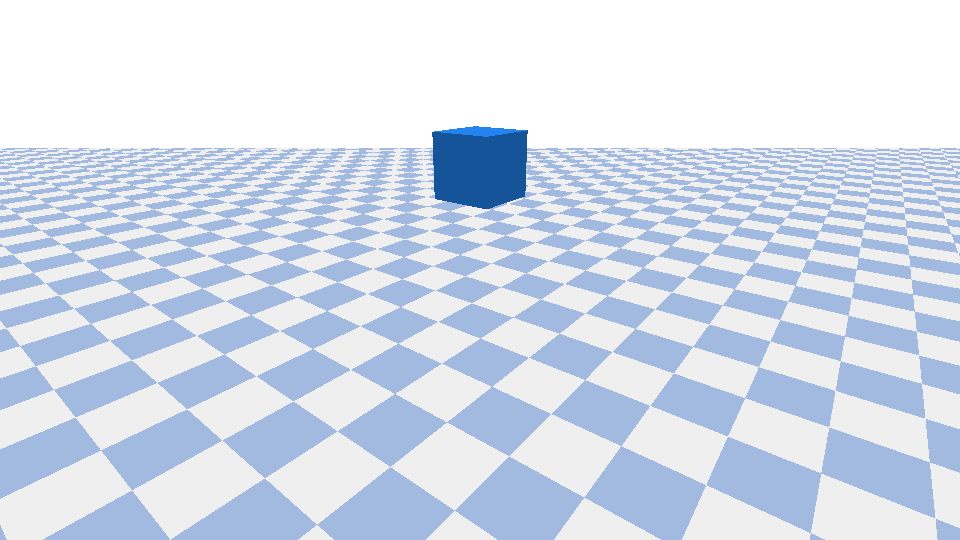
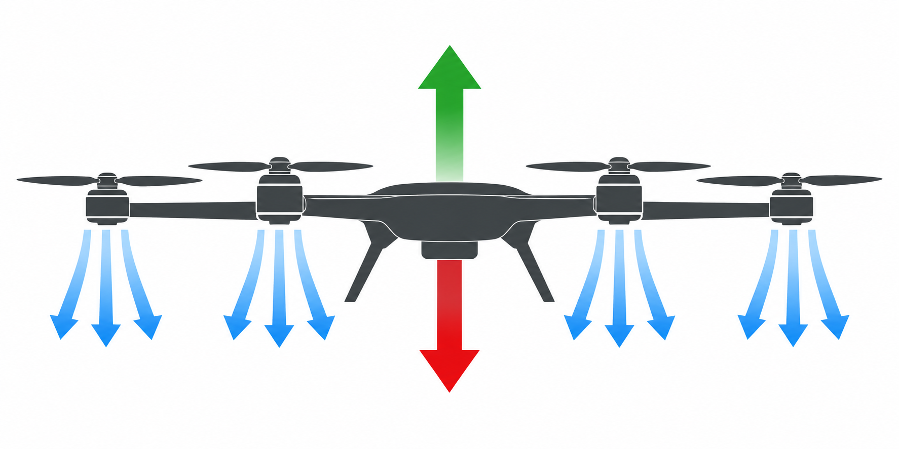
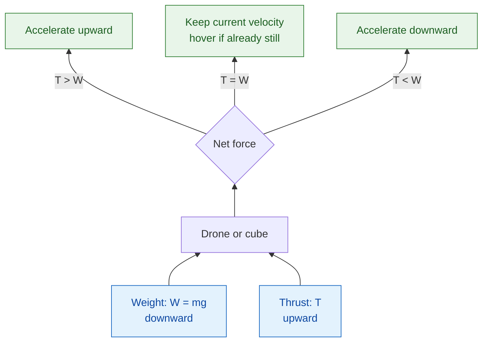

# Module 1: Mass and external forces

## By the end, you will be able to

- Explain Newton's three laws with drone examples.
- Measure free fall and estimate Earth gravity from vertical velocity.
- Calculate the upward force needed to hover with `T = mg`.
- Describe a drone state with 3-D position, velocity, and acceleration vectors.

---

## Important PyBullet methods

These are the PyBullet calls used directly by Module 1. Later modules reuse
them for drone bodies, motors, forces, and sensors.

| Method | What it does | Why Module 1 uses it | Important detail |
| --- | --- | --- | --- |
| `p.connect(p.GUI)` | Opens the interactive PyBullet window. | Lets you watch the cube fall or hover. | Use `p.DIRECT` instead for a headless automated check. |
| `p.disconnect()` | Closes the physics connection. | Cleans up after every example, even after an error. | Pass the client ID when more than one connection exists. |
| `p.setAdditionalSearchPath()` | Tells PyBullet where built-in assets live. | Lets `loadURDF()` find `plane.urdf` and `cube.urdf`. | The course examples use the `pybullet_data` asset directory. |
| `p.setGravity(0, 0, -9.81)` | Sets world acceleration caused by gravity. | Makes an unsupported cube fall. | The unit is `m/s²`, not newtons; negative Z is down in this course. |
| `p.setTimeStep(1 / 240)` | Sets one physics integration interval. | Makes the examples advance at 240 Hz. | Each `stepSimulation()` call advances exactly this duration. |
| `p.loadURDF()` | Loads a physical body from a URDF file. | Creates the ground plane and cube. | URDF provides mass, inertia, visual shape, and collision geometry. |
| `p.changeVisualShape()` | Changes how a body looks. | Makes the free-fall cube blue and easy to see. | Colour changes appearance only; it does not change mass or physics. |
| `p.getDynamicsInfo()` | Reads mass and other dynamics properties. | Lets the hover-force experiment calculate `W = mg`. | Base-link data uses link index `-1`; mass is in `kg`. |
| `p.applyExternalForce()` | Adds a force vector to a body for the next physics tick. | Supplies the simple upward thrust in the hover experiment. | Force is in newtons and lasts one step, so continuous thrust needs a call inside the loop. |
| `p.stepSimulation()` | Advances rigid-body physics once. | Updates position and velocity after gravity, thrust, and contact forces. | Call it after setting forces for the current tick. |
| `p.getBasePositionAndOrientation()` | Reads a body's world position and orientation. | Checks the final height in the free-fall experiment. | Position is in metres; orientation is a quaternion. |
| `p.getBaseVelocity()` | Reads linear and angular velocity. | Lets the velocity experiment estimate acceleration. | Linear velocity is `m/s`; angular velocity is `rad/s`. |

`p.applyExternalForce()` also needs a frame choice. Module 1 uses
`p.WORLD_FRAME`, so `(0, 0, upward_force)` always means upward in the fixed
world frame. [Experiment 3: Force and hover](03-hover-force/index.md) explores
this call in detail; [Experiment 2](02-track-linear-velocity/index.md) uses the
position and velocity readers to measure gravity.

This is the blue cube and ground plane used by the first experiment, rendered
by PyBullet before gravity advances the simulation:



---

## SI units used in this course

PyBullet uses SI units. Keep every value in these units so the equations and
simulation agree with real-world physics.

| Quantity | Symbol | SI unit | Example |
| --- | --- | --- | --- |
| Position / distance | `p`, `x`, `y`, `z` | metre (`m`) | A drone hovers at `5 m`. |
| Time | `t` | second (`s`) | One 240 Hz step is `1/240 s`. |
| Mass | `m` | kilogram (`kg`) | A small drone may weigh `0.65 kg`. |
| Velocity | `v` | metres per second (`m/s`) | Falling velocity is `−4.9 m/s`. |
| Acceleration | `a` | metres per second squared (`m/s²`) | Earth gravity is `−9.81 m/s²`. |
| Force / thrust / weight | `F`, `T`, `W` | newton (`N`) | A 0.65 kg drone weighs about `6.38 N`. |

A newton is a derived unit:

```text
1 N = 1 kg × 1 m/s²
```

That definition is why `F = ma` produces force in newtons when mass is in
kilograms and acceleration is in metres per second squared.

---

## From one dimension to the drone state

The first experiments use only altitude, but a drone moves in three dimensions.
We describe its translational state with vectors:

```text
p = [x, y, z]          position (m)
v = [vx, vy, vz]       velocity (m/s)
a = [ax, ay, az]       acceleration (m/s²)
```

Newton's law applies component by component:

```text
F = [Fx, Fy, Fz]
a = F / m
```

The free-fall experiment is therefore the special case `Fx = Fy = 0` and
`Fz = -mg`. Later, tilting the thrust vector creates horizontal components and
changes `vx` or `vy` as well as altitude.

### Mini-lab: a configurable 1-D state update

Use the free-fall example as a starting point and add a configurable constant
upward force. Record `[time, z, vz, az]` at every step, then compare the three
cases `T < mg`, `T = mg`, and `T > mg`. Explain which state variable changes
first: acceleration, then velocity, then position.

---

## Intuition: a drone obeys forces

A drone does not move because a motor command says “go up.” A motor produces
an upward force, gravity produces a downward force, and the **net force** decides
how its velocity changes. When the forces balance, the drone keeps doing what it
was already doing. A still drone stays still; a moving drone keeps moving unless
another force changes that motion.

---

## Newton's three laws

### First law: inertia

**Short rule:** an object's velocity stays the same unless a net force acts on
it. “The same velocity” includes zero velocity, so a stationary drone stays
still when its forces balance.

```text
ΣF = 0  →  a = 0  →  velocity stays constant
```

**On a drone:** if total thrust equals weight and the drone starts still, it
hovers. If it was already drifting sideways, balanced vertical forces do not
magically stop that drift; it needs a sideways force in the opposite direction.

### Second law: force changes motion

**Short rule:** net force produces acceleration, and a heavier object needs
more force for the same acceleration.

```text
ΣF = ma
weight = mg
vertical acceleration: a_z = (T - mg) / m
```

**On a drone:** `T` is total propeller thrust. When `T > mg`, the drone climbs;
when `T < mg`, it descends. Doubling mass doubles the hover thrust needed.
Tilting a drone later redirects some thrust sideways, creating horizontal
acceleration.

### Third law: action and reaction

**Short rule:** every force has an equal-size, opposite-direction partner on a
different object.

```text
force on air from propellers = −force on propellers from air
```

**On a drone:** each propeller accelerates air downward. The air reacts by
pushing the propeller—and therefore the drone—upward. This upward reaction is
the thrust represented by `T` in the second-law equation.



The **blue arrows** show the propellers accelerating air downward. That force is
applied to the air. By Newton's third law, the air applies an equal and opposite
force upward on the propellers and drone: the **green arrow**. The **red arrow**
is weight, caused by Earth's gravity acting on the drone's mass. At hover, the
total upward green force equals the downward red force: `T = mg`.

---

## The force-and-motion loop


```mermaid
flowchart BT
    G[Weight: W = mg\ndownward] --> B[Drone or cube]
    T[Thrust: T\nupward] --> B
    B --> N{Net force}
    N -->|T > W| U[Accelerate upward]
    N -->|T = W| H[Keep current velocity\nhover if already still]
    N -->|T < W| D[Accelerate downward]

    classDef force fill:#e3f2fd,stroke:#1565c0,color:#0d47a1;
    classDef result fill:#e8f5e9,stroke:#2e7d32,color:#1b5e20;
    class G,T force;
    class U,H,D result;
```

The simulator repeats this idea every time step: calculate forces, find the net
force, update velocity, then update position.

---

## Mass and weight

**Mass** is how much matter an object has. It is measured in kilograms (`kg`)
and does not change when you move the object from one planet to another.

**Weight** is the gravitational force acting on that mass. It is measured in
newtons (`N`) and depends on local gravity:

```text
W = mg
```

On Earth, `g ≈ 9.81 m/s²`. A `0.65 kg` drone therefore has a weight of about
`0.65 × 9.81 = 6.38 N`. To hover, its four propellers together must create about
`6.38 N` upward thrust. Each motor would supply roughly one quarter in a level
hover, before accounting for real losses.

PyBullet stores mass as a body property. The hover example reads it instead of
guessing it:

```python
mass = p.getDynamicsInfo(cube, -1)[0]
weight = mass * abs(GRAVITY_Z)
```

The `-1` means the body's base link. In a future multi-link drone URDF, each
link can have its own mass, while the total vehicle weight is the sum of all
those masses multiplied by gravity.

---

## Exercises

Each experiment is now a focused page with its own diagram, runnable code,
hands-on task, and review questions.

1. [Experiment 1: Free fall](01-free-fall/index.md) — gravity and ground contact.
2. [Experiment 2: Track linear velocity](02-track-linear-velocity/index.md) — measure acceleration from velocity samples.
3. [Experiment 3: Force below, at, and above hover](03-hover-force/index.md) — use `applyExternalForce()` to balance weight.

---

## Review quiz

<form class="quiz" data-answer="b" data-explanation="A net force is required to change velocity; this is Newton's first law.">
  <fieldset><legend>1. What happens to a still drone when thrust exactly equals weight?</legend>
    <label><input type="radio" name="q1" value="a"> It starts climbing</label><br>
    <label><input type="radio" name="q1" value="b"> It remains at the same height</label><br>
    <label><input type="radio" name="q1" value="c"> It immediately falls</label>
  </fieldset><button type="button" class="quiz-check">Check answer</button><p class="quiz-result" aria-live="polite"></p>
</form>

<form class="quiz" data-answer="a" data-explanation="Newton's second law relates net force, mass, and acceleration.">
  <fieldset><legend>2. Which equation describes how net force changes motion?</legend>
    <label><input type="radio" name="q2" value="a"> <code>F = ma</code></label><br>
    <label><input type="radio" name="q2" value="b"> <code>F = m / a</code></label><br>
    <label><input type="radio" name="q2" value="c"> <code>F = a / m</code></label>
  </fieldset><button type="button" class="quiz-check">Check answer</button><p class="quiz-result" aria-live="polite"></p>
</form>

<form class="quiz" data-answer="c" data-explanation="Gravity changes vertical velocity by about −9.81 m/s every second.">
  <fieldset><legend>3. During free fall, what should happen to vertical velocity?</legend>
    <label><input type="radio" name="q3" value="a"> It stays zero</label><br>
    <label><input type="radio" name="q3" value="b"> It becomes more positive</label><br>
    <label><input type="radio" name="q3" value="c"> It becomes more negative</label>
  </fieldset><button type="button" class="quiz-check">Check answer</button><p class="quiz-result" aria-live="polite"></p>
</form>

<form class="quiz" data-answer="b" data-explanation="The propeller pushes air down, and the air pushes the propeller and drone up.">
  <fieldset><legend>4. Which pair illustrates Newton's third law for a propeller?</legend>
    <label><input type="radio" name="q4" value="a"> Gravity and mass</label><br>
    <label><input type="radio" name="q4" value="b"> Propeller pushing air down and air pushing drone up</label><br>
    <label><input type="radio" name="q4" value="c"> Position and velocity</label>
  </fieldset><button type="button" class="quiz-check">Check answer</button><p class="quiz-result" aria-live="polite"></p>
</form>

<form class="quiz" data-answer="a" data-explanation="Doubling mass doubles weight, so the hover thrust must also double.">
  <fieldset><legend>5. If a drone's mass doubles, what hover thrust does it need?</legend>
    <label><input type="radio" name="q5" value="a"> Twice as much</label><br>
    <label><input type="radio" name="q5" value="b"> The same amount</label><br>
    <label><input type="radio" name="q5" value="c"> Half as much</label>
  </fieldset><button type="button" class="quiz-check">Check answer</button><p class="quiz-result" aria-live="polite"></p>
</form>

---

## Advanced quiz

<form class="quiz" data-answer="c" data-explanation="With thrust unchanged and mass doubled, weight doubles. The upward force is now below weight, so the drone accelerates downward.">
  <fieldset><legend>1. A drone doubles its mass but keeps the same total thrust. What happens?</legend>
    <label><input type="radio" name="advanced-q1" value="a"> It keeps hovering because thrust is unchanged</label><br>
    <label><input type="radio" name="advanced-q1" value="b"> It climbs because more mass creates more lift</label><br>
    <label><input type="radio" name="advanced-q1" value="c"> It accelerates downward because its weight increased</label>
  </fieldset><button type="button" class="quiz-check">Check answer</button><p class="quiz-result" aria-live="polite"></p>
</form>

<form class="quiz" data-answer="b" data-explanation="A force applied once affects only one physics step. Continuous thrust requires applying the force before every step.">
  <fieldset><legend>2. Why is <code>applyExternalForce()</code> inside the simulation loop?</legend>
    <label><input type="radio" name="advanced-q2" value="a"> It changes the cube color every step</label><br>
    <label><input type="radio" name="advanced-q2" value="b"> Continuous thrust must be applied for each physics step</label><br>
    <label><input type="radio" name="advanced-q2" value="c"> PyBullet otherwise forgets the cube's mass</label>
  </fieldset><button type="button" class="quiz-check">Check answer</button><p class="quiz-result" aria-live="polite"></p>
</form>

<form class="quiz" data-answer="a" data-explanation="Starting from rest, velocity is v = at = −9.81 × 0.5 ≈ −4.905 m/s.">
  <fieldset><legend>3. A cube starts at rest and falls for 0.5 s. About what is its vertical velocity?</legend>
    <label><input type="radio" name="advanced-q3" value="a"> <code>−4.9 m/s</code></label><br>
    <label><input type="radio" name="advanced-q3" value="b"> <code>0 m/s</code></label><br>
    <label><input type="radio" name="advanced-q3" value="c"> <code>+4.9 m/s</code></label>
  </fieldset><button type="button" class="quiz-check">Check answer</button><p class="quiz-result" aria-live="polite"></p>
</form>

<form class="quiz" data-answer="b" data-explanation="Balanced vertical forces do not remove an existing horizontal velocity. A horizontal force is needed to stop the drift.">
  <fieldset><legend>4. A drone hovers vertically but is already moving east. With no horizontal force, what happens?</legend>
    <label><input type="radio" name="advanced-q4" value="a"> It instantly stops moving east</label><br>
    <label><input type="radio" name="advanced-q4" value="b"> It continues drifting east at the same speed</label><br>
    <label><input type="radio" name="advanced-q4" value="c"> It begins moving west</label>
  </fieldset><button type="button" class="quiz-check">Check answer</button><p class="quiz-result" aria-live="polite"></p>
</form>

<form class="quiz" data-answer="c" data-explanation="The equal-and-opposite force pair is propeller-on-air and air-on-propeller. Weight acts between Earth and the drone, so it is not the paired reaction to thrust.">
  <fieldset><legend>5. Which force is the reaction partner of a propeller's downward force on air?</legend>
    <label><input type="radio" name="advanced-q5" value="a"> The drone's downward weight</label><br>
    <label><input type="radio" name="advanced-q5" value="b"> The ground's contact force</label><br>
    <label><input type="radio" name="advanced-q5" value="c"> The air's upward force on the propeller</label>
  </fieldset><button type="button" class="quiz-check">Check answer</button><p class="quiz-result" aria-live="polite"></p>
</form>

---

Prerequisite: [Module 0: PyBullet setup](../00-pybullet-setup/index.md). Next: [Module 2: URDF engine](../02-urdf-engine/index.md).
