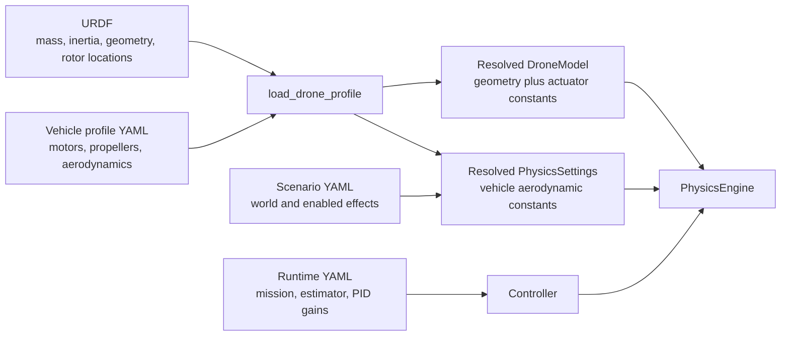

# Define a complete quadcopter: URDF, profile, scenario, and tuning

## By the end, you will be able to

- Put every drone property in one authoritative configuration source.
- Distinguish rigid-body geometry from motor, aerodynamic, and controller data.
- Create a new quadcopter profile without duplicating rotor geometry.
- Explain which changes belong in a URDF when frame size or weight changes.

---

## The simple rule: one property, one owner

You **can** place custom tags for motors, batteries, or drag inside a URDF,
but a normal URDF reader does not understand them. PyBullet reliably uses the
standard rigid-body parts: links, joints, inertial data, collision geometry,
and visual geometry. Keep the rest in a companion vehicle profile.



The profile loader is the **seam** between a portable URDF and the course's
physics implementation. Its small interface is `load_drone_profile(name)`;
it hides XML parsing and produces one resolved model for every caller.

---

## Ownership table

| Property | Authoritative source | Why |
| --- | --- | --- |
| Mass, center of mass, inertia tensor | URDF `<inertial>` block | PyBullet uses this rigid-body data directly. |
| Body/arm geometry and collision shape | URDF `<visual>` and `<collision>` blocks | They describe where the physical body exists. |
| Rotor location and orientation | URDF fixed `rotor_0` through `rotor_3` joints | Motor force must be applied at the actual lever arm. |
| Motor maximum RPM/thrust and response lag | Vehicle profile YAML | These are actuator measurements, not standard URDF data. |
| Propeller diameter/inertia, drag area, damping | Vehicle profile YAML | These are aerodynamic model parameters. |
| Motor CW/CCW direction | Vehicle profile YAML | It defines reaction-yaw torque sign in the mixer. |
| Gravity, wind, air density, enabled force models | Scenario YAML | They describe this simulated world, not the vehicle. |
| Camera rate, mission target, TTC settings, PID gains | Runtime YAML | They are sensor/controller tuning for one experiment. |

Do not copy a vehicle's mass, arm length, or aerodynamic coefficient into a
scenario. Select the vehicle profile there instead.

---

## What belongs in the URDF

The base link holds the total rigid-body mass and inertia. Fixed rotor links
are massless force attachment points. Their joint origins are the real motor
locations in the body frame.

```xml
<link name="base_link">
  <inertial>
    <origin xyz="0 0 0"/>
    <mass value="1.50"/>
    <inertia ixx="0.012" ixy="0" ixz="0" iyy="0.012" iyz="0" izz="0.022"/>
  </inertial>
  <collision><geometry><box size="0.22 0.14 0.06"/></geometry></collision>
</link>

<link name="rotor_0"><inertial><mass value="0"/></inertial></link>
<joint name="rotor_0_joint" type="fixed">
  <parent link="base_link"/><child link="rotor_0"/>
  <origin xyz="0.12 0.12 0.025"/>
</joint>
```

The course requires four direct fixed joints named `rotor_0_joint` through
`rotor_3_joint`, each connecting `base_link` to its matching rotor link. The
loader reads them in that order. The physics engine applies each propeller
force to the matching PyBullet link, and the mixer uses those same coordinates
to calculate roll and pitch torque.

---

## What belongs in the vehicle profile

The profile references one URDF and adds hardware data the standard URDF does
not define:

```yaml
name: seven_inch_trainer
urdf: seven_inch_trainer.urdf
actuators:
  max_rpm: 20000.0
  max_thrust_per_motor_n: 12.0
  motor_time_constant_s: 0.07
  rotor_drag_coefficient: 0.000003
  motor_yaw_signs: [1, -1, -1, 1]
aerodynamics:
  propeller_diameter_m: 0.1778
  body_drag_cd_area_m2: [0.020, 0.020, 0.030]
  angular_damping_nm_per_rad_s: [0.0018, 0.0018, 0.0030]
  rotor_inertia_kg_m2: 0.000008
```

`motor_yaw_signs` must have four values in `rotor_0` to `rotor_3` order. Equal
thrust then produces zero net yaw torque when CW and CCW motors alternate.

---

## When a drone changes

| Real-world change | Update URDF | Update vehicle profile | Retune runtime control |
| --- | --- | --- | --- |
| Heavier battery or payload | Mass, center of mass, inertia | Usually no | Yes: hover and altitude PID response. |
| Longer/wider frame | Rotor joint origins, visuals, collision, inertia | Usually no | Yes: roll/pitch authority changes. |
| New motors or propellers | No, unless geometry changes | RPM, thrust, lag, yaw direction, propeller diameter/inertia | Yes: thrust range and attitude response change. |
| Larger body or camera mount | Collision/visual geometry, inertia | Drag area and damping if measured | Possibly. |
| Windy day or a new test target | No | No | Scenario only. |

Weight affects hover force through (T_{hover}=mg). Frame size changes both
the inertia tensor and the rotor lever arms, so it affects how quickly the
drone can rotate. The new mixer reads lever arms from URDF; no profile arm
length is required.

---

## Inspect the resolved vehicle

Run either built-in profile:

```bash
uv run python examples/02-urdf-engine/inspect_vehicle_profile.py default
uv run python examples/02-urdf-engine/inspect_vehicle_profile.py seven_inch_trainer
```

```python
--8<-- "examples/02-urdf-engine/inspect_vehicle_profile.py"
```

Compare the output. Mass, center of mass, inertia, and rotor coordinates come
from the URDF. Motor and propeller values come from YAML.

---

## Hands-on: create a safe profile variation

1. Copy `seven_inch_trainer.urdf` and its profile under new names.
2. Move all four rotor joint origins farther from the center by the same scale.
3. Update visual arms and the inertia tensor in the copied URDF.
4. Run the inspection script. Confirm the four printed rotor coordinates
   changed without adding an arm-length field to YAML.
5. Change one profile motor value, such as `max_thrust_per_motor_n`, and
   confirm the geometry output does not change.

---

## Review quiz

<form class="quiz" data-answer="b" data-explanation="Mass, center of mass, and inertia describe the rigid body that PyBullet loads from URDF.">
  <fieldset><legend>1. Where does a drone's mass belong?</legend><label><input type="radio" name="drone-definition-q1" value="a"> Scenario YAML</label><br><label><input type="radio" name="drone-definition-q1" value="b"> URDF inertial block</label><br><label><input type="radio" name="drone-definition-q1" value="c"> PID gains</label></fieldset><button type="button" class="quiz-check">Check answer</button><p class="quiz-result" aria-live="polite"></p>
</form>

<form class="quiz" data-answer="c" data-explanation="Motor capability and lag are non-standard actuator data, so they belong in the companion vehicle profile.">
  <fieldset><legend>2. Where does motor response lag belong?</legend><label><input type="radio" name="drone-definition-q2" value="a"> Collision geometry</label><br><label><input type="radio" name="drone-definition-q2" value="b"> Wind scenario setting</label><br><label><input type="radio" name="drone-definition-q2" value="c"> Vehicle profile YAML</label></fieldset><button type="button" class="quiz-check">Check answer</button><p class="quiz-result" aria-live="polite"></p>
</form>

<form class="quiz" data-answer="a" data-explanation="Rotor joint origins are the source of truth for force locations and therefore torque lever arms.">
  <fieldset><legend>3. You lengthen a quadcopter frame. Which data must change?</legend><label><input type="radio" name="drone-definition-q3" value="a"> URDF rotor joint origins and inertia</label><br><label><input type="radio" name="drone-definition-q3" value="b"> Only the PID integral gain</label><br><label><input type="radio" name="drone-definition-q3" value="c"> Only the wind value</label></fieldset><button type="button" class="quiz-check">Check answer</button><p class="quiz-result" aria-live="polite"></p>
</form>

---

Previous: [real racing-quad case study](../real-drone/index.md). Back to the [Module 2 overview](../index.md). Next: [Module 3: propeller aerodynamics](../../03-propeller-aerodynamics/index.md).
