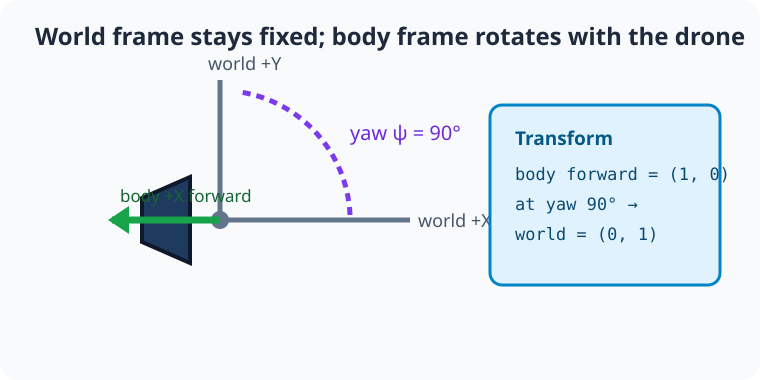
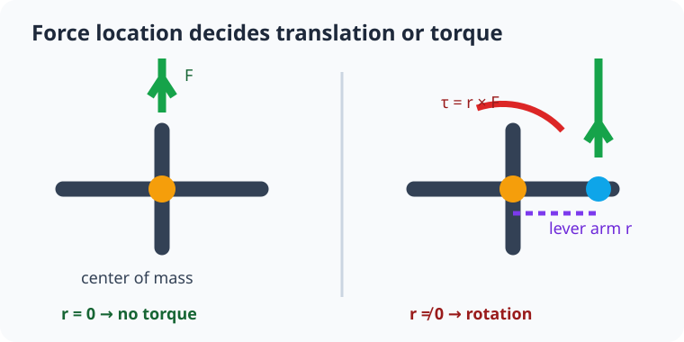
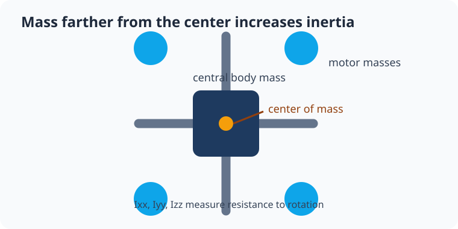

# Module 2: 3-D state, frames, URDF, and torque

## By the end, you will be able to

- Describe drone position and velocity as 3-D state vectors.
- Distinguish the fixed world frame from the rotating drone body frame.
- Explain center of mass, force, torque, and diagonal inertia.
- Load a 650 g quadcopter URDF and observe off-axis rotation.

---

## From a falling cube to a 3-D drone

Module 1 used one vertical coordinate. A drone moves in three dimensions, so
its position and velocity become vectors:

```text
p = [x, y, z]          position in metres
v = [vx, vy, vz]       velocity in metres per second
a = [ax, ay, az]       acceleration in metres per second squared
```

For now, keep the drone level. Its only attitude change is **yaw**: turning its
heading around the vertical Z axis. Roll and pitch arrive later with control.

---

## World frame and body frame

The **world frame** is fixed to the room: `+X`, `+Y`, and `+Z` never move. The
**body frame** is fixed to the drone: its forward, right, and up directions
turn with it. A motor force described as “forward” in the body frame must be
converted to the world frame before PyBullet can move the drone correctly.



For a level drone yawed by angle `ψ`, transform a horizontal body vector into a
world vector with:

```text
Rz(ψ) = [ cos ψ  −sin ψ ]
        [ sin ψ   cos ψ ]

v_world = Rz(ψ) × v_body
```

At `ψ = 90°`, body forward `[1, 0]` becomes world `[0, 1]`.


---

## Force, center of mass, and torque

A **force** changes linear motion. A force applied through the center of mass
has no turning effect. A force applied away from the center has a lever arm `r`
and creates **torque**:

```text
τ = r × F
```



In the image, the yellow point is the center of mass. The blue point is a motor
location. The same upward motor force can lift the entire drone and rotate it
because it is not applied at the center.

---

## Inertia and the physical blueprint

Mass determines resistance to translation. **Moment of inertia** determines
resistance to rotation. `Ixx`, `Iyy`, and `Izz` describe rotation around the
body X, Y, and Z axes.

The course drone is a 650 g one-link rigid body. Its calculation model is a
450 g central `0.12 × 0.12 × 0.04 m` box plus four 50 g motor masses at
`±0.12 m` in X and Y. The parallel-axis contribution of each motor is added to
the central box inertia, giving:

```text
Ixx = Iyy = 0.00348 kg·m²
Izz = 0.00396 kg·m²
```




---

## Important PyBullet methods

| Method | Short description |
| --- | --- |
| `p.loadURDF()` | Load a physical body from a URDF file. |
| `p.getBasePositionAndOrientation()` | Read world position and quaternion orientation. |
| `p.getBaseVelocity()` | Read linear and angular velocity. |
| `p.getDynamicsInfo()` | Read mass and inertia from PyBullet. |
| `p.applyExternalForce()` | Apply a force at a specified point. |
| `p.applyExternalTorque()` | Apply a direct turning effect. |
| `p.getQuaternionFromEuler()` | Create an orientation from roll, pitch, yaw angles. |

---

## Experiment 1: frames and state

Run a level drone with `90°` yaw. In GUI mode, world axes and the transformed
body-forward direction are drawn around the drone.

```bash
uv run python examples/02-urdf-engine/frames_state.py
```

```python
--8<-- "examples/02-urdf-engine/frames_state.py"
```

The headless check verifies that body forward `[1, 0, 0]` becomes world
`[0, 1, 0]` at `90°` yaw.

---

## Experiment 2: load the drone and inspect inertia

```bash
uv run python examples/02-urdf-engine/urdf_inertia.py
```

```python
--8<-- "examples/02-urdf-engine/urdf_inertia.py"
```

The URDF is intentionally one rigid link. Its arms and blue motor markers are
visual geometry; its mass and inertia live in one `<inertial>` block. This lets
you inspect a stable physical asset before adding separate motor links.

---

## Experiment 3: off-axis force creates torque

```bash
uv run python examples/02-urdf-engine/off_axis_torque.py
```

```python
--8<-- "examples/02-urdf-engine/off_axis_torque.py"
```

The script runs three trials with gravity disabled:

| Trial | Applied action | Expected result |
| --- | --- | --- |
| Center force | Upward force at the center of mass | Translation, no rotation |
| Off-axis force | Same force at a motor marker | Translation plus roll/pitch rotation |
| Direct torque | Torque matching the force lever arm | Rotation without needing a force point |

This is the mechanical reason four motor locations matter. Later, changing
individual motor thrust will create the roll, pitch, and yaw commands.

---

## Hands-on: rotate and twist the drone

1. Change `YAW_DEGREES` in `frames_state.py` from `90` to `45`. Predict the
   world direction of body forward, then run the headless example after updating
   its expected assertion.
2. In `off_axis_torque.py`, change `ARM_OFFSET` from `0.12` to `0.06`. Predict
   whether the rotation becomes weaker or stronger, then compare the printed
   angle.
3. Move the force point to `(0, 0, 0)`. Explain why the torque disappears even
   though upward force remains.

---

## Review quiz

<form class="quiz" data-answer="b" data-explanation="The world frame is fixed to the environment; the body frame rotates with the drone.">
  <fieldset><legend>1. Which frame rotates when a drone changes yaw?</legend><label><input type="radio" name="q1" value="a"> World frame</label><br><label><input type="radio" name="q1" value="b"> Body frame</label><br><label><input type="radio" name="q1" value="c"> Neither frame</label></fieldset><button type="button" class="quiz-check">Check answer</button><p class="quiz-result" aria-live="polite"></p>
</form>

<form class="quiz" data-answer="a" data-explanation="At 90 degrees yaw, the body forward X direction points along world positive Y.">
  <fieldset><legend>2. At 90° yaw, where does body forward <span class="arithmatex">\(\begin{bmatrix}1 \\ 0\end{bmatrix}\)</span> point in the world?</legend><label><input type="radio" name="q2" value="a"> <span class="arithmatex">\(\begin{bmatrix}0 \\ 1\end{bmatrix}\)</span></label><br><label><input type="radio" name="q2" value="b"> <span class="arithmatex">\(\begin{bmatrix}1 \\ 0\end{bmatrix}\)</span></label><br><label><input type="radio" name="q2" value="c"> <span class="arithmatex">\(\begin{bmatrix}0 \\ -1\end{bmatrix}\)</span></label></fieldset><button type="button" class="quiz-check">Check answer</button><p class="quiz-result" aria-live="polite"></p>
</form>

<form class="quiz" data-answer="c" data-explanation="Torque is the turning effect caused by a force with a nonzero lever arm.">
  <fieldset><legend>3. What equation describes torque from a force location?</legend><label><input type="radio" name="q3" value="a"> <span class="arithmatex">\(\tau = m / F\)</span></label><br><label><input type="radio" name="q3" value="b"> <span class="arithmatex">\(\tau = F / r\)</span></label><br><label><input type="radio" name="q3" value="c"> <span class="arithmatex">\(\boldsymbol{\tau} = \mathbf{r} \times \mathbf{F}\)</span></label></fieldset><button type="button" class="quiz-check">Check answer</button><p class="quiz-result" aria-live="polite"></p>
</form>

<form class="quiz" data-answer="b" data-explanation="A force through the center of mass has zero lever arm and therefore no torque.">
  <fieldset><legend>4. What does an upward force through the center of mass do?</legend><label><input type="radio" name="q4" value="a"> Rotates only</label><br><label><input type="radio" name="q4" value="b"> Translates without rotating</label><br><label><input type="radio" name="q4" value="c"> Does nothing</label></fieldset><button type="button" class="quiz-check">Check answer</button><p class="quiz-result" aria-live="polite"></p>
</form>

<form class="quiz" data-answer="a" data-explanation="Moment of inertia measures resistance to changes in rotational motion.">
  <fieldset><legend>5. What do <span class="arithmatex">\(I_{xx}\)</span>, <span class="arithmatex">\(I_{yy}\)</span>, and <span class="arithmatex">\(I_{zz}\)</span> describe?</legend><label><input type="radio" name="q5" value="a"> Resistance to rotation about body axes</label><br><label><input type="radio" name="q5" value="b"> The drone's GPS position</label><br><label><input type="radio" name="q5" value="c"> Motor battery voltage</label></fieldset><button type="button" class="quiz-check">Check answer</button><p class="quiz-result" aria-live="polite"></p>
</form>

---

## Advanced quiz

<form class="quiz" data-answer="c" data-explanation="With the same force, a shorter lever arm produces less torque because τ = r × F.">
  <fieldset><legend>1. What happens to torque if the motor is moved closer to the center of mass?</legend><label><input type="radio" name="advanced-q1" value="a"> It increases</label><br><label><input type="radio" name="advanced-q1" value="b"> It stays the same</label><br><label><input type="radio" name="advanced-q1" value="c"> It decreases</label></fieldset><button type="button" class="quiz-check">Check answer</button><p class="quiz-result" aria-live="polite"></p>
</form>

<form class="quiz" data-answer="b" data-explanation="The body visual geometry and the inertial properties are separate concepts in URDF.">
  <fieldset><legend>2. Which URDF block defines mass and inertia?</legend><label><input type="radio" name="advanced-q2" value="a"> &lt;visual&gt;</label><br><label><input type="radio" name="advanced-q2" value="b"> &lt;inertial&gt;</label><br><label><input type="radio" name="advanced-q2" value="c"> &lt;material&gt;</label></fieldset><button type="button" class="quiz-check">Check answer</button><p class="quiz-result" aria-live="polite"></p>
</form>

<form class="quiz" data-answer="a" data-explanation="The force creates translation, while the nonzero lever arm separately creates torque and rotation.">
  <fieldset><legend>3. Why does an off-axis motor force both lift and rotate a drone?</legend><label><input type="radio" name="advanced-q3" value="a"> It has force and a nonzero lever arm</label><br><label><input type="radio" name="advanced-q3" value="b"> Gravity disappears</label><br><label><input type="radio" name="advanced-q3" value="c"> Its mass becomes zero</label></fieldset><button type="button" class="quiz-check">Check answer</button><p class="quiz-result" aria-live="polite"></p>
</form>

<form class="quiz" data-answer="c" data-explanation="The world vector must be transformed because body forward rotates with yaw while the world axes do not.">
  <fieldset><legend>4. Why transform a body-frame force into the world frame?</legend><label><input type="radio" name="advanced-q4" value="a"> To change kilograms into newtons</label><br><label><input type="radio" name="advanced-q4" value="b"> To remove gravity</label><br><label><input type="radio" name="advanced-q4" value="c"> To account for the drone's orientation</label></fieldset><button type="button" class="quiz-check">Check answer</button><p class="quiz-result" aria-live="polite"></p>
</form>

<form class="quiz" data-answer="b" data-explanation="Mass farther from an axis raises moment of inertia, making the same torque produce less angular acceleration.">
  <fieldset><legend>5. What happens when motor mass moves farther from the center?</legend><label><input type="radio" name="advanced-q5" value="a"> Inertia decreases</label><br><label><input type="radio" name="advanced-q5" value="b"> Inertia increases</label><br><label><input type="radio" name="advanced-q5" value="c"> Gravity reverses</label></fieldset><button type="button" class="quiz-check">Check answer</button><p class="quiz-result" aria-live="polite"></p>
</form>

---

Prerequisite: [Module 1: Mass and external forces](../01-mass-and-forces/index.md). Next: [Module 3: Propeller aerodynamics](../03-propeller-aerodynamics/index.md).
