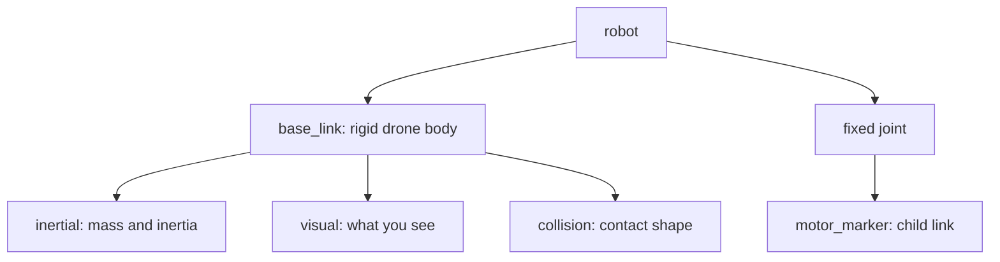

# URDF anatomy: describe one physical drone

## By the end, you will be able to

- Read the hierarchy of a URDF file.
- Separate physical, visual, collision, and connection data.
- Change an isolated drone property and verify it in PyBullet.

---

## The structure of a URDF

URDF means **Unified Robot Description Format**. A file starts with one
`&lt;robot&gt;` element. Inside it, **links** describe rigid bodies and **joints**
connect links into a robot tree.



The course's small anatomy drone contains one physical base link and one
massless motor marker. It is deliberately separate from later examples, so it
is safe to edit.

```xml
--8<-- "examples/02-urdf-engine/assets/anatomy_drone.urdf"
```

---

## Every important block

| Block | What it describes | Physics effect |
| --- | --- | --- |
| <code>&lt;robot&gt;</code> | The root container and robot name | Groups links and joints. |
| <code>&lt;link&gt;</code> | One rigid body | Creates a body or part of a body. |
| <code>&lt;inertial&gt;</code> | Mass, center of mass, inertia tensor | Changes acceleration and rotation. |
| <code>&lt;visual&gt;</code> | Geometry and material color | Appearance only. |
| <code>&lt;collision&gt;</code> | Contact geometry | Determines collisions with the ground and obstacles. |
| <code>&lt;joint&gt;</code> | Parent/child connection and its type | Defines how links move together. |

The base link's <code>&lt;inertial&gt;</code> block uses kilograms for mass and
kilogram-metre-squared for inertia. The marker's mass is zero because it exists
only as a named motor location.

For a fixed joint, the child marker has the same motion as the base. Its
<code>&lt;origin xyz="0.12 0.12 0"/&gt;</code> says where that marker sits in the base frame.

---

## Example: ask PyBullet what it loaded

```bash
uv run python examples/02-urdf-engine/inspect_urdf.py
```

The script reads the base mass and inertia through `p.getDynamicsInfo()` and
prints the fixed joint's child link. It asserts the expected `0.65 kg` mass and
one joint, so a malformed edit fails early.

```python
--8<-- "examples/02-urdf-engine/inspect_urdf.py"
```

---

## Hands-on: edit safely

1. In `anatomy_drone.urdf`, change base mass from `0.65` to `0.80`, then run
   the inspection script. Update its assertion only after explaining why the
   printed mass changed.
2. Change the motor marker joint origin from `0.12 0.12 0` to `0.18 0.12 0`.
   Predict which printed position changes, then run the script.
3. Change the base <code>&lt;visual&gt;</code> color. Explain why the mass and inertia output
   should remain unchanged.

---

## Review quiz

<form class="quiz" data-answer="b" data-explanation="The inertial block supplies mass, center-of-mass origin, and inertia to the physics engine.">
  <fieldset><legend>1. Which URDF block changes the rigid body's mass?</legend><label><input type="radio" name="anatomy-q1" value="a"> &lt;visual&gt;</label><br><label><input type="radio" name="anatomy-q1" value="b"> &lt;inertial&gt;</label><br><label><input type="radio" name="anatomy-q1" value="c"> &lt;material&gt;</label></fieldset><button type="button" class="quiz-check">Check answer</button><p class="quiz-result" aria-live="polite"></p>
</form>

<form class="quiz" data-answer="a" data-explanation="Visual geometry changes what is drawn, while collision geometry and inertial data determine simulation behavior.">
  <fieldset><legend>2. Which block can change color without changing mass?</legend><label><input type="radio" name="anatomy-q2" value="a"> &lt;visual&gt;</label><br><label><input type="radio" name="anatomy-q2" value="b"> &lt;inertial&gt;</label><br><label><input type="radio" name="anatomy-q2" value="c"> &lt;joint&gt;</label></fieldset><button type="button" class="quiz-check">Check answer</button><p class="quiz-result" aria-live="polite"></p>
</form>

<form class="quiz" data-answer="c" data-explanation="A fixed joint locks the relative pose, so the marker moves and rotates with its parent body.">
  <fieldset><legend>3. What does the fixed motor-marker joint do?</legend><label><input type="radio" name="anatomy-q3" value="a"> Makes the marker fall independently</label><br><label><input type="radio" name="anatomy-q3" value="b"> Adds motor thrust automatically</label><br><label><input type="radio" name="anatomy-q3" value="c"> Keeps the marker attached to the base</label></fieldset><button type="button" class="quiz-check">Check answer</button><p class="quiz-result" aria-live="polite"></p>
</form>

---

Back to the [Module 2 overview](../index.md). Next: [real racing-quad case study](../real-drone/index.md).
