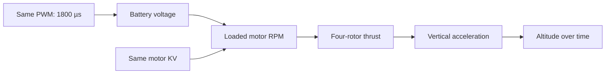
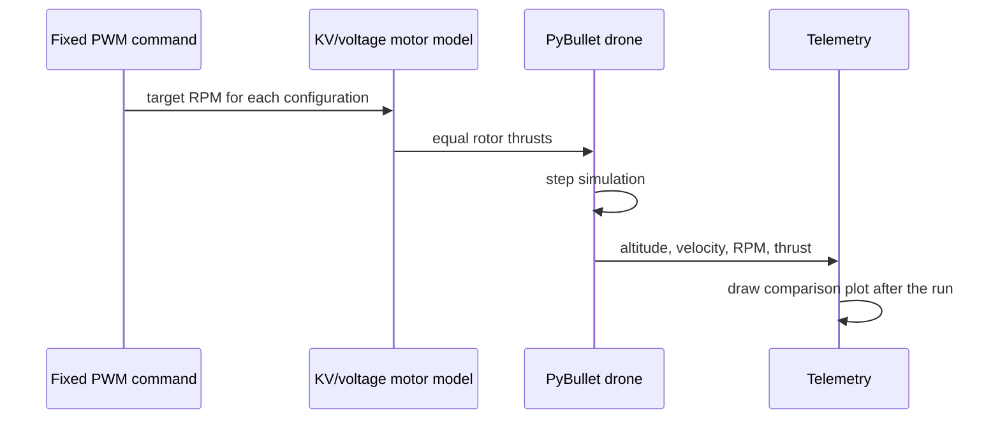

# Configuration takeoff comparison

This experiment launches two identical 5-inch drone frames with the same
`1800 µs` PWM command. One uses a 6S battery and the other uses 4S. Both use
1750 KV motors and 5×4.3×3 propellers.

## By the end, you will be able to

- Predict how battery voltage changes motor RPM at the same PWM.
- Compare two takeoff trajectories using altitude, speed, RPM, and thrust.
- Explain why the 6S configuration has more excess thrust in this model.
- Identify what the teaching motor model does not simulate.



---

## The two configurations

| Property | 6S reference | 4S comparison | Why it matters |
| --- | --- | --- | --- |
| Frame mass | 0.65 kg | 0.65 kg | Weight stays equal |
| Motor | 1750 KV | 1750 KV | KV stays equal |
| Propeller | 5×4.3×3 | 5×4.3×3 | Propeller load stays equal |
| Nominal voltage | 22.2 V | 14.8 V | This is the only power-system change |
| PWM command | 1800 µs | 1800 µs | Both receive the same throttle request |

The model calculates nominal voltage and then estimates loaded maximum RPM:

$$V = N_{cells}\times3.7,$$

$$\mathrm{RPM}_{loaded,max}=K_VV\times0.8.$$

The `0.8` value is a teaching load factor: a propeller prevents a real motor
from reaching no-load RPM. Thrust follows the squared RPM model:

$$T_{rotor}=k_T\,\mathrm{RPM}^2,$$

$$T_{drone}=4T_{rotor}.$$

---

## Run it

Open the side-by-side PyBullet view:

```bash
uv run python examples/03-propeller-aerodynamics/configuration_takeoff_comparison.py
```

Run the reproducible headless version and save a plot:

```bash
uv run python examples/03-propeller-aerodynamics/configuration_takeoff_comparison.py --headless
```

Try a different fixed throttle or output location:

```bash
uv run python examples/03-propeller-aerodynamics/configuration_takeoff_comparison.py \
  --headless --pwm 1750 --seconds 3 \
  --plot outputs/kv_voltage_1750us.png
```

The default plot is saved to:

```text
outputs/configuration_takeoff_comparison.png
```

---

## What to expect

At the same PWM, the 6S configuration has higher voltage. With the same 1750
KV motors, its target RPM is higher. The squared thrust equation amplifies that
RPM difference, so the 6S drone has much more thrust above its weight and
climbs faster.

The saved PNG has three panels:

| Panel | What to compare |
| --- | --- |
| Altitude | The 6S line should rise much faster and finish higher. |
| Vertical velocity | The 6S line shows stronger upward acceleration. |
| Thrust and RPM | Solid lines use the left thrust axis; dashed lines use the right RPM axis. Higher RPM produces higher thrust. |

The 4S vehicle still lifts off at the default command, but it has much less
excess thrust. At a lower PWM it may remain on the ground while the 6S model
climbs. That is a useful observation, not a failure of the script.

---

## How the code works

`MotorConfiguration` keeps the battery cells, KV, propeller label, and display
color together. The same `target_rpm()` function receives the PWM command for
both drones, but each configuration has a different voltage-based maximum RPM.

```python
def target_rpm(configuration, pwm):
    throttle = (pwm - PWM_MIN) / (PWM_MAX - PWM_MIN)
    return throttle * loaded_max_rpm(configuration)
```

`update_rpm()` adds a short motor-response delay rather than changing RPM
instantly. `rotor_thrust()` squares that RPM. `apply_collective_thrust()` sends
the same force to each of the four rotor links, so the lesson isolates vertical
motion instead of teaching roll, pitch, or yaw.

The main loop repeats this sequence at the existing 240 Hz physics timestep:



---

## Model limits

This is an educational comparison. It does not include battery voltage sag,
motor winding resistance, ESC current limits, motor heating, propeller
efficiency curves, or detailed thrust-stand data. Module 5 adds voltage sag.
For a real build, use motor and propeller manufacturer data before selecting
components.

---

## Hands-on

1. Run the default 1800 µs comparison and inspect all three plot panels.
2. Run again at 1750 µs. Which configuration still has clear excess thrust?
3. In `configuration_takeoff_comparison.py`, temporarily change the 4S motor
   from 1750 KV to 2550 KV. Predict the result, run it, and compare its RPM
   with the 6S/1750 KV line.
4. Explain why similar RPM does not prove that two real-world builds have the
   same current draw, battery sag, or flight time.

---

## Quiz

<form class="quiz" data-answer="b" data-explanation="The comparison keeps KV and propeller constant, so nominal battery voltage is the intended difference.">
  <fieldset><legend>1. What changes between the two default drones?</legend><label><input type="radio" name="comparison-q1" value="a"> Frame mass</label><br><label><input type="radio" name="comparison-q1" value="b"> Battery voltage</label><br><label><input type="radio" name="comparison-q1" value="c"> Propeller diameter</label></fieldset><button type="button" class="quiz-check">Check answer</button><p class="quiz-result" aria-live="polite"></p>
</form>
<form class="quiz" data-answer="a" data-explanation="The same 1750 KV motor receives more voltage on 6S, so its ideal and loaded RPM are higher in this model.">
  <fieldset><legend>2. Why does the 6S motor reach higher RPM at the same PWM?</legend><label><input type="radio" name="comparison-q2" value="a"> It receives higher battery voltage</label><br><label><input type="radio" name="comparison-q2" value="b"> It has lower KV</label><br><label><input type="radio" name="comparison-q2" value="c"> It has more mass</label></fieldset><button type="button" class="quiz-check">Check answer</button><p class="quiz-result" aria-live="polite"></p>
</form>
<form class="quiz" data-answer="c" data-explanation="Thrust scales with RPM squared in the teaching model, so an RPM difference becomes a larger thrust difference.">
  <fieldset><legend>3. Why is the thrust difference larger than the RPM difference?</legend><label><input type="radio" name="comparison-q3" value="a"> Gravity changes on 6S</label><br><label><input type="radio" name="comparison-q3" value="b"> The frame becomes lighter</label><br><label><input type="radio" name="comparison-q3" value="c"> Thrust uses squared RPM</label></fieldset><button type="button" class="quiz-check">Check answer</button><p class="quiz-result" aria-live="polite"></p>
</form>
<form class="quiz" data-answer="b" data-explanation="Changing 4S/1750 KV to 4S/2550 KV raises its no-load RPM, but real current, heat, and battery behavior can still differ.">
  <fieldset><legend>4. What is the reason to try 4S with 2550 KV?</legend><label><input type="radio" name="comparison-q4" value="a"> To remove the propeller</label><br><label><input type="radio" name="comparison-q4" value="b"> To partly compensate for lower voltage with higher KV</label><br><label><input type="radio" name="comparison-q4" value="c"> To make the drone heavier</label></fieldset><button type="button" class="quiz-check">Check answer</button><p class="quiz-result" aria-live="polite"></p>
</form>

---

Back to [Motor KV](../motor-kv/index.md). Next: [Module 5: Battery voltage sag](../../05-battery-voltage-sag/index.md).
