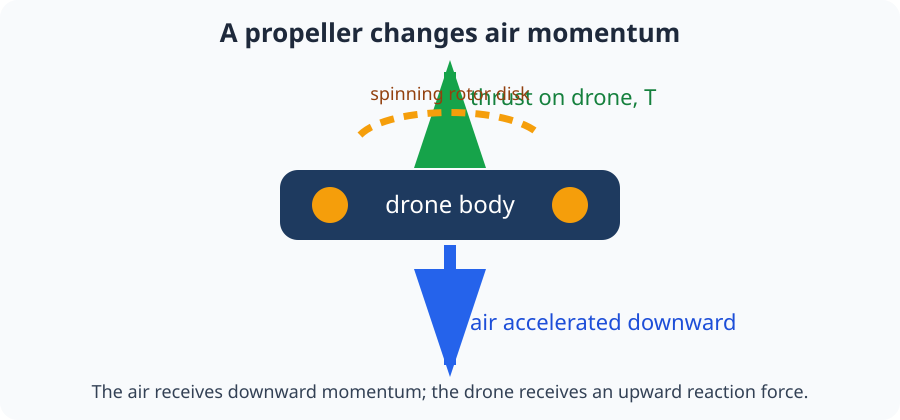
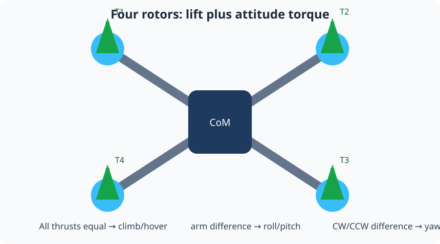

# Module 3: Propeller dynamics and aerodynamics

This module explains how a spinning propeller turns motor energy into the
forces and torques that move a quadcopter. We begin with “push air down, get
pushed up”, then add equations and experiments one piece at a time.

## By the end, you will be able to

- Explain how a propeller creates thrust in everyday language.
- Convert PWM to an approximate RPM and thrust value.
- Explain motor KV and select a sensible KV/voltage pair for a 5-inch frame.
- Use SI units for speed, force, torque, power, and propeller size.
- Explain how diameter, pitch, and blade count affect performance.
- Calculate ideal induced velocity with a momentum-theory model.
- Calculate rotor reaction torque and the total force/torque of four rotors.
- Tell which parts are teaching approximations and which require calibration.

**Prerequisite:** [Module 2: URDF engine](../02-urdf-engine/index.md). You
will use its center of mass, arm positions, body frame, and torque ideas.

---

## 1. What a propeller does

Imagine waving your hand downward through water. Your hand pushes water down,
and the water pushes your hand up. A propeller does the same thing with air,
continuously and much faster.



The four-step story is:

1. The motor spins the propeller.
2. The blades push air downward.
3. The air gains downward momentum.
4. The equal-and-opposite reaction force pushes the drone upward.

For a level drone, total thrust (T) competes with weight (mg):

```text
T > mg  → the drone accelerates upward
T = mg  → the drone can hover
T < mg  → the drone accelerates downward
```

For the course drone ((m=0.65\ \mathrm{kg})), the hover force is

$$W = mg = 0.65\times 9.81 \approx 6.38\ \mathrm{N}.$$

With four identical rotors, each rotor supplies about (1.60\ \mathrm{N}) in
ideal level hover.

---

## 2. Units and quantities

Use SI units so that equations agree with the PyBullet model:

| Quantity | Symbol | SI unit | Meaning |
| --- | --- | --- | --- |
| Motor angular speed | \(\omega\) | rad/s | How fast the shaft rotates |
| Motor speed | RPM | rev/min | A convenient motor label |
| Rotor thrust | \(T\) | N | Upward force from one rotor |
| Reaction torque | \(Q\) | N m | Twisting effect from one rotor |
| Mechanical power | \(P\) | W | Energy transferred each second |
| Propeller diameter | \(D\) | m | Tip-to-tip rotor size |
| Air density | \(\rho\) | kg/m³ | Mass of air in a volume |

RPM and angular speed are different labels for rotation:

$$\omega = \frac{2\pi\,\mathrm{RPM}}{60}.$$

Do not call PWM “thrust”. PWM is an electrical command in microseconds; thrust
is a physical force in newtons. The simulator converts one to the other with a
calibrated model.

---

## 3. From PWM to RPM to thrust

The complete teaching chain is:


The first model assumes thrust is proportional to the square of angular speed:

$$T_i = k_T\omega_i^2.$$

This makes sense for a beginner: doubling rotor speed produces much more than
double thrust. It is not a universal law. The coefficient (k_T) depends on
the propeller, motor, battery voltage, air density, and measurement setup.

The course simulator uses a PWM range of 1000–2000 µs, then applies the same
quadratic relationship through its RPM and thrust helpers. Its teaching
coefficient is fitted to the simulator's RPM-like value; a hardware model
would convert RPM to rad/s before identifying a physical coefficient.

### Hands-on: draw a thrust curve

```bash
uv run python examples/03-propeller-aerodynamics/pwm_thrust_curve.py
```

Record minimum PWM, midpoint PWM, and maximum PWM. Explain why midpoint command
is not necessarily half of maximum thrust. Try `--steps 21` and estimate the
PWM needed for one quarter of the drone's hover force.


Continue with [Motor KV: from theory to practice](motor-kv/index.md) to connect
battery voltage and motor RPM, then study
[Propeller geometry and airflow](propeller-design/index.md). Run the
[configuration takeoff comparison](configuration-comparison/index.md) to see
how the same PWM produces different takeoff trajectories on 4S and 6S.

---

## 4. Reaction torque, power, and yaw

The propeller resists the motor's rotation. A simple model is

$$Q_i = k_Q\omega_i^2,$$

and mechanical power is approximately

$$P_i = Q_i\omega_i.$$

Thrust translates the drone. Reaction torque twists it around body (z). A
quadcopter alternates CW and CCW propellers so equal rotor speeds approximately
cancel yaw torques.

```bash
uv run python examples/03-propeller-aerodynamics/reaction_torque.py
```

The equal-speed result should be nearly zero yaw torque. Speeding one rotor up
breaks the balance and creates a yaw command. The exact positive sign follows
the motor-direction tuple in `examples/common/drone_model.py`.

---

## 5. Four rotors: force, lever arm, and attitude

Each rotor applies an upward force at a different arm position. Because it is
offset from the center of mass, it can create torque:

$$\boldsymbol{\tau}_i = \mathbf r_i \times \mathbf F_i.$$



| Rotor change | Main effect |
| --- | --- |
| All four increase equally | More collective thrust; climb if above weight |
| Left/right thrust imbalance | Roll torque |
| Front/rear thrust imbalance | Pitch torque |
| CW/CCW pair imbalance | Yaw reaction torque |

Run the force calculator:

```bash
uv run python examples/03-propeller-aerodynamics/four_rotor_forces.py
uv run python examples/03-propeller-aerodynamics/four_rotor_forces.py 1.8 1.6 1.6 1.8
```

Write down the predicted attitude change before running it. This is the force
model; Module 4 turns the same relationships into a mixer and PID controller.

---

## 6. What this model leaves out

The equations do not simulate motor electrical dynamics, battery-voltage sag,
blade shape, non-uniform inflow, ground effect, wind, or vehicle drag. Module
4 introduces vehicle drag, wind-relative velocity, mixing, and PID control.
Module 5 adds voltage sag. A real vehicle needs measured thrust and torque data
to calibrate (k_T), (k_Q), and motor response time.

---

## Review quiz

<form class="quiz" data-answer="b" data-explanation="The propeller accelerates air downward; the air reacts upward on the propeller and drone.">
  <fieldset><legend>1. What does a hovering propeller do to the air?</legend><label><input type="radio" name="prop-q1" value="a"> It accelerates air upward</label><br><label><input type="radio" name="prop-q1" value="b"> It accelerates air downward</label><br><label><input type="radio" name="prop-q1" value="c"> It leaves the air still</label></fieldset><button type="button" class="quiz-check">Check answer</button><p class="quiz-result" aria-live="polite"></p>
</form>
<form class="quiz" data-answer="c" data-explanation="PWM is a command in microseconds; thrust is a physical force in newtons.">
  <fieldset><legend>2. Which quantity is measured in newtons?</legend><label><input type="radio" name="prop-q2" value="a"> PWM</label><br><label><input type="radio" name="prop-q2" value="b"> RPM</label><br><label><input type="radio" name="prop-q2" value="c"> Thrust</label></fieldset><button type="button" class="quiz-check">Check answer</button><p class="quiz-result" aria-live="polite"></p>
</form>
<form class="quiz" data-answer="a" data-explanation="Hover needs total thrust equal to weight, T = mg.">
  <fieldset><legend>3. What condition describes level hover?</legend><label><input type="radio" name="prop-q3" value="a"> Total thrust equals weight</label><br><label><input type="radio" name="prop-q3" value="b"> Total thrust is zero</label><br><label><input type="radio" name="prop-q3" value="c"> Weight is zero</label></fieldset><button type="button" class="quiz-check">Check answer</button><p class="quiz-result" aria-live="polite"></p>
</form>
<form class="quiz" data-answer="b" data-explanation="The squared model means doubling omega multiplies predicted thrust by four.">
  <fieldset><legend>4. In T = kT omega², what happens when omega doubles?</legend><label><input type="radio" name="prop-q4" value="a"> Thrust doubles</label><br><label><input type="radio" name="prop-q4" value="b"> Thrust becomes four times larger</label><br><label><input type="radio" name="prop-q4" value="c"> Thrust becomes half as large</label></fieldset><button type="button" class="quiz-check">Check answer</button><p class="quiz-result" aria-live="polite"></p>
</form>
<form class="quiz" data-answer="c" data-explanation="Alternating CW and CCW rotors cancel reaction torques when their speeds match.">
  <fieldset><legend>5. Why does a quadcopter alternate CW and CCW rotors?</legend><label><input type="radio" name="prop-q5" value="a"> To remove gravity</label><br><label><input type="radio" name="prop-q5" value="b"> To make all propellers the same size</label><br><label><input type="radio" name="prop-q5" value="c"> To balance reaction torque</label></fieldset><button type="button" class="quiz-check">Check answer</button><p class="quiz-result" aria-live="polite"></p>
</form>

## Advanced quiz

<form class="quiz" data-answer="a" data-explanation="Momentum theory gives vi = sqrt(T/(2 rho A)); increasing A lowers vi for the same thrust.">
  <fieldset><legend>1. For fixed thrust, what does a larger rotor disk area do to ideal induced velocity?</legend><label><input type="radio" name="prop-advanced-q1" value="a"> It lowers the required induced velocity</label><br><label><input type="radio" name="prop-advanced-q1" value="b"> It makes induced velocity infinite</label><br><label><input type="radio" name="prop-advanced-q1" value="c"> It has no effect</label></fieldset><button type="button" class="quiz-check">Check answer</button><p class="quiz-result" aria-live="polite"></p>
</form>
<form class="quiz" data-answer="b" data-explanation="A force through the center has no lever arm; an offset force creates r cross F torque.">
  <fieldset><legend>2. Why can one rotor force both lift and rotate the drone?</legend><label><input type="radio" name="prop-advanced-q2" value="a"> It changes the drone's mass</label><br><label><input type="radio" name="prop-advanced-q2" value="b"> It acts away from the center of mass</label><br><label><input type="radio" name="prop-advanced-q2" value="c"> It cancels gravity</label></fieldset><button type="button" class="quiz-check">Check answer</button><p class="quiz-result" aria-live="polite"></p>
</form>
<form class="quiz" data-answer="c" data-explanation="Power is torque times angular speed, P = Q omega.">
  <fieldset><legend>3. Which expression estimates rotor mechanical power?</legend><label><input type="radio" name="prop-advanced-q3" value="a"> P = mg</label><br><label><input type="radio" name="prop-advanced-q3" value="b"> P = T/D</label><br><label><input type="radio" name="prop-advanced-q3" value="c"> P = Q omega</label></fieldset><button type="button" class="quiz-check">Check answer</button><p class="quiz-result" aria-live="polite"></p>
</form>
<form class="quiz" data-answer="a" data-explanation="J compares forward speed with rotor rotation and diameter, describing changing inflow.">
  <fieldset><legend>4. What does advance ratio J describe?</legend><label><input type="radio" name="prop-advanced-q4" value="a"> Forward speed relative to rotor speed and size</label><br><label><input type="radio" name="prop-advanced-q4" value="b"> Battery charge only</label><br><label><input type="radio" name="prop-advanced-q4" value="c"> Drone mass divided by gravity</label></fieldset><button type="button" class="quiz-check">Check answer</button><p class="quiz-result" aria-live="polite"></p>
</form>
<form class="quiz" data-answer="b" data-explanation="kT and kQ depend on hardware and operating conditions, so they must be calibrated for a real vehicle.">
  <fieldset><legend>5. Why are kT and kQ not universal constants?</legend><label><input type="radio" name="prop-advanced-q5" value="a"> Newton's laws change every day</label><br><label><input type="radio" name="prop-advanced-q5" value="b"> Hardware and operating conditions change measurements</label><br><label><input type="radio" name="prop-advanced-q5" value="c"> Torque has no unit</label></fieldset><button type="button" class="quiz-check">Check answer</button><p class="quiz-result" aria-live="polite"></p>
</form>

---

Previous: [Module 2: URDF engine](../02-urdf-engine/index.md). Next:
[Module 4: Motor mixer and PID](../04-motor-mixer-pid/index.md).
