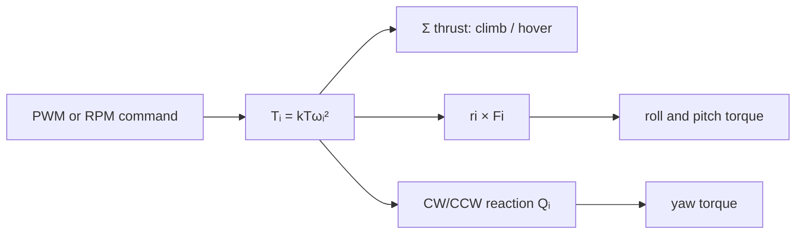

# Module 3: Propeller dynamics and aerodynamics

## By the end, you will be able to

- Map a motor command to thrust.
- Explain alternating-propeller yaw torque.
- Add velocity-opposing air drag to the simulation.
- Calculate rotor thrust, reaction torque, and lever-arm torque.

## Lessons

1. Relate propeller diameter, pitch, and blade count to performance.
2. Map PWM to quadratic thrust with a thrust coefficient (`Kt`).
3. Model CW/CCW reaction torque and environmental air drag.

---

## Rotor force and reaction torque

For a first motor model, rotor `i` has angular speed `ωᵢ` and produces

```text
Tᵢ = kT · ωᵢ²       upward thrust
Qᵢ = kQ · ωᵢ²       reaction torque
```

The collective thrust is `T = T₁ + T₂ + T₃ + T₄`. Because each rotor is away
from the center of mass, its force can also create a body torque:

```text
τᵢ = rᵢ × Fᵢ
```

The alternating CW/CCW directions make reaction torques cancel when all four
motors have equal speed. Increasing one pair changes yaw torque; increasing a
left/right or front/rear pair changes roll or pitch torque.



### Hands-on: predict the four-motor response

Use the X-frame motor mixer from Module 4 and write down the expected motion
before running it:

| Change | Expected result |
| --- | --- |
| All four motors increase equally | Climb or greater upward acceleration |
| Left/right pair imbalance | Roll |
| Front/rear pair imbalance | Pitch |
| CW pair versus CCW pair imbalance | Yaw |

Check the signs against the motor numbering and coordinate convention used by
the course; the physical effect is fixed, but the positive sign depends on the
chosen axes.

---

Prerequisite: [Module 2: URDF engine](../02-urdf-engine/index.md). Next: [Module 4: Motor mixer and PID](../04-motor-mixer-pid/index.md).
