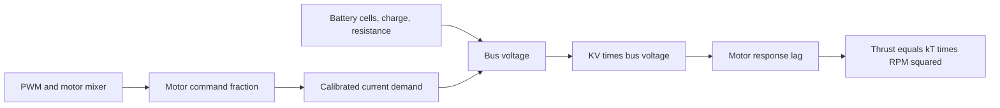

# Motor KV: from theory to practice

This Module 3 lesson connects battery voltage and motor KV to the RPM that a
propeller can reach. It uses a 5-inch FPV frame as a practical reference.

## By the end, you will be able to

- Explain what motor KV means and what it does not mean.
- Estimate no-load RPM from KV and battery voltage.
- Compare sensible 4S and 6S power-system choices for one 5-inch frame.
- Explain why KV alone cannot predict thrust.


---

## What KV means

**KV** means the motor's approximate no-load speed per volt. It is written as
RPM/V, so a 1750 KV motor supplied by a nominal 6S battery has an ideal speed
of:

$$\mathrm{RPM}_{no\ load} \approx K_V V = 1750\times(6\times3.7) = 38{,}850\ \mathrm{RPM}.$$

The propeller creates load, so real RPM is lower. Higher KV means more RPM for
the same voltage; it does not automatically mean more useful thrust. Motor
stator size, propeller, ESC current limit, battery, and airflow all decide
whether a combination is efficient, powerful, or too hot.

---

## One 5-inch frame, four combinations

The course reference build is a **5-inch frame, 6S battery, 1750 KV motors,
and 5×4.3×3 propellers**.

| Build goal | Battery and motor | Propeller | Why it is different |
| --- | --- | --- | --- |
| Reference freestyle | 6S, 1750 KV | 5×4.3×3 | Balanced starting point |
| 4S freestyle | 4S, 2550 KV | 5×4.3×3 | Similar no-load RPM with lower voltage |
| Efficient cruising | 6S, 1650 KV | 5×3.2×2 | Lower pitch and two blades reduce load |
| Aggressive racing | 6S, 2000 KV | 5×4.8×3 | Higher RPM and prop load demand more current |

The first two rows have similar no-load RPM, but they are not identical builds:
voltage sag, motor winding resistance, current, and battery behavior change
under propeller load. The racing row needs a motor and ESC rated for that
combination. Never choose a propeller from KV alone.

---

## KV inside this simulation

The shared flight engine now uses KV as the link between a battery and motor
speed. It does not treat KV as a direct thrust number.



For one motor command fraction (u), the engine uses:

$$\mathrm{RPM}_{target}=uK_VV_{bus}.$$

The same calibrated propeller curve then gives:

$$T_{rotor}=k_T\mathrm{RPM}_{actual}^2.$$

At 90% of the reference bus voltage, the available RPM is about 90%, and the
same-propeller thrust is about (0.9^2=81\%\). Motor lag remains active, so
the actual RPM changes smoothly rather than jumping instantly.

### Battery profile data

KV and the pack belong together in `examples/common/drone_profiles/<name>.yaml`:

```yaml
actuators:
  motor_kv_rpm_per_v: 1621.6216216
  max_thrust_per_motor_n: 6.3765
  motor_time_constant_s: 0.05

battery:
  cell_count: 4
  cell_voltage_full_v: 4.2
  cell_voltage_nominal_v: 3.7
  cell_voltage_empty_v: 3.3
  capacity_ah: 1.5
  internal_resistance_ohm: 0.025
  max_discharge_current_a: 120.0
  full_throttle_current_per_motor_a: 30.0
```

| Setting | Effect on flight |
| --- | --- |
| `cell_count` and `cell_voltage_*_v` | Set full, nominal, and depleted pack voltage. |
| `motor_kv_rpm_per_v` | Converts bus voltage into no-load RPM ceiling. |
| `capacity_ah` | Decides how quickly state of charge falls. |
| `internal_resistance_ohm` | Causes an immediate voltage drop when current rises. |
| `max_discharge_current_a` | Limits the calibrated current demand from all four motors. |
| `full_throttle_current_per_motor_a` | Calibrates current demand for this motor and propeller pair. |

Battery mass still belongs in the URDF inertial block because it changes the
drone's weight and inertia. The profile describes only electrical behavior.

---

## Hands-on: compare KV and voltage

```bash
uv run python examples/03-propeller-aerodynamics/motor_kv_comparison.py
uv run python examples/03-propeller-aerodynamics/motor_kv_comparison.py --kv 1750 --cells 4
```

First compare the 6S 1750 KV reference with 4S 2550 KV. Then try 4S 1750 KV
and explain why its ideal RPM is much lower. The script estimates relative
thrust **only when the propeller is unchanged**; changing pitch or blade count
means you need measured thrust data.

Module 5 will reuse this chain when battery voltage sag reduces available RPM
and thrust during a flight.

See [Configuration takeoff comparison](../configuration-comparison/index.md)
to watch the same 1750 KV motor take off on 4S and 6S with the same PWM.

Try the voltage-sag experiment:

```bash
uv run python examples/03-propeller-aerodynamics/kv_battery_sag.py
uv run python examples/03-propeller-aerodynamics/kv_battery_sag.py --profile seven_inch_trainer --throttle 0.8
```

It writes `outputs/kv_battery_sag.png`. Compare the fresh pack with a low
state of charge and twice the internal resistance. The lower voltage curve
causes lower RPM and lower thrust even though the PWM command stays constant.

---

## How KV factors into drone thrust

KV affects thrust through RPM. For the same battery voltage, a higher-KV motor
has a higher ideal no-load RPM:

$$\mathrm{RPM}_{no\ load} \approx K_VV.$$

With the same propeller and a similar load fraction, rotor thrust follows the
square of its loaded RPM:

$$T_{rotor} \approx k_T\,\mathrm{RPM}_{loaded}^2.$$

For four equal motors, total drone thrust is:

$$T_{drone} = T_1 + T_2 + T_3 + T_4 \approx 4T_{rotor}.$$

So if voltage stays fixed and a motor could increase loaded RPM by 10%, the
same-propeller thrust estimate rises by about (1.1^2 = 1.21), or 21%.
That is why KV matters. In a real build, the extra RPM also increases current,
heat, and battery sag; the propeller may prevent the motor from reaching the
ideal RPM. Use manufacturer thrust data to choose a safe motor, ESC, battery,
and propeller combination.

---

## Quiz

<form class="quiz" data-answer="b" data-explanation="KV is approximately no-load RPM per volt; it is not a thrust rating.">
  <fieldset><legend>1. What does 1750 KV describe?</legend><label><input type="radio" name="prop-kv-q1" value="a"> 1750 newtons of thrust</label><br><label><input type="radio" name="prop-kv-q1" value="b"> About 1750 no-load RPM per volt</label><br><label><input type="radio" name="prop-kv-q1" value="c"> A 1750 mAh battery</label></fieldset><button type="button" class="quiz-check">Check answer</button><p class="quiz-result" aria-live="polite"></p>
</form>
<form class="quiz" data-answer="a" data-explanation="At nominal voltage, 6S is 6 × 3.7 V = 22.2 V, so 1750 × 22.2 is about 38,850 RPM.">
  <fieldset><legend>2. What is the ideal no-load speed of a 1750 KV motor on nominal 6S?</legend><label><input type="radio" name="prop-kv-q2" value="a"> About 38,850 RPM</label><br><label><input type="radio" name="prop-kv-q2" value="b"> About 10,500 RPM</label><br><label><input type="radio" name="prop-kv-q2" value="c"> About 1750 RPM</label></fieldset><button type="button" class="quiz-check">Check answer</button><p class="quiz-result" aria-live="polite"></p>
</form>
<form class="quiz" data-answer="c" data-explanation="Propeller load, motor size, battery voltage, ESC limits, and airflow all affect real RPM and thrust.">
  <fieldset><legend>3. Why is KV alone not enough to predict thrust?</legend><label><input type="radio" name="prop-kv-q3" value="a"> KV makes gravity disappear</label><br><label><input type="radio" name="prop-kv-q3" value="b"> All propellers always make equal thrust</label><br><label><input type="radio" name="prop-kv-q3" value="c"> The battery, motor, ESC, and propeller also matter</label></fieldset><button type="button" class="quiz-check">Check answer</button><p class="quiz-result" aria-live="polite"></p>
</form>

<form class="quiz" data-answer="a" data-explanation="KV converts bus voltage to RPM. At 90% voltage, RPM is about 90% and the same-propeller thrust is about 81% because thrust follows RPM squared.">
  <fieldset><legend>4. With the same PWM and propeller, what happens near 90% bus voltage?</legend><label><input type="radio" name="prop-kv-q4" value="a"> RPM is about 90% and thrust about 81%</label><br><label><input type="radio" name="prop-kv-q4" value="b"> Thrust stays exactly unchanged</label><br><label><input type="radio" name="prop-kv-q4" value="c"> KV becomes a battery capacity</label></fieldset><button type="button" class="quiz-check">Check answer</button><p class="quiz-result" aria-live="polite"></p>
</form>

---

Back to [Module 3: Propeller dynamics and aerodynamics](../index.md). Next:
[Module 5: Battery voltage sag](../../05-battery-voltage-sag/index.md).
