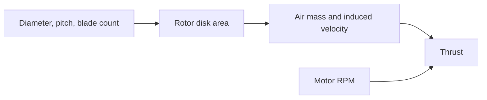

# Propeller geometry and airflow

This Module 3 lesson explains how a propeller's shape affects the air it can
move and the thrust it can produce.

## By the end, you will be able to

- Describe propeller diameter, pitch, and blade count.
- Calculate rotor disk area.
- Explain how forward motion changes airflow through a propeller.
- Estimate ideal hover induced velocity.



---

## Propeller geometry

- **Diameter** is the circle swept by blade tips. A larger disk can move more
  air, but needs more room and motor torque.
- **Pitch** is the ideal distance traveled in one revolution. Higher pitch can
  produce more speed, but only when the motor can maintain RPM.
- **Blade count** changes how much blade area touches the air. More blades can
  make a compact rotor produce more force, but usually increase drag and power.

Rotor disk area is

$$A = \pi\left(\frac{D}{2}\right)^2.$$

For forward flight, the advance ratio is

$$J = \frac{V}{nD},$$

where (V) is speed through the rotor disk and (n) is revolutions per second.
At hover, (V\approx0), so (J) is close to zero. At higher forward speed,
incoming air changes the blade forces.

### Hands-on: compare two disks

Calculate the area of 5-inch and 7-inch propellers. Predict which can move
more air, then explain why diameter alone does not determine final thrust:
pitch, RPM, blade shape, motor power, and air density also matter.

---

## Momentum theory: an ideal airflow model

Momentum theory treats the rotor as a disk accelerating a column of air. In
ideal hover:

$$T = 2\rho A v_i^2,$$

so induced air speed is

$$v_i = \sqrt{\frac{T}{2\rho A}}.$$

Here (v_i) is not the drone's vertical speed. It is the ideal airflow speed
associated with the rotor's change to air momentum.

The model assumes still air, uniform flow, no blade losses, and no ground
effect. It is useful for intuition, not a replacement for measurements or CFD.

### Hands-on: calculate hover induced velocity

```bash
uv run python examples/03-propeller-aerodynamics/hover_momentum.py
uv run python examples/03-propeller-aerodynamics/hover_momentum.py --diameter 0.178
```

Compare the default 5-inch rotor with the larger rotor. The larger disk should
need less induced velocity for the same thrust. Near the ground, explain why
the ideal model becomes inaccurate.

---

## Quiz

<form class="quiz" data-answer="a" data-explanation="Diameter is the circle swept by blade tips, so it determines the rotor disk size.">
  <fieldset><legend>1. What does propeller diameter describe?</legend><label><input type="radio" name="propeller-q1" value="a"> The circle swept by the blade tips</label><br><label><input type="radio" name="propeller-q1" value="b"> Battery capacity</label><br><label><input type="radio" name="propeller-q1" value="c"> Motor KV</label></fieldset><button type="button" class="quiz-check">Check answer</button><p class="quiz-result" aria-live="polite"></p>
</form>

<form class="quiz" data-answer="b" data-explanation="Disk area is A = π(D/2)², so increasing diameter increases area strongly.">
  <fieldset><legend>2. What happens to rotor disk area when diameter increases?</legend><label><input type="radio" name="propeller-q2" value="a"> It decreases</label><br><label><input type="radio" name="propeller-q2" value="b"> It increases</label><br><label><input type="radio" name="propeller-q2" value="c"> It always stays the same</label></fieldset><button type="button" class="quiz-check">Check answer</button><p class="quiz-result" aria-live="polite"></p>
</form>

<form class="quiz" data-answer="c" data-explanation="Pitch is the ideal screw-like distance traveled in one revolution, not a direct thrust rating.">
  <fieldset><legend>3. What does a propeller's pitch describe?</legend><label><input type="radio" name="propeller-q3" value="a"> The motor's winding resistance</label><br><label><input type="radio" name="propeller-q3" value="b"> The battery voltage</label><br><label><input type="radio" name="propeller-q3" value="c"> Its ideal travel in one revolution</label></fieldset><button type="button" class="quiz-check">Check answer</button><p class="quiz-result" aria-live="polite"></p>
</form>

<form class="quiz" data-answer="a" data-explanation="At hover, forward speed through the rotor disk is near zero, so advance ratio is close to zero.">
  <fieldset><legend>4. What is the advance ratio near hover?</legend><label><input type="radio" name="propeller-q4" value="a"> Close to zero</label><br><label><input type="radio" name="propeller-q4" value="b"> Always one</label><br><label><input type="radio" name="propeller-q4" value="c"> Equal to battery voltage</label></fieldset><button type="button" class="quiz-check">Check answer</button><p class="quiz-result" aria-live="polite"></p>
</form>

<form class="quiz" data-answer="b" data-explanation="For the same thrust, a larger ideal disk area needs less induced velocity in momentum theory.">
  <fieldset><legend>5. For the same hover thrust, what does a larger disk need?</legend><label><input type="radio" name="propeller-q5" value="a"> More ideal induced velocity</label><br><label><input type="radio" name="propeller-q5" value="b"> Less ideal induced velocity</label><br><label><input type="radio" name="propeller-q5" value="c"> No air movement</label></fieldset><button type="button" class="quiz-check">Check answer</button><p class="quiz-result" aria-live="polite"></p>
</form>

---

Back to [Module 3: Propeller dynamics and aerodynamics](../index.md). Previous:
[Motor KV](../motor-kv/index.md). Next: [Module 4: Motor mixer and PID](../../04-motor-mixer-pid/index.md).
