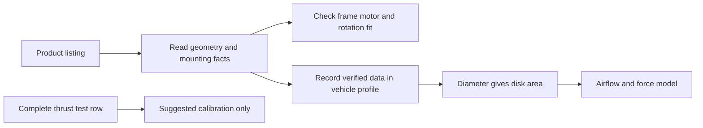
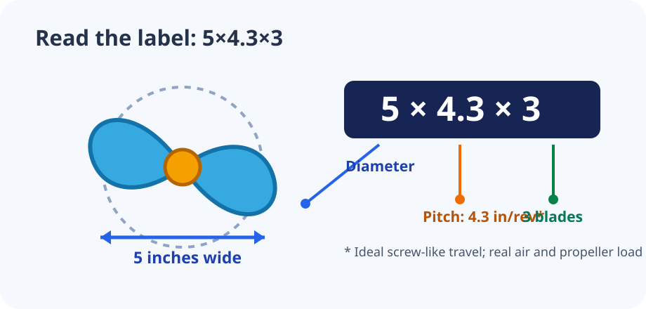
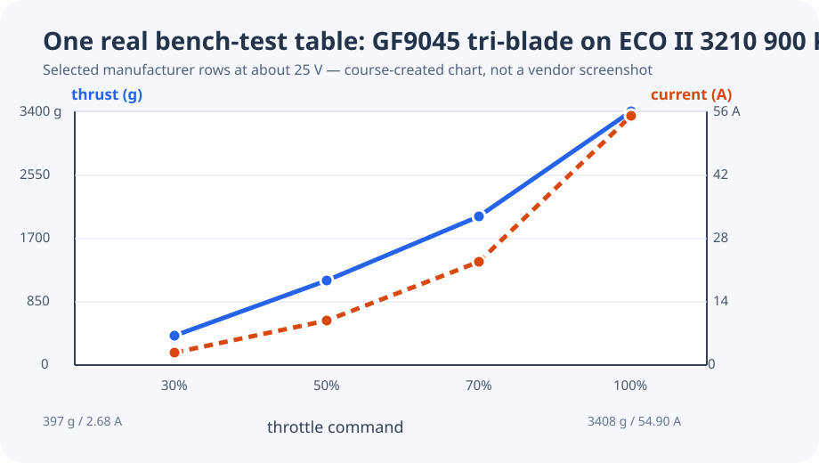

# Propeller geometry: understand what you bought

This lesson turns a product listing into facts you can understand, check for fit, and record in the simulator.

## By the end, you will be able to

- Read a label such as `5×4.3×3`.
- Identify listing facts needed before mounting a propeller.
- Convert diameter from inches to metres for the simulator.
- Recognise which seller claims cannot calibrate thrust.
- Calculate disk area and ideal hover induced velocity.


```mermaid
flowchart LR
    listing[Product listing] --> facts[Read geometry and mounting facts]
    facts --> fit[Check frame motor and rotation fit]
    facts --> profile[Record verified data in vehicle profile]
    profile --> disk[Diameter gives disk area]
    disk --> physics[Airflow and force model]
    test[Complete thrust test row] --> calibration[Suggested calibration only]
```

---

## Start with one label

The course beginner propeller is **5×4.3×3**.



| Label part | Everyday meaning | What you do with it |
| --- | --- | --- |
| `5` | Tip-to-tip diameter is 5 inches. | Check clearance; use 0.127 m in simulation. |
| `4.3` | Ideal screw-like travel per turn is 4.3 inches. | Higher pitch usually asks the motor for more power. |
| `3` | Three blades push on the air. | More blades can add grip, drag, and current draw. |

Some listings use compact codes such as `5043` or a brand-specific model name.

Do **not** guess from the short title. Confirm geometry in the specification image or table.

---

## Read an AliExpress listing in this order

Use the listing to record facts, not promises.

| Check first | Why it matters |
| --- | --- |
| Exact product name | Lets you find the same propeller again. |
| Diameter, pitch, blades | Describe the geometry. |
| CW and CCW pair | A quad needs correct rotation directions. |
| Hub and shaft fit | The hole, adapter, and motor mount must fit. |
| Material, weight, package count | Useful for durability, balance, and buying enough props. |
| Recommended KV or battery | A seller hint, not proof of safe thrust. |

The current simulator uses only **diameter** for rotor-disk, inflow, and ground-effect calculations.

Save the other fields anyway: they describe the real part you bought.

### Copy this listing worksheet

```yaml
propeller:
  name: Exact name from listing
  diameter_in: 5.0
  pitch_in: 4.3
  blade_count: 3
  rotation_set: CW and CCW pair
  hub_diameter_mm: null       # Leave unknown values blank; never invent them.
  shaft_diameter_mm: null
  material: polycarbonate
  weight_g: null
  package_count: 4
  source: AliExpress listing URL or saved product title
```

`examples/common/drone_profiles/default.yaml` contains the course default.

Your own profile can use the same `propeller` section.

---

## Real manufacturer data: read one complete test

The course default is a 5-inch propeller. This next example is deliberately
larger: an EMAX ECO II 3210 900 KV motor with a GF9045 tri-blade propeller.
It shows what a useful test table looks like. Do not copy its thrust value into
the 5-inch course profile because the motor, propeller, and voltage differ.

| Throttle | Voltage | Current | RPM | Thrust |
| ---: | ---: | ---: | ---: | ---: |
| 30% | 25.0 V | 2.68 A | 5,856 | 397 g |
| 50% | 24.9 V | 9.77 A | 9,312 | 1,138 g |
| 70% | 24.8 V | 22.64 A | 12,290 | 1,992 g |
| 100% | 24.5 V | 54.90 A | 15,925 | 3,408 g |



These selected rows are transcribed from the [EMAX ECO II 3210 official
bench-test table](https://shop.emaxmodel.com/collections/all/products/emax-ecoii-3210-800kv-900kv-1050kv-1200kv-brushless-drone-motor-for-8-10inch-fpv-rc-drone).
The rising current and slightly falling voltage are a useful first view of
battery sag. The chart is our own drawing from four rows, not a copied vendor
image or a claim that the results are independently verified.

### Hands-on: turn one row into physics units

Use the 70% row. Convert 1,992 g to newtons, then calculate its candidate
thrust coefficient from 12,290 RPM:

$$T_N=\frac{1992\times9.80665}{1000},\qquad k_T=\frac{T_N}{12290^2}.$$

Compare your answer with the helper:

```bash
uv run python examples/03-propeller-aerodynamics/inspect_propeller_listing.py \
  --name "EMAX GF9045 tri-blade" --diameter-in 9 --pitch-in 4.5 --blades 3 \
  --thrust-g 1992 --rpm 12290 --voltage-v 24.8 --current-a 22.64 \
  --motor "EMAX ECO II 3210 900 KV"
```

---

## What can calibrate physics?

A product photo that says “high thrust” cannot give a trustworthy thrust coefficient.

A useful test row states battery voltage, motor model or KV, RPM, thrust, current, and throttle or test condition together.

| Required test fact | Why |
| --- | --- |
| Battery voltage | RPM and thrust change with voltage. |
| Motor model or KV | The same prop behaves differently on another motor. |
| RPM and thrust | Connect measured force to the RPM-squared model. |
| Current | Shows electrical cost and checks battery/ESC suitability. |
| Throttle or test condition | States whether it was full throttle or another point. |

$$T_N=\frac{T_g\times9.80665}{1000},\qquad k_T=\frac{T_N}{\mathrm{RPM}^2}.$$

The helper prints a **suggested** value; it never edits the flight model.

```bash
uv run python examples/03-propeller-aerodynamics/inspect_propeller_listing.py
uv run python examples/03-propeller-aerodynamics/inspect_propeller_listing.py \
  --diameter-in 5 --pitch-in 4.3 --blades 3 \
  --thrust-g 650 --rpm 24000 --voltage-v 14.8 --current-a 30 \
  --motor "1622 KV course motor"
```

The second command uses an illustrative complete test row.

Replace it only with a manufacturer table or your own thrust-stand measurement.

---

## Diameter becomes airflow area

$$D_m=D_{in}\times0.0254.$$

$$A=\pi\left(\frac{D}{2}\right)^2.$$

A larger disk can move required air with less ideal induced velocity, but it needs more frame clearance and motor torque.

Diameter alone never predicts final thrust: pitch, blade shape, RPM, motor power, and battery voltage matter.

### Hands-on: compare two disks

```bash
uv run python examples/03-propeller-aerodynamics/hover_momentum.py --diameter 0.127
uv run python examples/03-propeller-aerodynamics/hover_momentum.py --diameter 0.178
```

The first is a 5-inch propeller and the second is a 7-inch propeller.

Predict which needs less ideal airflow speed for the same hover thrust, then check the printed disk area and induced velocity.

---

## Momentum theory: the simple airflow idea

Momentum theory treats the propeller as a disk that accelerates air.

$$T=2\rho A v_i^2,\qquad v_i=\sqrt{\frac{T}{2\rho A}}.$$

Here \(v_i\) is downward airflow created by the propeller, not drone vertical speed.

The model ignores blade shape, losses, ground effect, and uneven flow.

For forward flight, advance ratio is \(J=\frac{V}{nD}\).

At hover \(V\approx0\), so \(J\) is close to zero. Forward motion changes airflow each blade feels.

---

## Quiz

<form class="quiz" data-answer="b" data-explanation="The first number is the tip-to-tip diameter.">
  <fieldset><legend>1. In a 5×4.3×3 label, what does 5 mean?</legend><label><input type="radio" name="propeller-q1" value="a"> 5 volts</label><br><label><input type="radio" name="propeller-q1" value="b"> 5-inch diameter</label><br><label><input type="radio" name="propeller-q1" value="c"> 5 newtons of thrust</label></fieldset><button type="button" class="quiz-check">Check answer</button><p class="quiz-result" aria-live="polite"></p>
</form>

<form class="quiz" data-answer="c" data-explanation="Pitch is ideal distance per revolution, not guaranteed thrust.">
  <fieldset><legend>2. What does 4.3 describe?</legend><label><input type="radio" name="propeller-q2" value="a"> Battery capacity</label><br><label><input type="radio" name="propeller-q2" value="b"> Number of motors</label><br><label><input type="radio" name="propeller-q2" value="c"> Ideal travel per revolution in inches</label></fieldset><button type="button" class="quiz-check">Check answer</button><p class="quiz-result" aria-live="polite"></p>
</form>

<form class="quiz" data-answer="a" data-explanation="The specification table or image confirms geometry when shorthand names vary.">
  <fieldset><legend>3. A listing says only “5043 prop.” What should you do?</legend><label><input type="radio" name="propeller-q3" value="a"> Confirm its specification table or image</label><br><label><input type="radio" name="propeller-q3" value="b"> Assume its hub fits every motor</label><br><label><input type="radio" name="propeller-q3" value="c"> Use the title as a thrust measurement</label></fieldset><button type="button" class="quiz-check">Check answer</button><p class="quiz-result" aria-live="polite"></p>
</form>

<form class="quiz" data-answer="b" data-explanation="A useful calibration row gives electrical conditions, RPM, thrust, and test condition.">
  <fieldset><legend>4. What makes a thrust row useful for calibration?</legend><label><input type="radio" name="propeller-q4" value="a"> Only a product photo</label><br><label><input type="radio" name="propeller-q4" value="b"> Voltage, motor, RPM, thrust, current, and condition</label><br><label><input type="radio" name="propeller-q4" value="c"> Only package count</label></fieldset><button type="button" class="quiz-check">Check answer</button><p class="quiz-result" aria-live="polite"></p>
</form>

<form class="quiz" data-answer="a" data-explanation="The current force model directly uses propeller diameter.">
  <fieldset><legend>5. Which listing value does the current force model use directly?</legend><label><input type="radio" name="propeller-q5" value="a"> Diameter</label><br><label><input type="radio" name="propeller-q5" value="b"> Package colour</label><br><label><input type="radio" name="propeller-q5" value="c"> Seller rating</label></fieldset><button type="button" class="quiz-check">Check answer</button><p class="quiz-result" aria-live="polite"></p>
</form>

---

Back to [Module 3: Propeller dynamics and aerodynamics](../index.md). Previous:
[Motor KV](../motor-kv/index.md). Next: [Configuration takeoff comparison](../configuration-comparison/index.md).
