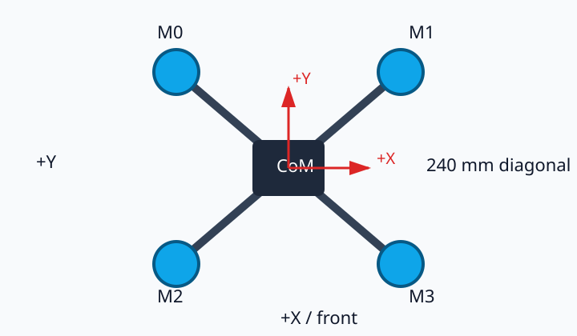
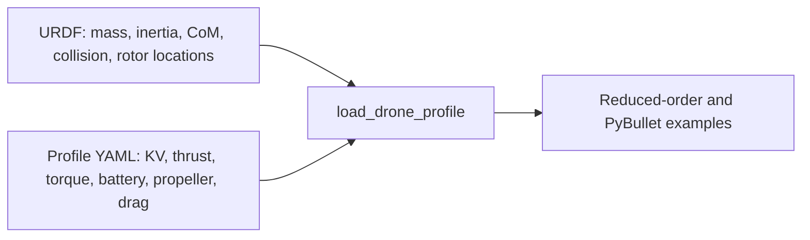

# Topic 0: Specify the real reference drone

## By the end, you will be able to

- identify the frame, motors, propellers, ESC, flight controller, and battery;
- explain which values belong in the URDF and which belong in the vehicle profile;
- verify the 240 mm motor geometry and 0.62 kg working mass estimate;
- understand which values still require measurement after assembly.

The simulator is easier to trust when it names the physical vehicle first. We
use a 5-inch X-frame, 6S battery, T-Motor V2208 V2 1750 KV motors, and T5143S
tri-blade propellers. The exact reference and purchase list are recorded in
`design/learning/autonomous_hover_capstone_module_plan.md`.



For a real product photograph, see the [TBS Source One V6 official product
page](https://www.team-blacksheep.com/products/product%3A8547). The repository
keeps an original geometry diagram rather than copying manufacturer photography.

---

## The model boundary



The URDF describes the rigid body that PyBullet integrates. The YAML profile
describes actuator and electrical behavior that URDF does not standardize.

| Value | Initial reference |
| --- | --- |
| All-up mass | `0.62 kg`, budgeted estimate until weighed |
| Frame | TBS Source One V6, 240 mm diagonal wheelbase |
| Motor | 4 × V2208 V2, 1750 KV, 6S |
| Propeller | T5143S, 5.1 × 4.3 inch, tri-blade |
| Battery | 6S, 1300 mAh, 22.2 V nominal |
| Rotor coordinates | `(±0.084853, ±0.084853, 0.025) m` |

The visual URDF is intentionally simple. Mass, inertia, center of mass, rotor
coordinates, and collision envelope are the physics contract. The `0.62 kg`
mass is a component-budget estimate; replace it after weighing the assembled
vehicle with its selected battery and payload.

## How the working all-up mass is estimated

All-up mass means the vehicle in its flight-ready state, including the battery.
The listed components give this known subtotal:

| Component | Mass |
| --- | ---: |
| Frame | `136.5 g` |
| Four motors | `4 × 36.9 = 147.6 g` |
| 4-in-1 ESC | `13.8 g` |
| Flight controller | `8 g` |
| 6S 1300 mAh battery | `214 g` |
| Known subtotal | **`519.9 g`** |

Props, wiring, fasteners, capacitor, battery straps, and a small payload are
estimated at approximately `100 g`:

\[
m_{all-up}\approx519.9\,\mathrm{g}+100\,\mathrm{g}=619.9\,\mathrm{g}\approx0.62\,\mathrm{kg}
\]

This `620 g` value is the working simulation mass, not a measured fact. Weigh
the completed vehicle with its selected battery and payload, then replace the
URDF mass and inertia with the measured values.

---

## Run the checks

```bash
uv run python examples/06-autonomous-hover/00-real-drone-specification/inspect_real_drone.py
uv run python examples/06-autonomous-hover/00-real-drone-specification/measure_vehicle.py
```

The first command loads the URDF and profile together, then prints the mass,
inertia, motor, battery, and propeller values. The second checks that opposite
motors are 240 mm apart diagonally and reports the working inertia tensor.

Representative output:

```text
vehicle: real_reference
mass: 0.620 kg
inertia: (0.00332, 0.00332, 0.00378, 0.0, 0.0, 0.0) kg m^2
motor: 1750 KV, 14.32 N max model thrust
battery: 6S 1.30 Ah, 22.2 V nominal
real-reference profile self-check passed
diagonal motor spacing: 240.0 mm
adjacent motor spacing: 169.7 mm
vehicle geometry self-check passed
```

The output is evidence that the lesson is using the intended Topic 0 vehicle,
not a generic default drone.

### Profile and URDF loading

The working example uses the shared loader rather than duplicating the vehicle
specification in the lesson script:

??? example "Open the profile-loading source excerpt"

    ```python
    from common.drone_model import load_drone_profile

    profile = load_drone_profile("real_reference")
    model = profile.model
    print(model.mass_kg, model.inertia_kg_m2)
    print(model.rotor_positions_m)
    ```

The full runnable file is
`examples/06-autonomous-hover/00-real-drone-specification/inspect_real_drone.py`.

`load_drone_profile` follows the profile's `urdf` path, reads the base-link
mass, center of mass, inertia, and rotor-joint positions, then combines those
rigid-body values with the profile's motor, battery, propeller, and aerodynamic
values. This keeps the URDF as the source of truth for rigid-body physics and
the YAML profile as the source of truth for actuator and electrical behavior.

### Geometry and mass checks

The second example derives motor spacing from the loaded rotor coordinates:

??? example "Open the geometry-check source excerpt"

    ```python
    from math import hypot

    positions = profile.model.rotor_positions_m
    diagonal = hypot(
        positions[0][0] - positions[3][0],
        positions[0][1] - positions[3][1],
    )
    assert abs(diagonal - 0.24) < 0.001
    ```

The full runnable file is
`examples/06-autonomous-hover/00-real-drone-specification/measure_vehicle.py`.

The `0.62 kg` value is checked as a working mass estimate, while the diagonal
check verifies the frame geometry. These checks protect the later force lessons
from silently using the wrong vehicle.

---

## Checkpoint quiz

<form class="quiz" data-answer="b" data-explanation="The URDF owns rigid-body properties such as mass, inertia, center of mass, collision geometry, and rotor locations.">
  <fieldset><legend>1. Where should the drone mass and inertia be defined?</legend><label><input type="radio" name="topic0-spec-q1" value="a"> Only in the PID controller</label><br><label><input type="radio" name="topic0-spec-q1" value="b"> In the URDF inertial block</label><br><label><input type="radio" name="topic0-spec-q1" value="c"> Only in the battery profile</label></fieldset>
  <button type="button" class="quiz-check">Check answer</button><p class="quiz-result" aria-live="polite"></p>
</form>

<form class="quiz" data-answer="c" data-explanation="The listed components total 519.9 g, and the remaining approximately 100 g covers props, wiring, hardware, straps, and payload.">
  <fieldset><legend>2. How is the 620 g working mass estimated?</legend><label><input type="radio" name="topic0-spec-q2" value="a"> From the frame weight alone</label><br><label><input type="radio" name="topic0-spec-q2" value="b"> From the battery voltage</label><br><label><input type="radio" name="topic0-spec-q2" value="c"> From the 519.9 g known subtotal plus approximately 100 g allowance</label></fieldset>
  <button type="button" class="quiz-check">Check answer</button><p class="quiz-result" aria-live="polite"></p>
</form>

<form class="quiz" data-answer="a" data-explanation="The motor coordinates determine the diagonal and adjacent spacing, which set the lever arms used for later roll and pitch torque calculations.">
  <fieldset><legend>3. Why does Topic 0 check the rotor coordinates?</legend><label><input type="radio" name="topic0-spec-q3" value="a"> They define frame geometry and future torque lever arms</label><br><label><input type="radio" name="topic0-spec-q3" value="b"> They determine the battery chemistry</label><br><label><input type="radio" name="topic0-spec-q3" value="c"> They replace the need to measure mass</label></fieldset>
  <button type="button" class="quiz-check">Check answer</button><p class="quiz-result" aria-live="polite"></p>
</form>

---

## Hands-on exercise

Weigh the assembled vehicle with and without its battery. Compare the result
with the `620 g` working estimate, record the difference, and rerun both Topic 0
checks. Do not update the URDF from a catalog estimate; update it from the
measured flight-ready vehicle.

---

Prerequisite: [Module 5: Battery voltage sag](../../05-battery-voltage-sag/index.md). Next: [Topic 1: Initialize the environment](../01-initialize-environment/index.md).
