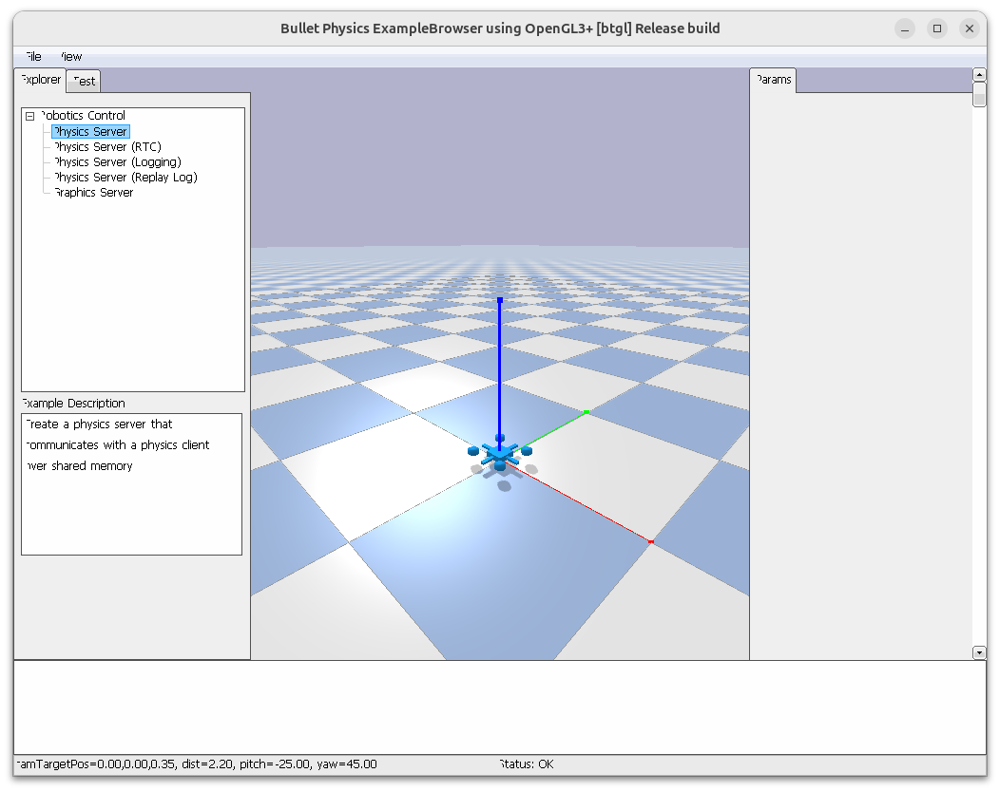

# Step 1: Initialize the simulation environment

Before a drone can hover, the simulator needs a predictable world: a clock,
gravity, a ground plane, and the drone model. This first capstone step loads
that world and stops before physics advances, so you can inspect its starting
state.

## By the end, you will be able to

- Open the course drone and ground plane in PyBullet.
- Identify the gravity and 240 Hz clock shared by later flight examples.
- Read a drone's initial position, velocity, and attitude.
- Use GUI and headless runs for visual inspection and automated checks.


---

## Run the environment

From the repository root, run:

```bash
uv run python examples/06-autonomous-hover/initialize_environment.py
```

The GUI shows the plane and the course quadcopter, positioned just above the
ground. It does **not** call `stepSimulation()`, so gravity has not yet started
the drone falling. Use the mouse to orbit and zoom, then press `Q` or `Esc` to
close the example.

For a terminal-only check:

```bash
uv run python examples/06-autonomous-hover/initialize_environment.py --headless
```

This prints a position close to `(0.0, 0.0, 0.05) m`, zero velocity, and level
roll, pitch, and yaw.



---

## What `create_world()` prepares

The example deliberately reuses `examples/common/pybullet_utils.py` rather
than copying setup code. That helper is the single shared definition of the
course environment:

| Setup item | Why it matters |
| --- | --- |
| PyBullet connection | Chooses an interactive GUI or invisible headless simulation. |
| Gravity `(0, 0, -9.81)` | Gives every free object Earth's downward acceleration. |
| Timestep `1 / 240 s` | Sets the fixed clock used by the physics engine. |
| `plane.urdf` | Provides a static ground surface for takeoff and landing. |
| `full_drone.urdf` | Defines the mass, inertia, links, and visual drone frame. |

The helper returns the PyBullet body id for the drone. `read_state(drone)` uses
that id to read the complete rigid-body state. At this point the important
values are position and velocity:

$$\mathbf{p}=(x,y,z), \qquad \mathbf{v}=(v_x,v_y,v_z).$$

The initial velocity is zero because loading an object does not simulate time.
The next tutorial steps will apply forces, call `stepSimulation()`, and observe
how these values change.

---

## The small runnable example

```python
--8<-- "examples/06-autonomous-hover/initialize_environment.py"
```

`--self-check` is the fast automated version of this lesson. It verifies the
spawn height and confirms the drone has not moved:

```bash
uv run python examples/06-autonomous-hover/initialize_environment.py --self-check
```

---

## Hands-on: inspect before moving

1. Run the GUI example and orbit around the drone.
2. Confirm that the frame starts level and that it is slightly above the plane.
3. Run the headless command and compare the printed state with what you saw.
4. Explain why the vertical velocity is still `0.0 m/s` even though gravity is
   already configured.

---

## Review quiz

<form class="quiz" data-answer="b" data-explanation="The helper loads a fixed plane and the course drone, then returns the drone body id.">
  <fieldset><legend>1. What does <code>create_world()</code> return?</legend>
    <label><input type="radio" name="environment-q1" value="a"> A motor PWM command</label><br>
    <label><input type="radio" name="environment-q1" value="b"> The loaded drone's PyBullet body id</label><br>
    <label><input type="radio" name="environment-q1" value="c"> A camera image</label>
  </fieldset><button type="button" class="quiz-check">Check answer</button><p class="quiz-result" aria-live="polite"></p>
</form>

<form class="quiz" data-answer="a" data-explanation="Loading a world only creates state. Physics changes it only after a simulation step.">
  <fieldset><legend>2. Why is the initial vertical velocity zero?</legend>
    <label><input type="radio" name="environment-q2" value="a"> No physics step has happened yet</label><br>
    <label><input type="radio" name="environment-q2" value="b"> Gravity is disabled</label><br>
    <label><input type="radio" name="environment-q2" value="c"> The plane pushes upward before contact</label>
  </fieldset><button type="button" class="quiz-check">Check answer</button><p class="quiz-result" aria-live="polite"></p>
</form>

---

Prerequisite: [Module 5: Battery voltage sag](../../05-battery-voltage-sag/index.md). Next: [Step 2: Drone free fall](../02-drone-free-fall/index.md).
