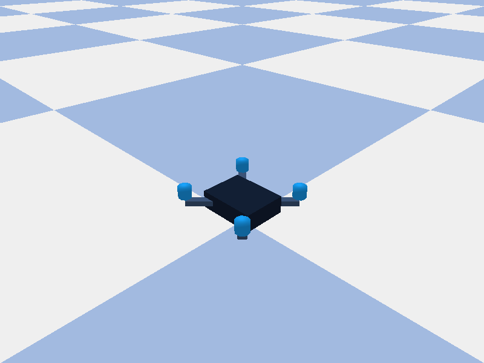

# Topic 1: Initialize the environment

## By the end, you will be able to

- load the reference profile, ground, and URDF;
- explain how the Topic 0 vehicle becomes a PyBullet world;
- identify the physics timestep and why the first state is deterministic;
- inspect the initial state before time advances;
- run the same initialization in headless and GUI modes.


```mermaid
flowchart LR
    profile[Topic 0 real-reference profile] --> world[PyBullet world]
    world --> ground[Ground plane and gravity]
    world --> urdf[Load URDF rigid body]
    ground --> state[Initial pose and velocity]
    urdf --> state
    state --> check[Deterministic self-check]
```

Topic 0 defined the vehicle. Topic 1 creates the world that will later receive
gravity, contact, thrust, drag, and control forces.

---

## The intuition: create the stage before adding forces

PyBullet needs three things before the simulation loop can do useful work:

1. a world with a fixed gravity and timestep;
2. a ground plane for contact;
3. the real-reference URDF with its mass, inertia, center of mass, collision
   geometry, and rotor locations.

At this topic there are no motor forces yet. We only check that the drone is
loaded in the correct initial pose and that no physics step has accidentally
changed its state.

---

## The simulation timestep

The physics engine advances in fixed increments:

\[
\Delta t=\frac{1}{f_{physics}}
\]

For the course settings:

\[
\Delta t=\frac{1}{240\,\mathrm{Hz}}=0.00417\,\mathrm{s}
\]

| Symbol | Meaning | SI unit |
| --- | --- | --- |
| \(\Delta t\) | Duration of one physics step | s |
| \(f_{physics}\) | Physics update frequency | Hz or s⁻¹ |
| \(t_k\) | Simulation time at step \(k\) | s |
| \(t_{k+1}\) | Time after one step | s |

The initial-state check happens before calling `p.stepSimulation()`. Therefore
the vehicle should still be at approximately `(0, 0, 0.05) m` with zero linear
velocity.

---

## Run the working example

Headless mode prints the state and runs without opening a window:

```bash
uv run python examples/06-autonomous-hover/01-initialize-environment/initialize_environment.py --headless
```

Self-check mode also asserts the spawn height and zero initial velocity:

```bash
uv run python examples/06-autonomous-hover/01-initialize-environment/initialize_environment.py --self-check
```

GUI mode opens PyBullet. Press `Q` or `Esc` to exit:

```bash
uv run python examples/06-autonomous-hover/01-initialize-environment/initialize_environment.py
```

The example can also render a deterministic window-style snapshot without
opening a GUI:

```bash
uv run python examples/06-autonomous-hover/01-initialize-environment/initialize_environment.py \
  --snapshot docs/modules/06-autonomous-hover/01-initialize-environment/images/environment-initial-state.png
```



*Figure: a reproducible camera snapshot of the same initial world used by the
headless and GUI modes.*

Representative headless output:

```text
Position: (0.0, 0.0, 0.05) m
Linear velocity: (0.0, 0.0, 0.0) m/s
Roll/pitch/yaw: (0.0, -0.0, 0.0) rad
Body rate: (0.0, 0.0, 0.0) rad/s
Environment initialization self-check passed
```

The important evidence is not visual detail. It is that the Topic 0 URDF loads,
the vehicle begins 5 cm above the plane, and the state has not advanced before
the first physics step.

---

## Source excerpts

The full working example is
`examples/06-autonomous-hover/01-initialize-environment/initialize_environment.py`.

??? example "Open the cumulative profile-to-world setup"

    ```python
    profile = load_drone_profile("real_reference")
    drone = create_world(profile.model, profile.physics_settings)
    print(format_drone_state(read_state(drone)))
    ```

This is the cumulative handoff from Topic 0: the world uses the same URDF and
vehicle profile that were inspected and validated there.

??? example "Open the initial-state check"

    ```python
    state = read_state(drone)
    assert abs(state.position_m[2] - 0.05) < 1e-9
    assert state.linear_velocity_mps == (0.0, 0.0, 0.0)
    ```

The check is intentionally small. Later topics will add forces and verify how
this state changes after time advances.

---

## Checkpoint quiz

<form class="quiz" data-answer="a" data-explanation="The fixed timestep defines how much simulated time advances on each call to p.stepSimulation().">
  <fieldset><legend>1. What does the physics timestep control?</legend><label><input type="radio" name="topic1-init-q1" value="a"> The simulated time advanced by each physics step</label><br><label><input type="radio" name="topic1-init-q1" value="b"> The drone's mass</label><br><label><input type="radio" name="topic1-init-q1" value="c"> The number of propeller blades</label></fieldset>
  <button type="button" class="quiz-check">Check answer</button><p class="quiz-result" aria-live="polite"></p>
</form>

<form class="quiz" data-answer="c" data-explanation="Topic 0's URDF and profile are loaded before later topics add forces to the simulation loop.">
  <fieldset><legend>2. What is Topic 1 responsible for before thrust is added?</legend><label><input type="radio" name="topic1-init-q2" value="a"> Tuning the altitude PID</label><br><label><input type="radio" name="topic1-init-q2" value="b"> Measuring propeller thrust</label><br><label><input type="radio" name="topic1-init-q2" value="c"> Creating the world, ground, and real-reference rigid body</label></fieldset>
  <button type="button" class="quiz-check">Check answer</button><p class="quiz-result" aria-live="polite"></p>
</form>

<form class="quiz" data-answer="b" data-explanation="Before p.stepSimulation() is called, the initialized drone should still have its spawn pose and zero velocity.">
  <fieldset><legend>3. What should the initial-state check observe?</legend><label><input type="radio" name="topic1-init-q3" value="a"> A completed takeoff</label><br><label><input type="radio" name="topic1-init-q3" value="b"> The spawn pose and zero initial velocity</label><br><label><input type="radio" name="topic1-init-q3" value="c"> Maximum rotor RPM</label></fieldset>
  <button type="button" class="quiz-check">Check answer</button><p class="quiz-result" aria-live="polite"></p>
</form>

---

## Hands-on exercise

1. Run the self-check and record the initial pose.
2. Run GUI mode and identify the ground plane, body, and four rotor markers.
3. Change the spawn height in `create_world` from `0.05` m to `0.20` m.
4. Predict which output line changes and rerun the self-check.
5. Explain why no force lesson should be tuned until this initialization check passes.

Previous: [Topic 0](../00-real-drone-specification/index.md). Next: [Topic 2](../02-gravity-and-contact/index.md).
