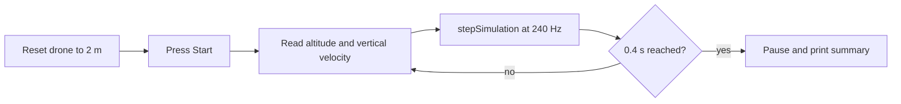
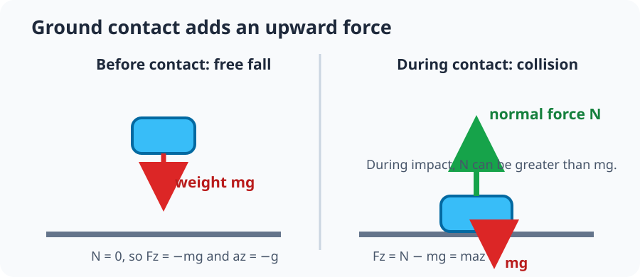

# Step 2: Drone free fall and ground contact

Now the environment from Step 1 advances in time. With motors off, the drone
falls because gravity changes its vertical velocity on every 240 Hz physics
tick. The experiment stops while the drone is still in the air so its measured
acceleration contains gravity only.

## By the end, you will be able to

- Predict a falling drone's altitude and vertical velocity.
- Run and pause a 240 Hz PyBullet loop with Start, Stop, Reset, and Exit controls.
- Measure airborne acceleration and compare it with Earth gravity.
- Explain why collision acceleration is different from free-fall acceleration.



---

## Run the free-fall experiment

```bash
uv run python examples/06-autonomous-hover/drone_free_fall.py
```

The GUI starts paused. Press **Start** in the control window to run 0.4 s of
motor-off free fall. The drone starts at 2 m and remains above the ground when
the experiment pauses. **Reset** returns it to the same position with zero
velocity, ready for another run.

For a quick terminal measurement:

```bash
uv run python examples/06-autonomous-hover/drone_free_fall.py --headless
```

The summary reports the end altitude, end vertical velocity, measured airborne
acceleration, and the error from configured gravity.

---

## Velocity and position during free fall

PyBullet uses world `z` as up. Gravity points downward, so:

$$a_z=-g=-9.81\ \mathrm{m/s^2}.$$

If the drone starts at rest, its vertical velocity becomes more negative over
time:

$$v_z=v_{z0}+a_zt=-gt.$$

Position changes because of that velocity:

$$z=z_0+v_{z0}t+\frac{1}{2}a_zt^2=z_0-\frac{1}{2}gt^2.$$

At 0.4 s, the prediction is approximately `-3.92 m/s` vertical velocity. The
drone has fallen about `0.78 m`, leaving it safely above the ground.

### What the 240 Hz loop means

The program advances one small interval, \(\Delta t=1/240\) s, each time it
calls `p.stepSimulation()`. A simple discrete view of the same physics is:

$$v_{z,next}=v_z-g\Delta t,$$

$$z_{next}=z+v_{z,next}\Delta t.$$

PyBullet performs this integration internally. The code reads the result after
each tick and prints the final measurement at 0.4 s.

---

## The runnable example

```python
--8<-- "examples/06-autonomous-hover/drone_free_fall.py"
```

Run the automated check with:

```bash
uv run python examples/06-autonomous-hover/drone_free_fall.py --self-check
```

---

## Ground contact is different



Before contact, gravity is the only vertical force. The ground's normal force
is zero:

$$N=0, \qquad F_z=-mg=ma_z.$$

When the drone touches the ground, the surface supplies an upward normal force
\(N\). The vertical force equation becomes:

$$F_z=N-mg=ma_z.$$

During impact, \(N\) can be larger than \(mg\). The drone then has a strong
upward acceleration that slows its downward motion. That is why impact
acceleration is not a good measurement of gravity.

One useful physical intuition models the ground like a spring and damper:

$$N\approx k\delta+c\dot{\delta},$$

where \(\delta\) is small contact compression, \(k\) is stiffness, and
\(c\) is damping. PyBullet uses a contact-constraint solver rather than this
exact equation, but the model explains why stronger compression and faster
impact can produce a larger upward force.

---

## Hands-on: predict, run, compare

1. Before pressing Start, predict the sign of vertical velocity after 0.4 s.
2. Run the GUI experiment and compare its end velocity with `-3.92 m/s`.
3. Press Reset, then Start again. Explain why the second summary is nearly the
   same as the first.
4. Explain why the normal force is absent during free fall but present at ground
   contact.

---

## Review quiz

<form class="quiz" data-answer="b" data-explanation="With world z pointing up, negative vertical velocity means the drone is moving downward.">
  <fieldset><legend>1. What does a negative vertical velocity mean in this experiment?</legend>
    <label><input type="radio" name="free-fall-q1" value="a"> The drone moves upward</label><br>
    <label><input type="radio" name="free-fall-q1" value="b"> The drone moves downward</label><br>
    <label><input type="radio" name="free-fall-q1" value="c"> The drone is paused</label>
  </fieldset><button type="button" class="quiz-check">Check answer</button><p class="quiz-result" aria-live="polite"></p>
</form>

<form class="quiz" data-answer="a" data-explanation="Each call advances the physics state by the configured 1/240-second timestep.">
  <fieldset><legend>2. What does one call to <code>stepSimulation()</code> do here?</legend>
    <label><input type="radio" name="free-fall-q2" value="a"> Advances the world by one fixed physics tick</label><br>
    <label><input type="radio" name="free-fall-q2" value="b"> Adds motor thrust</label><br>
    <label><input type="radio" name="free-fall-q2" value="c"> Resets the drone to 2 m</label>
  </fieldset><button type="button" class="quiz-check">Check answer</button><p class="quiz-result" aria-live="polite"></p>
</form>

<form class="quiz" data-answer="c" data-explanation="The ground applies an upward normal force during contact, so the net force is no longer gravity alone.">
  <fieldset><legend>3. Why should gravity be measured before ground contact?</legend>
    <label><input type="radio" name="free-fall-q3" value="a"> Gravity turns off at the ground</label><br>
    <label><input type="radio" name="free-fall-q3" value="b"> The drone becomes massless</label><br>
    <label><input type="radio" name="free-fall-q3" value="c"> Ground normal force changes the acceleration</label>
  </fieldset><button type="button" class="quiz-check">Check answer</button><p class="quiz-result" aria-live="polite"></p>
</form>

---

Previous: [Step 1: Initialize environment](../01-initialize-environment/index.md). Next: [Step 5: Physics-engine validation](../05-physics-engine-validation/index.md).
