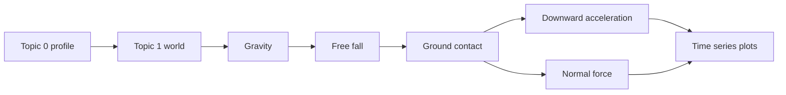
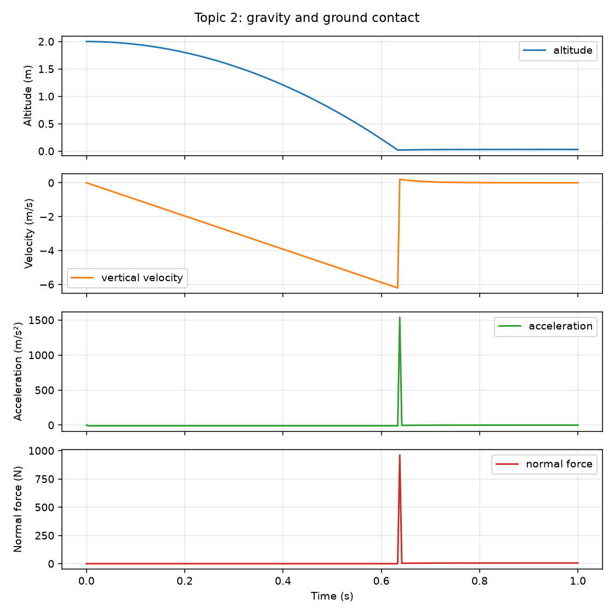
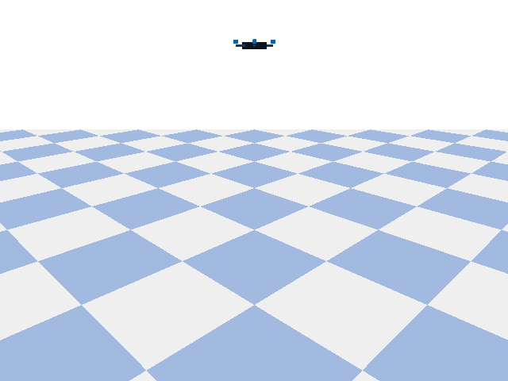

# Topic 2: Gravity and contact

## By the end, you will be able to

- calculate the gravitational force \(F_g=mg\);
- predict the sign and approximate size of free-fall acceleration;
- distinguish gravity from the ground's normal contact force;
- read altitude, velocity, acceleration, and contact force from a graph;
- run the cumulative real-reference PyBullet experiment headlessly or in a GUI.



Topic 1 created the stage. This topic lets gravity move the real-reference
drone and then observes what changes when the ground prevents further fall.

---

## The intuition: gravity pulls, contact pushes back

Gravity is a force acting on the drone's mass:

\[
F_g=mg
\]

The reference drone has \(m=0.62\,\mathrm{kg}\), so its weight is:

\[
F_g=0.62\times9.81=6.08\,\mathrm{N}
\]

With motors off and no ground contact, Newton's second law gives:

\[
a_z=\frac{F_g}{m}=g_z=-9.81\,\mathrm{m/s^2}
\]

The negative sign means acceleration is downward in the world frame. When the
body reaches the plane, the contact solver applies an upward normal force. The
normal force is not gravity: it is the ground's response that prevents the
drone from moving through the plane. During a collision it can briefly be
larger than the drone's weight.

| Symbol | Meaning | SI unit |
| --- | --- | --- |
| \(F_g\) | Gravitational force | N |
| \(m\) | All-up drone mass | kg |
| \(g_z\) | World-frame gravitational acceleration | m/s² |
| \(a_z\) | Measured vertical acceleration | m/s² |
| \(N\) | Ground normal contact force | N |
| \(t\) | Simulation time | s |

The experiment records acceleration from successive velocity readings:

\[
a_z(t_k)\approx\frac{v_z(t_k)-v_z(t_{k-1})}{\Delta t}
\]

where \(\Delta t=1/240\,\mathrm{s}\) is the fixed Topic 1 physics timestep.

---

## Run the working example

The example now belongs to Topic 2 and reuses Topic 0's profile and Topic 1's
world setup:

Copy and paste this command into the repository terminal:

```bash
uv run python examples/06-autonomous-hover/02-gravity-and-contact/gravity_contact.py --headless --output outputs/06-autonomous-hover/topic-02-gravity-contact
```

To also record the PyBullet scene as an animated GIF, copy and paste:

```bash
uv run python examples/06-autonomous-hover/02-gravity-and-contact/gravity_contact.py --headless --output outputs/06-autonomous-hover/topic-02-gravity-contact --gif outputs/06-autonomous-hover/topic-02-gravity-contact.gif
```

```bash
uv run python examples/06-autonomous-hover/02-gravity-and-contact/gravity_contact.py \
  --headless \
  --output outputs/06-autonomous-hover/topic-02-gravity-contact
```

The same force equations can be run without PyBullet's rendered world:

```bash
uv run python examples/06-autonomous-hover/02-gravity-and-contact/gravity_contact.py --backend reduced
```

The command writes a CSV time series and a PNG with four panels:

- altitude versus time;
- vertical velocity versus time;
- vertical acceleration versus time;
- ground normal force versus time.



*Figure: altitude decreases during free fall, velocity becomes more negative,
and the contact-force trace appears only when the drone reaches the plane.*



*Animation: the same deterministic run from a fixed teaching camera. The drone
falls under gravity, reaches the plane, and responds to the ground contact
force. GIF recording samples the 240 Hz physics run at approximately 12 frames
per second so the teaching asset stays small.*

Run the deterministic check without opening a window:

```bash
uv run python examples/06-autonomous-hover/02-gravity-and-contact/gravity_contact.py \
  --self-check
```

The check expects airborne acceleration near \(-9.81\,\mathrm{m/s^2}\) and at
least one positive normal-force sample after impact. To watch the same run in
PyBullet, omit `--headless`; press `Q` or `Esc` after the experiment completes.

Representative output:

```text
Measured airborne acceleration: -9.81 m/s²
Expected gravity: -9.81 m/s²
Impact/contact time: 0.638 s
First normal force: ... N
Gravity and contact self-check passed
```

The exact contact peak depends on the physics engine's collision resolution,
but the physical sequence should remain: free fall first, contact response
second.

The GIF recorder is optional. The simulation and graph commands work without
it, while `--self-check --gif PATH` also verifies that the generated file is a
valid multi-frame animation.

---

## Why the acceleration spikes at collision

The large positive acceleration spike at impact is the ground stopping the
downward motion in a very short time. Just before contact, the drone has a
large negative vertical velocity. During the collision, the contact solver
changes that velocity toward zero over only a few physics steps.

The relationship is impulse:

\[
J=\Delta p=m\Delta v
\]

and the average contact force is approximately:

\[
F_{contact}\approx\frac{J}{\Delta t}
\]

Because the collision time \(\Delta t\) is small, the force and calculated
acceleration can be much larger than the ordinary gravitational values. In
this run, the graph shows an impact acceleration spike and a normal-force peak
near `960 N`, followed by a settled normal force near the drone weight of
`6.08 N`.

That spike is useful evidence that a collision occurred, but it is not a
measurement of gravity. It is also sensitive to the physics timestep,
collision margin, restitution, and solver settings. A real accelerometer can
show a similar impact shock, but it also includes sensor noise, vibration, and
the distinction between inertial acceleration and specific force.

---

## Optional landing detection and disarm logic

The Topic 2 signals can support a later landing detector. They should not be
used as a single-sample disarm trigger:

```text
landing_candidate =
    normal_force > contact_threshold
    and abs(vertical_velocity) < velocity_threshold
    and altitude < landing_altitude
    and motor_command < low_thrust_threshold

landed = landing_candidate remains true for a confirmation period
```

A conservative simulation example could use:

| Condition | Teaching value |
| --- | --- |
| Normal force > `0.7 mg` | The body is carrying its weight through the ground |
| Vertical speed < `0.2 m/s` | The drone is no longer descending quickly |
| Altitude < `0.15 m` | The vehicle is close to the landing surface |
| Low thrust command | Prevents mistaking a low-altitude hover for landing |
| Conditions stable for `0.2 s` | Rejects one-step collision spikes |

Disarm is a separate safety decision. Only after the landed state remains
confirmed should the controller reduce the motors to idle and disarm:

```text
if landed and low_thrust and confirmation_timer_elapsed:
    reduce motors to idle
    disarm
```

In PyBullet, `getContactPoints()` supplies the normal force directly. A real
drone usually has no direct normal-force sensor, so a hardware landing
detector would combine accelerometer evidence with barometer or rangefinder
altitude, vertical velocity, motor command, and possibly a downward-facing
distance sensor. The acceleration spike is therefore useful as supporting
evidence, but it must not be the only landing or disarm condition.

This detector belongs in the later autonomous-flight topic. Topic 2 provides
the force and contact measurements needed to choose and validate its
thresholds.

---

## Source excerpts

The full working example is
`examples/06-autonomous-hover/02-gravity-and-contact/gravity_contact.py`.

??? example "Open the cumulative world setup"

    ```python
    profile = load_drone_profile("real_reference")
    drone = create_world(profile.model, profile.physics_settings)
    ```

The same profile and URDF used by Topics 0 and 1 provide the mass, inertia,
gravity, and fixed timestep. No generic drone constants are introduced here.

??? example "Open the Topic 2 force methods"

    ```python
    def gravity_force(profile):
        # F_g = m * g; negative z points downward.
        return (0.0, 0.0, profile.model.mass_kg * profile.physics_settings.gravity_z_mps2)

    def apply_gravity(drone, profile):
        force_world_n = gravity_force(profile)
        p.applyExternalForce(drone, -1, force_world_n, (0, 0, 0), p.WORLD_FRAME)
    ```

`gravity_force` is the shared mathematical step used by both backends. The
PyBullet loop applies it as an external world-frame force; the reduced-order
loop adds the same vector to its point-mass force sum. `ground_contact_force`
uses the documented spring-damper approximation only for the reduced-order
backend, while PyBullet uses its native collision solver.

??? example "Open the force observation"

    ```python
    normal_force_n = sum(point[9] for point in p.getContactPoints(bodyA=drone))
    acceleration = (velocity - previous_velocity) / time_step
    ```

The example reads the normal force from PyBullet contact data and estimates
acceleration from the measured state. It does not confuse the collision force
with the configured gravitational acceleration.

---

## Checkpoint quiz

<form class="quiz" data-answer="b" data-explanation="Weight is the gravitational force mg, so 0.62 kg times 9.81 m/s² is approximately 6.08 N.">
  <fieldset><legend>1. What is the reference drone's approximate weight?</legend><label><input type="radio" name="topic2-gravity-q1" value="a"> 0.62 N</label><br><label><input type="radio" name="topic2-gravity-q1" value="b"> 6.08 N</label><br><label><input type="radio" name="topic2-gravity-q1" value="c"> 9.81 N</label></fieldset>
  <button type="button" class="quiz-check">Check answer</button><p class="quiz-result" aria-live="polite"></p>
</form>

<form class="quiz" data-answer="a" data-explanation="With motors off and before contact, the only modeled vertical force is gravity, so acceleration is approximately -9.81 m/s².">
  <fieldset><legend>2. What causes the initial downward acceleration?</legend><label><input type="radio" name="topic2-gravity-q2" value="a"> Gravity acting on the drone mass</label><br><label><input type="radio" name="topic2-gravity-q2" value="b"> Propeller thrust</label><br><label><input type="radio" name="topic2-gravity-q2" value="c"> The ground normal force before impact</label></fieldset>
  <button type="button" class="quiz-check">Check answer</button><p class="quiz-result" aria-live="polite"></p>
</form>

<form class="quiz" data-answer="c" data-explanation="The normal force is produced by ground contact and appears when the body reaches the plane; it is not the same force as gravity.">
  <fieldset><legend>3. What does a positive normal-force trace indicate?</legend><label><input type="radio" name="topic2-gravity-q3" value="a"> The battery is charging</label><br><label><input type="radio" name="topic2-gravity-q3" value="b"> The motor speed is increasing</label><br><label><input type="radio" name="topic2-gravity-q3" value="c"> The drone is pushing against the ground</label></fieldset>
  <button type="button" class="quiz-check">Check answer</button><p class="quiz-result" aria-live="polite"></p>
</form>

---

## Hands-on exercise

1. Predict the drone's velocity after \(0.4\,\mathrm{s}\) of motor-off free fall.
2. Run the self-check and compare your prediction with the graph.
3. Change `START_HEIGHT_M` to `3.0` m and predict how the contact time changes.
4. Change the URDF mass while keeping gravity fixed. Explain why the ideal
   free-fall acceleration should stay the same even though the weight changes.
5. Identify the contact-force spike and explain why it is not a measurement of
   \(g\).

---

## Topic summary: the force baseline for every later lesson

This topic establishes the drone's passive physics baseline. Before a motor,
controller, wind model, or battery model is added, the vehicle already has a
known downward force:

\[
F_g=mg=6.08\,\mathrm{N}
\]

For the `0.62 kg` reference drone, that force produces approximately
\(-9.81\,\mathrm{m/s^2}\) of vertical acceleration while the vehicle is
airborne. The important result is that free-fall acceleration does not depend
on the drone mass when gravity is unchanged: a heavier drone has more weight,
but it also has proportionally more inertia.

The graph gives us two different physical stories in sequence:

1. During free fall, the velocity becomes increasingly negative and the
   measured acceleration follows configured gravity.
2. At impact, the ground produces a short, large normal-force response that
   changes the velocity and prevents the body from passing through the plane.

This distinction is the foundation for the rest of Module 6. Later, rotor
thrust will be compared against the same (mg) weight force; contact force
will be separated from thrust; and controller tests will only be meaningful if
the gravity and collision baseline behaves as expected. If the free-fall slope
or contact event is wrong here, later hover results cannot be trusted.

Previous: [Topic 1: Initialize the environment](../01-initialize-environment/index.md).
Next: [Topic 3: Rotor thrust](../03-rotor-thrust/index.md).
