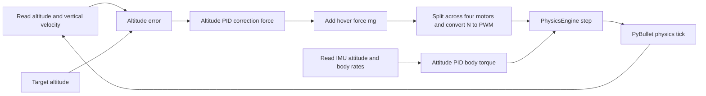

# Drone hover capstone

## By the end, you will be able to

- Find the collective thrust needed for level hover.
- Take off manually with a collective PWM command.
- Follow the path from altitude PID output to four motor forces.
- Run and tune the automatic hover controller.

---

## Manual takeoff

This capstone uses the complete 620 g drone body, a ground plane, four virtual
motors, and one collective PWM slider. It is manual control: the slider changes
lift, while attitude hold prevents an unintended spin.

```bash
uv run python examples/06-autonomous-hover/manual_takeoff.py
```

In the PyBullet GUI, raise **Collective PWM (us)** slowly from `1000` toward
`1500`. The display shows commanded PWM, actual rotor RPM, individual thrust,
total thrust, attitude, body rate, and the `6.08 N` drone weight.

| PWM range | Expected behaviour |
| --- | --- |
| Below `1500 us` | Thrust is below weight; the drone stays down or descends. |
| Near `1500 us` | Total thrust is about equal to weight; the drone can hover. |
| Above `1500 us` | Total thrust exceeds weight; the drone climbs. |

For a repeatable terminal run:

```bash
uv run python examples/06-autonomous-hover/manual_takeoff.py --headless --pwm 1550
```

Run the motor-lag and equal-force check:

```bash
uv run python examples/06-autonomous-hover/manual_takeoff.py --self-check
```

---

## One control step: altitude to motor forces

The controller updates at **120 Hz**. The shared physics engine advances at
**240 Hz**, so each controller decision is held for two physics ticks.



At level hover:

$$
F_{total} = mg + F_{PID}.
$$

`F_PID` is a correction in newtons. The engine divides the total between four
motors, applies motor lag, mixes body-torque corrections, calculates actual
forces, then advances PyBullet once. The green arrows in the GUI show actual
delayed rotor thrust, not the requested command.

---

## Automatic takeoff, hover, yaw, and landing

The automatic example climbs to `3 m`, hovers for four seconds, rotates `180°`,
then lands. Conservative vertical gains keep the headless peak altitude below
`3.5 m`.

```bash
uv run python examples/06-autonomous-hover/auto_takeoff_and_hover.py
uv run python examples/06-autonomous-hover/auto_takeoff_and_hover.py --headless
```

The altitude PID creates collective-force correction. Separate roll, pitch,
and yaw PIDs create body torque; the X-frame mixer converts that torque into
small motor-force differences. Attitude hold does not create lift: if collective
thrust falls below `mg`, the drone descends.

---

## Live altitude PID tuning

`pid_tuning_hover.py` opens a paused simulation, a control window, and live
plots. Use the controls to start, stop, reset, exit, or load a preset. The plot
shows target/true/measured altitude, collective thrust, and each P/I/D term.

```bash
uv run python examples/06-autonomous-hover/pid_tuning_hover.py
```

Start with gains `(0.7, 0.05, 1.1)`. Change one gain at a time, then move the
altitude target to observe a step response.

| Gain | What to observe |
| --- | --- |
| `Kp` | Faster response; too much produces overshoot and oscillation. |
| `Ki` | Removes steady error; too much accumulates and overshoots. |
| `Kd` | Damps vertical motion. |

For a repeatable chart and CSV trace:

```bash
uv run python examples/06-autonomous-hover/pid_tuning_hover.py \
  --headless --seconds 12 --output pid-tuning-run
```

Run its controller/noise self-check with:

```bash
uv run python examples/06-autonomous-hover/pid_tuning_hover.py --self-check
```

---

## Hands-on

1. Run manual takeoff at `1450`, `1500`, and `1550` PWM. Record the expected
   force balance before each run.
2. Run automatic hover, then make one small `Kp` change in the tuning tool.
   Compare overshoot and settling time.
3. Return to the [force inventory](../index.md#force-inventory) and identify
   which forces affect altitude and which mainly affect attitude.

## Review questions

1. Why can a level drone hover when total thrust equals weight?
2. Why does a collective PWM step not create an instant thrust step?
3. Why does attitude hold fail to prevent descent below hover thrust?
4. Why does the controller update at 120 Hz while physics advances at 240 Hz?

---

Next: [Step 5: Physics-engine validation](../05-physics-engine-validation/index.md).
