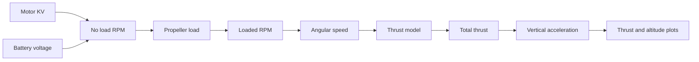
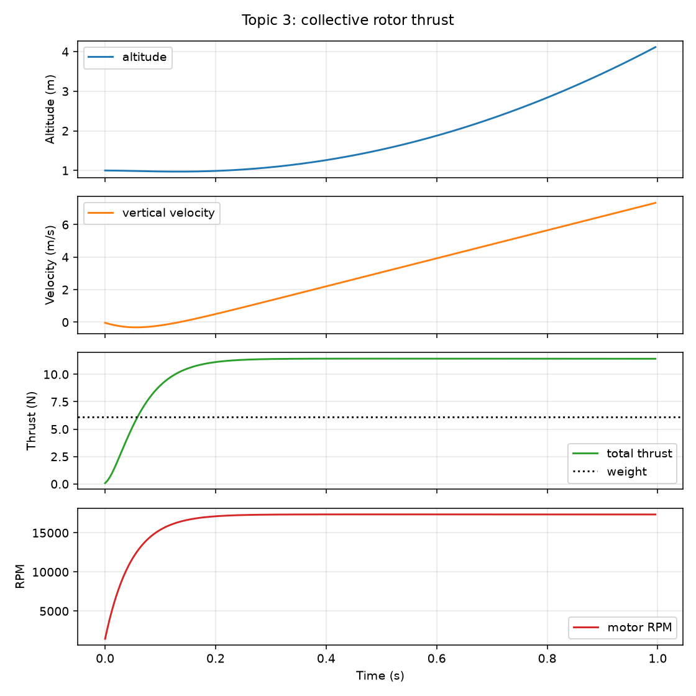
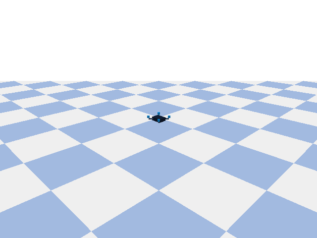
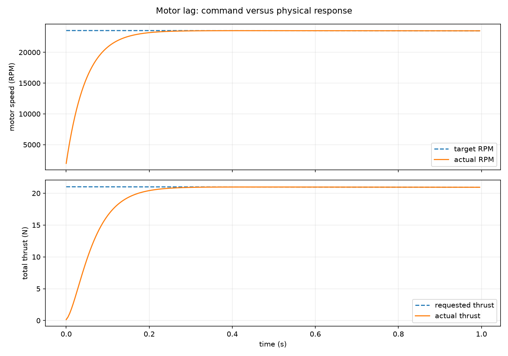
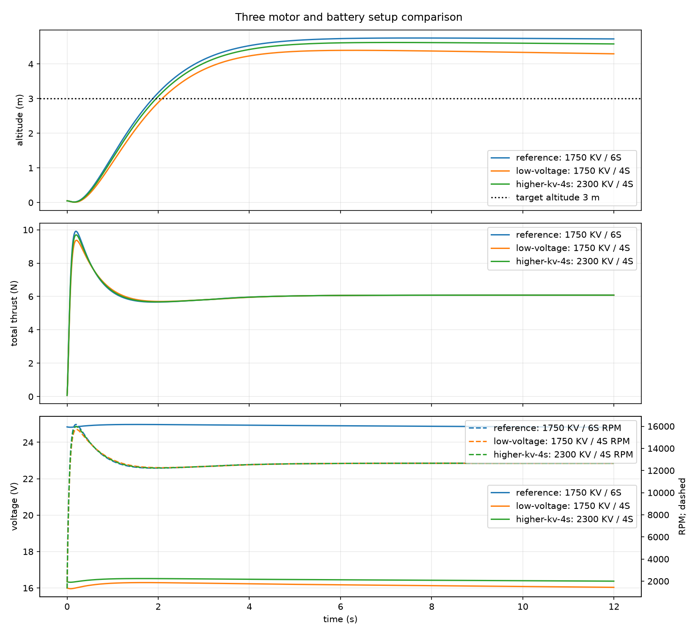

# Topic 3: Rotor thrust

## By the end, you will be able to

- explain how a spinning propeller creates an upward force;
- calculate approximate no-load RPM from motor KV and battery voltage;
- distinguish no-load RPM from loaded RPM under propeller load;
- use the quadratic thrust model \(T_i=k_T\omega_i^2\);
- calculate the thrust required for hover;
- read thrust, altitude, RPM, and velocity from a simulation graph;
- explain why the teaching model is calibrated instead of treated as a motor datasheet.



---

## The intuition: thrust must beat weight

Each propeller pushes air downward. The equal-and-opposite reaction pushes the
drone upward. The four rotors do not need to produce the same force as the
drone's mass; they need to produce the same force as its weight.

- If total thrust is greater than weight, the drone accelerates upward.
- If total thrust equals weight, the drone has zero vertical acceleration.
- If total thrust is less than weight, the drone accelerates downward.

For the Topic 0 reference vehicle, the working all-up mass estimate is `0.62 kg`.

---

## From KV and battery voltage to thrust

Motor KV tells us the approximate **no-load speed** produced by one volt:

\[
RPM_{no-load}=K_VV
\]

For the reference motor and a nominal 6S battery:

\[
RPM_{no-load}=1750\frac{RPM}{V}\times(6\times3.7V)=38{,}850\ RPM
\]

Convert RPM to angular speed before using the thrust model:

\[
\omega=\frac{2\pi}{60}RPM
\]

For one rotor, thrust is then estimated from the **loaded** rotor speed:

\[
T_i = k_T\omega_i^2
\]

The model says that doubling rotor speed produces approximately four times the
thrust. KV and voltage provide a no-load speed estimate; they do **not** provide
loaded RPM or thrust by themselves. The propeller load, current, ESC behavior,
battery sag, air density, and vehicle motion affect the loaded speed.

| Symbol | Meaning | SI unit |
| --- | --- | --- |
| \(K_V\) | Motor speed constant | RPM/V |
| \(V\) | Battery voltage at the motor | V |
| \(RPM_{no-load}\) | Estimated motor speed without propeller load | RPM |
| \(RPM\) | Measured or modeled loaded rotor speed | RPM |
| \(T_i\) | Thrust produced by rotor \(i\) | N |
| \(k_T\) | Propeller/motor thrust coefficient | N·s²/rad² |
| \(\omega_i\) | Loaded angular speed of rotor \(i\) | rad/s |
| \(i\) | Rotor index | dimensionless |

To calculate thrust, we therefore need one more ingredient: \(k_T\), obtained
from a manufacturer thrust curve or a thrust-stand calibration. The minimum
calculation chain is:

\[
K_V,V \rightarrow RPM_{no-load};\qquad RPM_{loaded}\rightarrow\omega\rightarrow T
\]

There is no physically reliable way to calculate thrust from only motor KV and
battery voltage.

The total collective thrust is the sum of the four rotor forces:

\[
T_{total}=T_0+T_1+T_2+T_3
\]

Hover requires approximately:

\[
T_{hover,total}=W=mg
\]

where \(m\) is mass in kilograms and \(g\approx9.81\,\mathrm{m/s^2}\) is gravity.

---

## Worked example: the real-reference drone

First calculate the no-load speed. The nominal battery voltage is:

\[
V=6\times3.7=22.2\,V
\]

Therefore:

\[
RPM_{no-load}=1750\times22.2=38{,}850\ RPM
\]

That number is not the propeller's flight RPM. To show the next step, suppose a
thrust-stand calibration gives \(k_T=8.66\times10^{-7}\,\mathrm{N\,s^2/rad^2}\)
and the loaded rotor speed is `30,000 RPM`:

\[
\omega=\frac{2\pi}{60}\times30{,}000=3142\,\mathrm{rad/s}
\]

\[
T_i=k_T\omega^2=(8.66\times10^{-7})(3142)^2=8.55\,N
\]

The coefficient and loaded RPM are the measured/model inputs. KV and voltage
only supplied the no-load reference for checking whether the loaded speed is
reasonable.

For hover, compare the four rotor thrusts with the drone weight:

Use the provisional mass from Topic 0:

\[
W=mg=0.62\times9.81=6.08\,\mathrm{N}
\]

With four identical rotors, the ideal hover thrust per rotor is:

\[
T_i=\frac{6.08}{4}=1.52\,\mathrm{N}
\]

The hover calculation tells us the target thrust; the motor/propeller model then
finds the loaded RPM required to produce approximately `1.52 N` per rotor.
Battery sag and propeller loading must be included before converting that RPM to
a PWM command.

---

## Cumulative PyBullet example

Topic 3 now adds collective rotor thrust to the same Topic 0 vehicle and Topic 1
world. The Topic 3 loop converts the PWM command into motor RPM, applies four
upward rotor forces, includes motor lag and battery behavior, and advances
PyBullet. The example records altitude, vertical velocity, total thrust, motor
RPM, and battery voltage.

Copy and paste this command to run the example, save its graph and CSV, and
record the deterministic PyBullet scene:

```bash
uv run python examples/06-autonomous-hover/03-rotor-thrust/rotor_thrust.py --headless --pwm 1400 --seconds 1 --output outputs/06-autonomous-hover/topic-03-rotor-thrust --gif outputs/06-autonomous-hover/topic-03-rotor-thrust.gif
```



*Figure: the modeled total thrust rises above the reference drone's weight,
while altitude and vertical velocity increase. The dotted line is the hover
weight target.*



*Animation: the reference drone responds to equal collective rotor thrust. The
GIF uses the same fixed teaching camera and recorder introduced in Topic 2.*

The `1400 µs` command is a teaching input, not a universal flight command.
Changing `--pwm`, `--seconds`, or the shared vehicle profile changes the
result. The no-load RPM printed by the example comes from \(K_VV\), while the
graph's loaded RPM and thrust are produced by the motor and propeller model.

Run the deterministic check:

```bash
uv run python examples/06-autonomous-hover/03-rotor-thrust/rotor_thrust.py --self-check --gif /tmp/topic-03-rotor-thrust.gif
```

The self-check confirms that the motor model produces positive RPM and thrust,
that the reference command climbs, and that the optional GIF contains multiple
frames.

To run the same Topic 3 force equations with the reduced-order backend:

```bash
uv run python examples/06-autonomous-hover/03-rotor-thrust/rotor_thrust.py --backend reduced --pwm 1400 --seconds 1
```

??? example "Open the cumulative thrust-loop source excerpt"

    ```python
    motor_rpms, battery_state = advance_motor_state(profile, battery, motor_rpms, pwm_us)
    # Previous-topic force remains active first.
    apply_gravity(drone, profile)
    # =============================================================================
    # TOPIC 3 NEW FORCE: T_i = k_T * RPM_i² in each rotor link's local +z axis.
    # =============================================================================
    motor_thrusts = apply_rotor_thrust(drone, profile, motor_rpms)
    # Integrate after all forces for this step have been applied.
    p.stepSimulation()
    ```

The full runnable file is
`examples/06-autonomous-hover/03-rotor-thrust/rotor_thrust.py`.

`apply_gravity` is the copied Topic 2 method. `apply_rotor_thrust` is the new
Topic 3 method. Its implementation comments identify the equation
\(T_i=k_T\,RPM_i^2\), the local link-frame +z direction, the force-only scope,
and its position before `p.stepSimulation()`. Both the PyBullet and reduced-order loops calculate rotor thrust from
the same calibrated coefficient and actual motor RPM.

---

## Checkpoint quiz: physics and equations

<form class="quiz" data-answer="b" data-explanation="KV multiplied by battery voltage estimates the motor's no-load RPM. Propeller loading reduces the actual loaded RPM.">
  <fieldset><legend>1. What does motor KV multiplied by battery voltage estimate?</legend><label><input type="radio" name="topic3-physics-q1" value="a"> Loaded thrust directly</label><br><label><input type="radio" name="topic3-physics-q1" value="b"> Approximate no-load RPM</label><br><label><input type="radio" name="topic3-physics-q1" value="c"> Drone mass</label></fieldset>
  <button type="button" class="quiz-check">Check answer</button><p class="quiz-result" aria-live="polite"></p>
</form>

<form class="quiz" data-answer="c" data-explanation="The propeller load, battery sag, ESC behavior, and air conditions affect loaded RPM, so KV and voltage alone are not enough for thrust.">
  <fieldset><legend>2. Why can KV and battery voltage not determine flight thrust by themselves?</legend><label><input type="radio" name="topic3-physics-q2" value="a"> Voltage has no effect on RPM</label><br><label><input type="radio" name="topic3-physics-q2" value="b"> Thrust is independent of RPM</label><br><label><input type="radio" name="topic3-physics-q2" value="c"> They do not describe the loaded propeller speed or thrust coefficient</label></fieldset>
  <button type="button" class="quiz-check">Check answer</button><p class="quiz-result" aria-live="polite"></p>
</form>

<form class="quiz" data-answer="a" data-explanation="The quadratic model makes thrust proportional to the square of angular speed, so doubling speed gives four times the modeled thrust.">
  <fieldset><legend>3. In \(T=k_T\omega^2\), what happens when \(\omega\) doubles?</legend><label><input type="radio" name="topic3-physics-q3" value="a"> Modeled thrust becomes four times larger</label><br><label><input type="radio" name="topic3-physics-q3" value="b"> Modeled thrust doubles</label><br><label><input type="radio" name="topic3-physics-q3" value="c"> Modeled thrust becomes zero</label></fieldset>
  <button type="button" class="quiz-check">Check answer</button><p class="quiz-result" aria-live="polite"></p>
</form>

---

## Run the simulation

The reduced-order simulator uses the Topic 0 real-reference profile without
requiring PyBullet. It records a CSV and creates a PNG with:

- altitude and horizontal velocity versus time;
- total thrust and drag versus time;
- battery voltage and motor RPM versus time.

```bash
uv run python examples/06-autonomous-hover/reduced_order_simulation.py \
  --scenario thrust \
  --seconds 2 \
  --output outputs/06-autonomous-hover/topic-03-thrust
```

Open these generated files after the run:

- `outputs/06-autonomous-hover/topic-03-thrust.png`
- `outputs/06-autonomous-hover/topic-03-thrust.csv`

The graph should show thrust building up as modeled loaded motor RPM rises.
Because the simulator includes motor lag, the force curve follows the command
instead of changing instantly. Its `max_thrust_per_motor_n` value is a teaching
calibration point, not the no-load thrust calculated from KV and voltage.

To isolate motor lag, generate a graph that compares the requested and actual
motor response:

Read the dedicated subtopic for the motor model and controller consequences:
[Motor lag and control response](motor-lag/index.md).

```bash
uv run python examples/06-autonomous-hover/reduced_order_simulation.py \
  --motor-lag-plot \
  --seconds 1 \
  --output outputs/06-autonomous-hover/topic-03-motor-lag
```



*Figure: the dashed line is the requested motor response and the solid line is
the physical response after the motor time constant is applied. The gap between
the curves is the transient effect of motor lag; it is why thrust does not jump
instantly when PWM changes.*

To change physical properties and compare curves interactively:

```bash
uv run python examples/06-autonomous-hover/reduced_order_simulation.py --interactive
```

Use the controls to change mass, motor KV, battery pack size (`4S`, `5S`, or
`6S`), drag, wind, and altitude-controller gain. The reference curve remains
visible so the effect of each change can be explained. The altitude-PID
experiment targets `3 m`; the graph includes a dotted 3 m target line. A lower
cell count may not have enough available thrust to reach the target, while a
higher voltage can produce a faster climb and overshoot with the same gains.

To generate one embedded comparison graph for three fixed setups, run:

```bash
uv run python examples/06-autonomous-hover/reduced_order_simulation.py \
  --compare-setups \
  --seconds 12 \
  --output outputs/06-autonomous-hover/topic-03-setup-comparison
```

The command writes a PNG and a CSV summary. The graph compares altitude, total
thrust, battery voltage, and RPM. Solid lines show voltage; dashed lines show
RPM on the separate right-hand scale.



*Figure: the blue reference is `1750 KV / 6S`, orange is `1750 KV / 4S`, and
green is `2300 KV / 4S`. The dotted line marks the 3 m altitude target.*

### How to read the three setup results

| Setup | Change | Expected behavior |
| --- | --- | --- |
| Reference: `1750 KV / 6S` | Topic 0 baseline | Highest voltage headroom and the reference climb response |
| Low voltage: `1750 KV / 4S` | Same motor, two fewer cells | Lower no-load RPM and thrust headroom; slower climb and possibly failure to reach 3 m at high mass |
| Higher KV: `2300 KV / 4S` | Same 4S pack, higher KV motor | Higher no-load RPM than 1750 KV on 4S; more thrust headroom, faster climb, and greater PID overshoot risk |

The final comparison is not “higher KV is always better.” Battery voltage and
KV both affect no-load RPM, while the propeller load and thrust calibration
determine the actual loaded thrust. The controller gains are unchanged across
the three runs, so the graph also shows why a controller tuned for one setup
may overshoot or fail on another.

---

## Checkpoint quiz: simulation evidence

<form class="quiz" data-answer="b" data-explanation="Level hover requires total upward thrust to approximately equal the drone's weight, (mg).">
  <fieldset><legend>4. What total thrust is needed for level hover?</legend><label><input type="radio" name="topic3-simulation-q1" value="a"> Zero thrust</label><br><label><input type="radio" name="topic3-simulation-q1" value="b"> Approximately the drone weight (mg)</label><br><label><input type="radio" name="topic3-simulation-q1" value="c"> Four times the drone mass in newtons</label></fieldset>
  <button type="button" class="quiz-check">Check answer</button><p class="quiz-result" aria-live="polite"></p>
</form>

<form class="quiz" data-answer="c" data-explanation="The graph uses a separate right-hand RPM scale because RPM values are much larger than voltage values; sharing one scale would hide one of the trends.">
  <fieldset><legend>5. Why does the comparison graph use separate voltage and RPM scales?</legend><label><input type="radio" name="topic3-simulation-q2" value="a"> Voltage and RPM are the same physical quantity</label><br><label><input type="radio" name="topic3-simulation-q2" value="b"> RPM should not be plotted over time</label><br><label><input type="radio" name="topic3-simulation-q2" value="c"> Their numeric ranges are very different</label></fieldset>
  <button type="button" class="quiz-check">Check answer</button><p class="quiz-result" aria-live="polite"></p>
</form>

---

## Hands-on exercise

1. Run the thrust scenario and inspect the PNG and CSV.
2. Calculate the reference drone's weight and ideal thrust per rotor by hand.
3. Change the mass slider from `0.62 kg` to `0.90 kg`.
4. Predict what will happen to altitude before running the changed case.
5. Explain the difference between your prediction and the graph.

Optional extension: change the motor KV, battery voltage, or thrust coefficient
in the profile, rerun the simulation, and record which graph changes directly
and which result still requires a loaded-motor calibration.

---

## Optional challenge quiz

<form class="quiz" data-answer="b" data-explanation="The squared speed term means doubling rotor speed multiplies the modeled thrust by four.">
  <fieldset><legend>1. Why does the quadratic thrust model use the square of rotor speed?</legend><label><input type="radio" name="topic3-challenge-q1" value="a"> Because mass is measured in kilograms</label><br><label><input type="radio" name="topic3-challenge-q1" value="b"> Because doubling speed produces four times the modeled thrust</label><br><label><input type="radio" name="topic3-challenge-q1" value="c"> Because voltage is always squared</label></fieldset>
  <button type="button" class="quiz-check">Check answer</button><p class="quiz-result" aria-live="polite"></p>
</form>

<form class="quiz" data-answer="a" data-explanation="Total collective thrust is the sum of the four individual rotor thrusts.">
  <fieldset><legend>2. How is total collective thrust calculated?</legend><label><input type="radio" name="topic3-challenge-q2" value="a"> Add the thrust from all four rotors</label><br><label><input type="radio" name="topic3-challenge-q2" value="b"> Use only the front rotor</label><br><label><input type="radio" name="topic3-challenge-q2" value="c"> Multiply the drone mass by RPM</label></fieldset>
  <button type="button" class="quiz-check">Check answer</button><p class="quiz-result" aria-live="polite"></p>
</form>

<form class="quiz" data-answer="c" data-explanation="A 0.62 kg vehicle weighs approximately 0.62 × 9.81 = 6.08 N, so level hover needs about 6.08 N total thrust.">
  <fieldset><legend>3. What total thrust is required for a 0.62 kg drone to hover near Earth?</legend><label><input type="radio" name="topic3-challenge-q3" value="a"> About 0.62 N</label><br><label><input type="radio" name="topic3-challenge-q3" value="b"> About 60.8 N</label><br><label><input type="radio" name="topic3-challenge-q3" value="c"> About 6.08 N</label></fieldset>
  <button type="button" class="quiz-check">Check answer</button><p class="quiz-result" aria-live="polite"></p>
</form>

<form class="quiz" data-answer="b" data-explanation="KV and voltage estimate no-load speed, but loaded thrust also needs loaded rotor speed and a thrust coefficient.">
  <fieldset><legend>4. What extra information is needed to estimate loaded thrust?</legend><label><input type="radio" name="topic3-challenge-q4" value="a"> Only the drone color</label><br><label><input type="radio" name="topic3-challenge-q4" value="b"> Loaded RPM and a calibrated thrust coefficient</label><br><label><input type="radio" name="topic3-challenge-q4" value="c"> Only the frame wheelbase</label></fieldset>
  <button type="button" class="quiz-check">Check answer</button><p class="quiz-result" aria-live="polite"></p>
</form>

<form class="quiz" data-answer="a" data-explanation="Motor lag delays the rise of actual RPM and thrust after a command changes, so the force curve follows the command over time.">
  <fieldset><legend>5. How does motor lag appear in the graph?</legend><label><input type="radio" name="topic3-challenge-q5" value="a"> Actual thrust changes gradually after the command</label><br><label><input type="radio" name="topic3-challenge-q5" value="b"> Battery mass disappears instantly</label><br><label><input type="radio" name="topic3-challenge-q5" value="c"> RPM becomes unrelated to thrust</label></fieldset>
  <button type="button" class="quiz-check">Check answer</button><p class="quiz-result" aria-live="polite"></p>
</form>

---

## Topic summary: from electrical inputs to physical lift

This topic connects the first actuator inputs to a force that PyBullet can
integrate. Motor KV and battery voltage establish a no-load RPM reference:

\[
RPM_{no-load}=K_VV
\]

They do not, by themselves, tell us the loaded propeller RPM or thrust. The
calibrated quadratic model supplies that missing relationship:

\[
T_i=k_T\omega_i^2
\]

The simulation graph makes the chain visible. A PWM command changes motor RPM
through the motor model; RPM changes rotor thrust; four rotor thrusts add to a
total force; and the difference between total thrust and \(mg\) changes the
drone's vertical acceleration. When total thrust is above the dotted weight
line, the drone climbs. When it matches weight, the vertical acceleration
should approach zero and the vehicle can hover.

The most important limitation is that \(K_VV\) is not a thrust calculation. It
is a speed estimate without propeller load. The loaded behavior still depends
on \(k_T\), propeller geometry, battery sag, motor lag, ESC behavior, and air
conditions. That is why the lesson keeps the no-load calculation, calibrated
force model, and measured simulation output visibly separate.

Topic 2 supplied gravity and contact as the passive force baseline. Topic 3 now
adds the first active force. Topic 4 will use the same rotor forces at different
lever arms to create roll and pitch torque.

---

Prerequisite: [Topic 2: Gravity and contact](../02-gravity-and-contact/index.md). Next: [Topic 4: Roll and pitch torque](../04-roll-pitch-torque/index.md).
