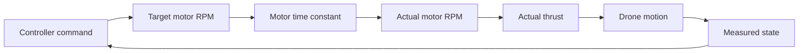

# Subtopic: Motor lag and control response

## By the end, you will be able to

- explain why a motor does not reach a new RPM instantly;
- use a first-order motor-lag model;
- identify the gap between commanded and actual thrust on a graph;
- explain how lag changes altitude and attitude control;
- choose controller gains with actuator delay in mind.



---

## The intuition

A controller can request a motor-speed change immediately, but the motor,
ESC, propeller, and rotating inertia need time to respond. This delay is called
**motor lag**.

The controller therefore acts on a target that has not happened yet:

```text
controller request → motor response delay → changed thrust → changed motion
```

If the controller ignores this delay, it may continue increasing the command
while the drone is still responding to the previous command. That can create
overshoot, oscillation, or slow recovery.

---

## The first-order motor model

Use the continuous-time model:

\[
\dot{\omega}=\frac{\omega_{cmd}-\omega}{\tau_m}
\]

For the simulator, the model is integrated with a small timestep:

\[
\omega_{k+1}=\omega_k+\alpha(\omega_{cmd}-\omega_k),
\qquad
\alpha=\min\left(1,\frac{\Delta t}{\tau_m}\right)
\]

Thrust then follows the actual rotor speed, not the requested speed:

\[
T=k_T\omega^2
\]

| Symbol | Meaning | SI unit |
| --- | --- | --- |
| \(\omega\) | Actual rotor angular speed | rad/s, or RPM in the teaching simulator |
| \(\omega_{cmd}\) | Commanded rotor angular speed | rad/s, or RPM |
| \(\dot{\omega}\) | Rate of motor-speed change | rad/s² |
| \(\tau_m\) | Motor time constant | s |
| \(\Delta t\) | Simulation timestep | s |
| \(\alpha\) | Discrete response fraction per step | dimensionless |
| \(T\) | Actual rotor thrust | N |
| \(k_T\) | Thrust coefficient | N·s²/rad², or calibrated simulator units |

For the reference simulator, \(\Delta t=1/240\approx0.00417\,s\) and
\(\tau_m=0.05\,s\), so:

\[
\alpha=\frac{0.00417}{0.05}\approx0.083
\]

Only about `8.3%` of the remaining speed error is closed on each physics step.

---

## How lag affects the control system

### Altitude control

The altitude controller requests more thrust when the drone is below its target.
With lag, actual thrust rises after the request. If the controller keeps adding
correction during that delay, the drone can pass the target altitude before the
thrust has settled.

### Roll and pitch control

The motor mixer changes individual motor commands to create torque. Lag means
the four motors do not instantly create the requested thrust difference, so the
attitude response is slower than the mixer command.

### PID tuning

- Too much proportional gain can make delayed thrust corrections overshoot.
- Too much integral gain can accumulate error while the motor is still catching up.
- Derivative action can reduce overshoot, but noisy or delayed measurements can
  make it react too strongly.
- The motor time constant must be included when tuning gains; changing motors,
  propellers, battery, or ESC settings may require retuning.

---

## Run the motor-lag experiment

Generate the dedicated graph used in this lesson:

```bash
uv run python examples/06-autonomous-hover/reduced_order_simulation.py \
  --motor-lag-plot \
  --seconds 1 \
  --output outputs/06-autonomous-hover/topic-03-motor-lag
```


The dashed curves are the requested motor response. The solid curves are the
actual response after the time constant is applied. The largest separation is
the transient error that the controller must tolerate.

To experiment with the wider altitude-control response, use the interactive
playground from the parent topic:

```bash
uv run python examples/06-autonomous-hover/reduced_order_simulation.py --interactive
```

---

## Optional challenge quiz

<form class="quiz" data-answer="b" data-explanation="The time constant determines how quickly actual RPM closes the gap to commanded RPM.">
  <fieldset><legend>1. What does the motor time constant describe?</legend><label><input type="radio" name="topic3-lag-q1" value="a"> Drone mass</label><br><label><input type="radio" name="topic3-lag-q1" value="b"> How quickly the motor approaches commanded speed</label><br><label><input type="radio" name="topic3-lag-q1" value="c"> Battery capacity only</label></fieldset>
  <button type="button" class="quiz-check">Check answer</button><p class="quiz-result" aria-live="polite"></p>
</form>

<form class="quiz" data-answer="c" data-explanation="The actual rotor speed is delayed, and thrust is calculated from actual speed rather than the command.">
  <fieldset><legend>2. Which quantity produces the simulated thrust?</legend><label><input type="radio" name="topic3-lag-q2" value="a"> The future controller command</label><br><label><input type="radio" name="topic3-lag-q2" value="b"> The drone's target altitude</label><br><label><input type="radio" name="topic3-lag-q2" value="c"> The actual rotor speed</label></fieldset>
  <button type="button" class="quiz-check">Check answer</button><p class="quiz-result" aria-live="polite"></p>
</form>

<form class="quiz" data-answer="a" data-explanation="Integral error can accumulate while thrust is still catching up, which can produce overshoot after the motor reaches the requested speed.">
  <fieldset><legend>3. Why can integral gain be risky with motor lag?</legend><label><input type="radio" name="topic3-lag-q3" value="a"> Error can accumulate during the delayed response</label><br><label><input type="radio" name="topic3-lag-q3" value="b"> It removes battery mass</label><br><label><input type="radio" name="topic3-lag-q3" value="c"> It makes RPM independent of thrust</label></fieldset>
  <button type="button" class="quiz-check">Check answer</button><p class="quiz-result" aria-live="polite"></p>
</form>

---

## Hands-on exercise

1. Run the motor-lag graph with the default `0.05 s` time constant.
2. Change `motor_time_constant_s` in `examples/common/drone_profiles/real_reference.yaml` to `0.02` and regenerate the graph.
3. Change it again to `0.10` and compare the gap between target and actual RPM.
4. Predict which setup needs less aggressive PID gains and explain why.
5. Restore the profile value to `0.05 s` after the experiment.

---

Prerequisite: [Topic 3: Rotor thrust](../index.md). Next: [Topic 4: Roll and pitch torque](../../04-roll-pitch-torque/index.md).
