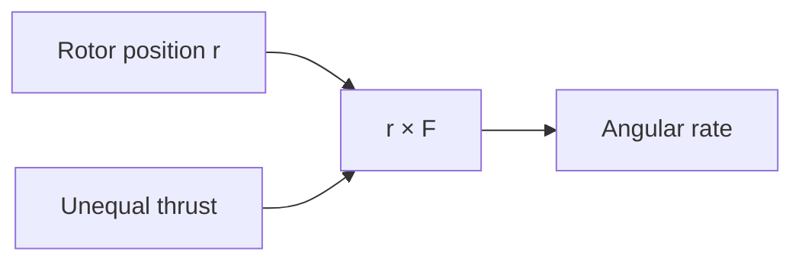

# Topic 4: Roll and pitch torque

## By the end, you will be able to

- calculate torque from a rotor lever arm;
- connect unequal thrust to angular acceleration.

Run `uv run python examples/06-autonomous-hover/reduced_order_simulation.py --scenario torque`.

---

## Exercise and review

Change the applied torque sign and predict the rate sign. Why does inertia
change the slope of the angular-rate graph? Which rotor pair creates roll?

Previous: [Topic 3](../03-rotor-thrust/index.md). Next: [Topic 5](../05-reaction-yaw-torque/index.md).
