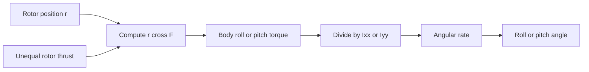
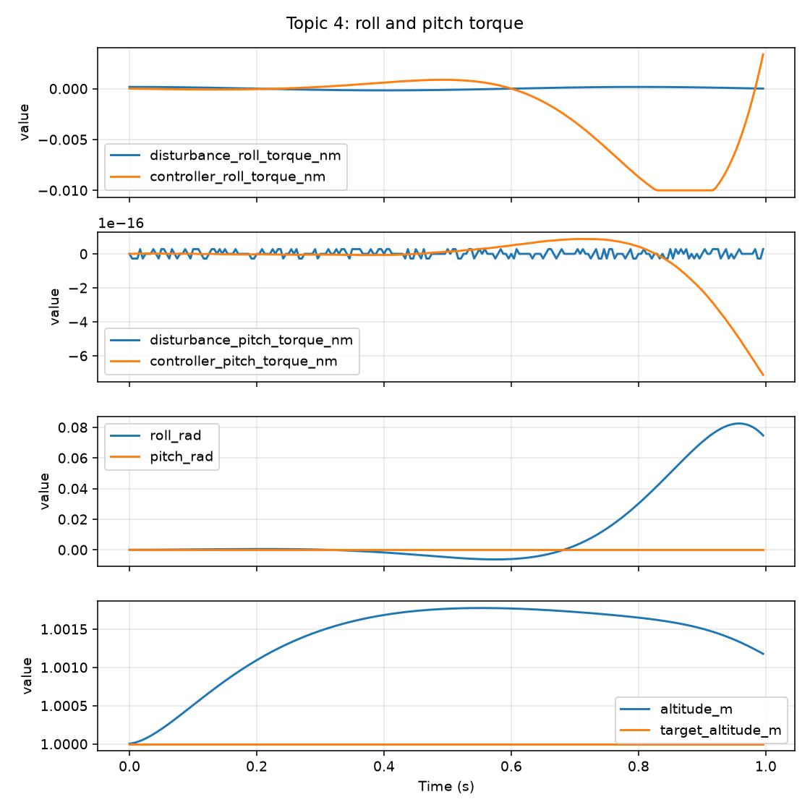

# Topic 4: Roll and pitch torque

## By the end, you will be able to

- calculate torque from an off-center rotor force;
- predict roll or pitch direction from unequal thrust;
- use the URDF inertia to estimate angular acceleration;
- compare PyBullet and reduced-order attitude response;
- identify where the new torque method enters the cumulative loop;
- use altitude and attitude PID to keep the vehicle near hover;
- apply a latched roll/pitch disturbance and compare it with controller correction.

An equal four-rotor thrust command produces lift. If one side produces more
thrust than the other, the force no longer acts through the center of mass. The
lever arm turns that force difference into body torque, changing angular rate
and then attitude.



---

## The lever-arm equation

For rotor \(i\), torque about the center of mass is:

\[
\mathbf{\tau}_i = \mathbf{r}_i \times \mathbf{F}_i
\]

For an upward rotor force \(\mathbf{F}_i=(0,0,T_i)\), where
\(\mathbf{r}_i=(x_i,y_i,z_i)\):

\[
\tau_x = y_i T_i, \qquad \tau_y = -x_i T_i
\]

Summing all four rotors gives:

\[
\tau_x = \sum_i y_iT_i, \qquad \tau_y = -\sum_i x_iT_i
\]

| Symbol | Meaning | SI unit |
| --- | --- | --- |
| \(\mathbf{r}_i\) | Rotor position relative to the center of mass | m |
| \(\mathbf{F}_i\) | Rotor thrust force | N |
| \(T_i\) | Rotor thrust magnitude | N |
| \(\tau_x\) | Roll torque about body x | N·m |
| \(\tau_y\) | Pitch torque about body y | N·m |
| \(I_{xx}, I_{yy}\) | Roll and pitch moments of inertia | kg·m² |

The rotational equation is:

\[
\alpha_x=\frac{\tau_x}{I_{xx}}, \qquad \alpha_y=\frac{\tau_y}{I_{yy}}
\]

For the reference drone, \(y=0.12\,m\), \(I_{xx}=0.00348\,kg\,m^2\),
and a \(0.02\,N\) thrust difference on each side:

\[
\tau_x = 4(0.12)(0.02)=0.0096\,N\,m
\]

\[
\alpha_x = \frac{0.0096}{0.00348}\approx2.76\,rad/s^2
\]

The inertia controls the slope of the angular-rate curve: the same torque
creates less angular acceleration on a vehicle with larger inertia.

To keep this lesson near hover, the default collective command is `1290 us`,
which is close to the reference drone's calculated hover command. The default
roll imbalance is a conservative `0.0005 N` per motor, and the roll and pitch
imbalance is driven by:

[
Delta T(t)=Acosleft(\frac{2\pi t}{P}\right)
]

In headless runs the sign changes every (P/2) seconds. In the interactive run,
the `Roll torque` and `Pitch torque` buttons latch a constant disturbance until
clicked again.

---

## Sign convention and thrust pattern

The vehicle uses body \(+x\) forward, body \(+y\) left, and body \(+z\) up.

- Positive roll delta increases thrust on rotors with positive \(y\).
- Positive pitch delta increases thrust on rotors with negative \(x\).
- The resulting torque is applied in the body frame.
- Rotor reaction torque is deferred to Topic 5.

Topic 3 collective thrust remains active. Topic 4 now adds a small altitude and
attitude stabilizer around that thrust. The deliberate unequal-thrust pattern
is still applied as a separate disturbance, so the graph can compare the new
torque with the requested controller correction.

---

## Run the simulation

```bash
uv run python examples/06-autonomous-hover/04-roll-pitch-torque/roll_pitch_torque.py --self-check
```

Run the reduced-order version:

```bash
uv run python examples/06-autonomous-hover/04-roll-pitch-torque/roll_pitch_torque.py --backend reduced --self-check
```

Try pitch instead of roll:

```bash
uv run python examples/06-autonomous-hover/04-roll-pitch-torque/roll_pitch_torque.py --backend reduced --roll-delta 0 --pitch-delta 0.0005 --seconds 1
```

When the PyBullet backend runs interactively, an external Tk control window
provides live run controls:

- `Start`: begin or resume the physics loop.
- `Pause`: stop physics ticks without changing the current state.
- `Restart`: reset the drone, battery, motors, timer, telemetry, and GIF
  frames, then press `Start` again.
- `Quit`: stop the topic and close the PyBullet session.

Interactive PyBullet ticks are paced in real time. Press `Start`, then latch
`Roll torque` or `Pitch torque` to disturb the hover; click the same button to
release it and observe recovery. Headless and reduced-order runs remain
uncapped for fast experiments.

Interactive PyBullet runs are not limited by `--seconds`; they continue until
the Tk control window is closed. The `--seconds` value still limits headless,
reduced-order, self-check, and output-generation runs.

The Topic 4 controller holds altitude and attitude. It does not yet close the
outer X/Y position loop, so a tilted drone may still accumulate horizontal
drift. Full position correction is introduced with the later controller topic.

Use a bounded headless run when generating a graph or testing a longer case:

```bash
uv run python examples/06-autonomous-hover/04-roll-pitch-torque/roll_pitch_torque.py \
  --seconds 1 --output docs/modules/06-autonomous-hover/04-roll-pitch-torque/images/topic-04-disturbance-recovery
```

The generated graph overlays disturbance torque and requested controller
correction, then shows attitude and altitude response:



The recorded data is available at
[topic-04-disturbance-recovery.csv](images/topic-04-disturbance-recovery.csv).

Try a slower, larger oscillation:

```bash
uv run python examples/06-autonomous-hover/04-roll-pitch-torque/roll_pitch_torque.py --seconds 4 --roll-delta 0.001 --oscillation-period 1.2
```

---

## The new force method

The topic-owned method calculates signed rotor thrust values, computes
\(\mathbf{r}\times\mathbf{F}\), and applies the resulting body torque:

??? example "Open the Topic 4 torque method"

    ```python
    # ! TOPIC 4 NEW FORCE: ROLL AND PITCH TORQUE
    def apply_roll_pitch_torque(drone, profile, collective_thrust_n, roll_delta_n, pitch_delta_n):
        rotor_thrusts_n = tuple(
            max(0.0, collective_thrust_n + roll_delta_n * sign(y) - pitch_delta_n * sign(x))
            for x, y, _ in profile.model.rotor_positions_m
        )
        torque_body_nm = torque_from_rotor_thrusts(profile, rotor_thrusts_n)
        p.applyExternalTorque(drone, -1, tuple(torque_body_nm), p.LINK_FRAME)
        return rotor_thrusts_n, torque_body_nm
    ```

Complete implementation: `examples/06-autonomous-hover/04-roll-pitch-torque/roll_pitch_torque.py`.

The cumulative PyBullet loop is:

```python
state = read_state(drone)
pwm_us, controller_torque_nm, pid_terms = controller_command(
    profile, altitude_pid, attitude_controller, state.position_m[2],
    state.linear_velocity_mps[2], read_imu(drone), START_HEIGHT_M,
    bus_voltage_v,
)
motor_rpms, battery_state = advance_motor_state(profile, battery, motor_rpms, pwm_us)
apply_gravity(drone, profile)
motor_thrusts = apply_rotor_thrust(drone, profile, motor_rpms)
# ! TOPIC 4 NEW FORCE CALL: disturbance follows previous forces before correction.
_, disturbance_torque_nm = apply_roll_pitch_torque(
        drone, profile, np.mean(motor_thrusts), roll_delta, pitch_delta
)
# ! TOPIC 4 STABILIZATION CALL: PID correction follows the new disturbance.
p.applyExternalTorque(drone, -1, controller_torque_nm, p.LINK_FRAME)
p.stepSimulation()
```

The reduced-order loop uses the same torque equation and integrates:

\[
\omega_{k+1}=\omega_k+\frac{\tau}{I}\Delta t, \qquad
\theta_{k+1}=\theta_k+\omega_{k+1}\Delta t
\]

---

## Exercise

1. Run the default roll case and compare disturbance torque with controller torque.
2. Set `--roll-delta 0 --pitch-delta 0.0005` and compare pitch with roll.
3. Change the inertia in the drone profile and predict the rate slope change.
4. Set both deltas to zero and confirm the disturbance and correction curves
   disappear while near-hover altitude remains stable.

---

## Checkpoint quiz

<form class="quiz" data-answer="b" data-explanation="For an upward force, tau_x = yT, so the y lever arm creates roll torque.">
<fieldset><legend>1. For an upward rotor force at positive body y, which term contributes to roll torque?</legend><label><input type="radio" name="topic4-q1" value="a"> xT</label><br><label><input type="radio" name="topic4-q1" value="b"> yT</label><br><label><input type="radio" name="topic4-q1" value="c"> zT</label></fieldset><button type="button" class="quiz-check">Check answer</button><p class="quiz-result" aria-live="polite"></p>
</form>

<form class="quiz" data-answer="a" data-explanation="Angular acceleration is torque divided by moment of inertia, alpha = tau/I.">
<fieldset><legend>2. What happens to angular acceleration if inertia doubles while torque stays constant?</legend><label><input type="radio" name="topic4-q2" value="a"> It is reduced by half</label><br><label><input type="radio" name="topic4-q2" value="b"> It doubles</label><br><label><input type="radio" name="topic4-q2" value="c"> It becomes zero</label></fieldset><button type="button" class="quiz-check">Check answer</button><p class="quiz-result" aria-live="polite"></p>
</form>

<form class="quiz" data-answer="c" data-explanation="Rotor positions and thrust directions are body-frame quantities, so the resulting torque is applied in the body frame.">
<fieldset><legend>3. Which frame is used for the Topic 4 applied torque?</legend><label><input type="radio" name="topic4-q3" value="a"> Camera frame</label><br><label><input type="radio" name="topic4-q3" value="b"> World frame</label><br><label><input type="radio" name="topic4-q3" value="c"> Body frame</label></fieldset><button type="button" class="quiz-check">Check answer</button><p class="quiz-result" aria-live="polite"></p>
</form>

---

## Topic summary

Roll and pitch motion begins when thrust acts away from the center of mass.
The cross product \(\mathbf{r}\times\mathbf{F}\) converts the rotor lever arm
and thrust difference into body torque. The inertia then determines angular
acceleration.

The graph connects four results: the injected disturbance, the requested PID
correction, the attitude response, and the altitude response. The correction
curve should oppose the disturbance or the resulting attitude error. The
vehicle is expected to keep altitude and bounded attitude, while some
horizontal drift remains because XY position control comes later.

The important baseline is that Topic 4 applies roll and pitch torque as the
new disturbance while preserving gravity, thrust, motor lag, and a simple
altitude/attitude stabilization loop.
Rotor reaction torque around body z is not part of this lesson; Topic 5 adds
that yaw effect. The cumulative model now contains gravity, contact, collective
thrust, motor lag, and attitude torque.

Previous: [Topic 3](../03-rotor-thrust/index.md). Next: [Topic 5](../05-reaction-yaw-torque/index.md).
