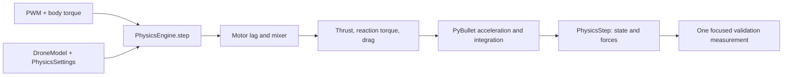
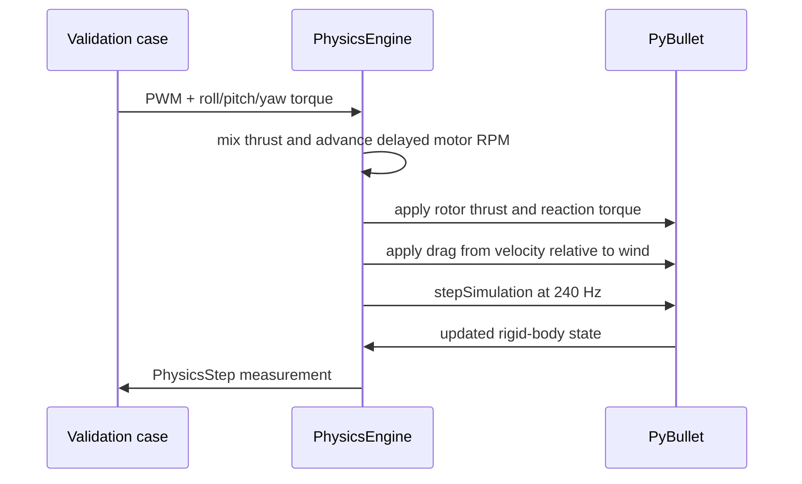

# Step 5: Validate the physics engine

Before trusting a controller, test the physical model one cause at a time. A
PID can sometimes hide a wrong model in one flight, but gravity, thrust,
torque, and wind checks reveal whether the simulator behaves for the right
physical reason.

## By the end, you will be able to

- Describe what enters and leaves one `PhysicsEngine.step()` call.
- Run seven independent checks for gravity, lift, attitude, and wind.
- Read a measurement with its unit and decide whether it matches a prediction.
- Explain why motor spin-up is removed from the hover-balance test.



---

## The physics path

`PhysicsEngine.step()` is the seam between a flight command and a new physical
state. Its caller supplies collective PWM and desired body torque; it returns
motor RPM, motor thrust, drag force, and the resulting `DroneState`.



The physical responsibilities map to the real code like this:

| Physical stage | Where it happens | What it means |
| --- | --- | --- |
| Gravity | `create_world()` configures PyBullet | The world pulls every dynamic body downward. |
| Motor thrust | `PhysicsEngine._apply_rotor_forces()` | Each rotor applies upward force from RPM. |
| Motor reaction torque | `PhysicsEngine._apply_rotor_forces()` | CW and CCW rotor pairs create or cancel yaw torque. |
| Wind and drag | `PhysicsSettings` and `_apply_drag()` | Drag opposes velocity relative to moving air. |
| Acceleration and integration | `p.stepSimulation()` | PyBullet combines forces with mass and inertia to update motion. |

The engine does not calculate acceleration with a separate public method:
PyBullet performs that rigid-body calculation after the engine applies forces.

---

## Run the validation suite

Run all seven deterministic checks in a terminal:

```bash
uv run python examples/06-autonomous-hover/physics_engine_validation.py --headless
```

The console groups the results clearly:

```text
====== PHYSICS-ENGINE VALIDATION ======
               gravity: -9.810 m/s² (near -9.81 m/s²)
                 hover: 0.000 m (near 0 m altitude error)
...
7/7 checks passed
========================================
```

The command also saves `outputs/physics_engine_validation.png`. Its bars have
different units, so use their labels to read individual results; do not compare
one bar's height directly with another's.

Run one check when studying a single effect:

```bash
uv run python examples/06-autonomous-hover/physics_engine_validation.py \
  --headless --scenario wind --no-plot
```

---

## Seven checks, seven predictions

Each test changes one physical cause, measures one result, and checks it with
an assertion. A failed assertion means the model no longer matches the stated
prediction.

| Check | Controlled setup | Measurement | Expected result |
| --- | --- | --- | --- |
| Gravity | Motors off at 10 m for 0.4 s | Vertical acceleration | Near \(-9.81\ \mathrm{m/s^2}\) |
| Hover | Equal hover PWM at 5 m for 2 s | Altitude error | Near `0 m` |
| Vertical | Equal `1650 µs` PWM | Vertical velocity | Positive upward value |
| Roll | Positive roll torque | Body roll rate | Positive `rad/s` |
| Pitch | Positive pitch torque | Body pitch rate | Positive `rad/s` |
| Yaw | CW/CCW yaw torque | Body yaw rate | Positive `rad/s` with nearly unchanged lift |
| Wind | Positive 5 m/s y-direction wind | y displacement | Positive lateral drift |

### Why hover RPM is primed

Real motors cannot jump instantly to a requested RPM. The engine models that
delay. For the hover validation, the test begins with all four motors already
at hover RPM, so it measures **force balance** instead of the temporary drop
that would happen while motors spin up from rest.

### The runnable validation code

```python
--8<-- "examples/06-autonomous-hover/physics_engine_validation.py"
```

Run all assertions without a plot:

```bash
uv run python examples/06-autonomous-hover/physics_engine_validation.py --self-check
```

---

## Hands-on: reverse the wind prediction

1. Run the wind scenario and record the sign of the y displacement.
2. In `wind_validation()`, change `wind_world_mps` from `(0.0, 5.0, 0.0)` to
   `(0.0, -5.0, 0.0)`.
3. Predict that the drift becomes negative, then run the scenario again.
4. Restore `(0.0, 5.0, 0.0)` so the shared self-check remains the reference.

---

## Review quiz: understand every check

<form class="quiz" data-answer="a" data-explanation="With motors off and before contact, gravity is the only vertical cause, so acceleration should be near −9.81 m/s².">
  <fieldset><legend>1. What does the gravity check measure?</legend><label><input type="radio" name="validation-q1" value="a"> Free-fall acceleration near −9.81 m/s²</label><br><label><input type="radio" name="validation-q1" value="b"> Rotor RPM at maximum throttle</label><br><label><input type="radio" name="validation-q1" value="c"> Wind speed</label></fieldset><button type="button" class="quiz-check">Check answer</button><p class="quiz-result" aria-live="polite"></p>
</form>

<form class="quiz" data-answer="b" data-explanation="Hover means total lift balances weight, so the drone should have almost no altitude error.">
  <fieldset><legend>2. What result shows that the hover check passes?</legend><label><input type="radio" name="validation-q2" value="a"> A large positive yaw rate</label><br><label><input type="radio" name="validation-q2" value="b"> Altitude error close to zero</label><br><label><input type="radio" name="validation-q2" value="c"> Negative lateral drift</label></fieldset><button type="button" class="quiz-check">Check answer</button><p class="quiz-result" aria-live="polite"></p>
</form>

<form class="quiz" data-answer="c" data-explanation="Equal PWM above hover increases total thrust beyond weight, so vertical velocity should become positive.">
  <fieldset><legend>3. What should 1650 µs equal collective PWM produce?</legend><label><input type="radio" name="validation-q3" value="a"> Downward velocity</label><br><label><input type="radio" name="validation-q3" value="b"> Only a yaw rotation</label><br><label><input type="radio" name="validation-q3" value="c"> Positive upward velocity</label></fieldset><button type="button" class="quiz-check">Check answer</button><p class="quiz-result" aria-live="polite"></p>
</form>

<form class="quiz" data-answer="a" data-explanation="The roll validation reads the body angular velocity around the roll axis.">
  <fieldset><legend>4. Which measurement proves a positive roll response?</legend><label><input type="radio" name="validation-q4" value="a"> Positive roll rate in rad/s</label><br><label><input type="radio" name="validation-q4" value="b"> Positive altitude error in m</label><br><label><input type="radio" name="validation-q4" value="c"> Positive wind speed in m/s</label></fieldset><button type="button" class="quiz-check">Check answer</button><p class="quiz-result" aria-live="polite"></p>
</form>

<form class="quiz" data-answer="b" data-explanation="The pitch validation reads the body angular velocity around the pitch axis.">
  <fieldset><legend>5. Which measurement proves a positive pitch response?</legend><label><input type="radio" name="validation-q5" value="a"> Positive lateral drift</label><br><label><input type="radio" name="validation-q5" value="b"> Positive pitch rate in rad/s</label><br><label><input type="radio" name="validation-q5" value="c"> Positive gravity</label></fieldset><button type="button" class="quiz-check">Check answer</button><p class="quiz-result" aria-live="polite"></p>
</form>

<form class="quiz" data-answer="c" data-explanation="Changing CW and CCW rotor balance creates yaw torque while the equal collective part remains nearly unchanged.">
  <fieldset><legend>6. Why can the yaw check rotate without strongly changing lift?</legend><label><input type="radio" name="validation-q6" value="a"> Yaw removes gravity</label><br><label><input type="radio" name="validation-q6" value="b"> The drone has no mass during yaw</label><br><label><input type="radio" name="validation-q6" value="c"> CW/CCW torque changes can keep collective thrust nearly constant</label></fieldset><button type="button" class="quiz-check">Check answer</button><p class="quiz-result" aria-live="polite"></p>
</form>

<form class="quiz" data-answer="a" data-explanation="Drag responds to motion relative to air, so reversing the wind changes the drift direction.">
  <fieldset><legend>7. What should happen when the crosswind direction is reversed?</legend><label><input type="radio" name="validation-q7" value="a"> Lateral drift reverses direction</label><br><label><input type="radio" name="validation-q7" value="b"> Gravity becomes zero</label><br><label><input type="radio" name="validation-q7" value="c"> The drone mass changes</label></fieldset><button type="button" class="quiz-check">Check answer</button><p class="quiz-result" aria-live="polite"></p>
</form>

<form class="quiz" data-answer="b" data-explanation="Separate checks expose a wrong force or torque model before a PID controller can partly hide the error.">
  <fieldset><legend>8. Why validate physics before tuning a PID controller?</legend><label><input type="radio" name="validation-q8" value="a"> To avoid measuring state</label><br><label><input type="radio" name="validation-q8" value="b"> To find force-model errors before the controller hides them</label><br><label><input type="radio" name="validation-q8" value="c"> To make the simulation run slower</label></fieldset><button type="button" class="quiz-check">Check answer</button><p class="quiz-result" aria-live="polite"></p>
</form>

---

Previous: [Step 2: Drone free fall](../02-drone-free-fall/index.md). Next: [Automatic takeoff and hover](../index.md#automatic-takeoff-yaw-and-landing).
