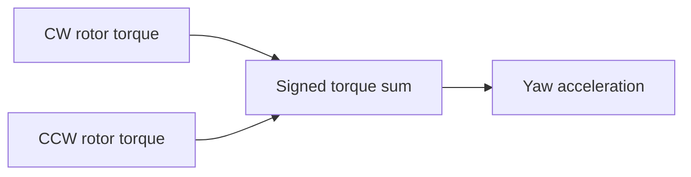

# Topic 5: Reaction yaw torque

## By the end, you will be able to

- explain CW/CCW torque cancellation;
- create yaw without intentionally changing collective thrust.

Run `uv run python examples/06-autonomous-hover/reduced_order_simulation.py --scenario yaw`.

---

## Exercise and review

Reverse the yaw torque and compare yaw-rate signs. Why do equal CW and CCW
speeds cancel? What is the role of `kQ`?

Previous: [Topic 4](../04-roll-pitch-torque/index.md). Next: [Topic 6](../06-body-drag/index.md).
