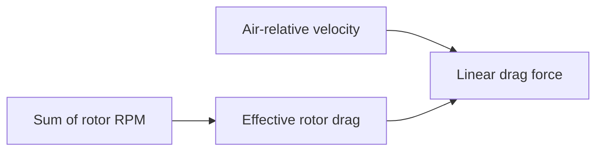

# Topic 7: Rotor-dependent linear drag

## By the end, you will be able to

- relate total rotor speed to linear rotor drag;
- compare drag at different throttle levels.

Run the reduced-order drag scenario, then vary the motor command and compare
the drag channel in the CSV output.

---

## Exercise and review

Why does rotor drag depend on RPM? How does battery sag change it? Why is this
model intentionally simpler than full rotor aerodynamics?

Previous: [Topic 6](../06-body-drag/index.md). Next: [Topic 8](../08-wind/index.md).
