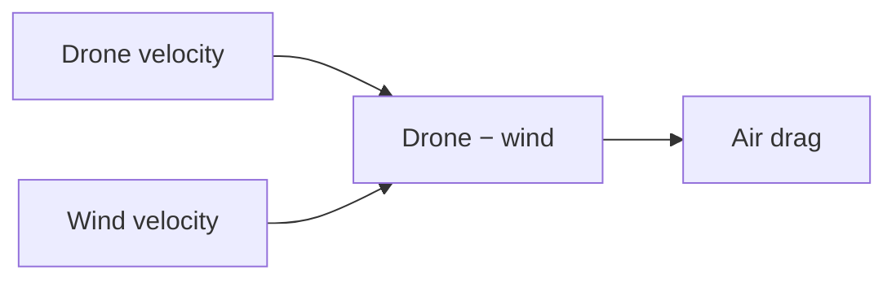

# Topic 8: Wind and air-relative velocity

## By the end, you will be able to

- distinguish wind velocity from force;
- predict drift from crosswind drag.

Run `uv run python examples/06-autonomous-hover/reduced_order_simulation.py --scenario wind`.

---

## Exercise and review

Reverse the wind sign and predict the displacement sign. Why can attitude hold
continue while horizontal position drifts?

Previous: [Topic 7](../07-rotor-drag/index.md). Next: [Topic 9](../09-angular-damping/index.md).
