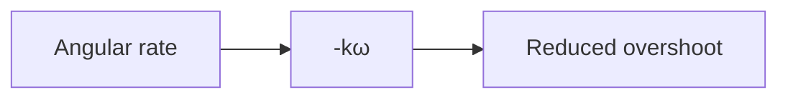

# Topic 9: Angular damping

## By the end, you will be able to

- model torque that opposes angular rate;
- compare damped and undamped rotational motion.

Use the torque scenario and compare its angular-rate trace with angular
damping enabled and disabled in the profile settings.

---

## Exercise and review

Why must damping reverse sign when angular rate reverses? Which controller
behavior does damping improve? Does damping create lift?

Previous: [Topic 8](../08-wind/index.md). Next: [Topic 10](../10-battery-and-motor-dynamics/index.md).
