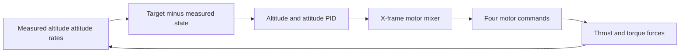

# Topic 11: Control loop, PID, and motor mixing

## By the end, you will be able to

- turn altitude error into collective thrust;
- turn attitude error into roll, pitch, and yaw torque;
- explain why the mixer changes individual motor thrusts;
- distinguish a force model from a stabilizing controller;
- observe stabilized altitude and attitude in PyBullet and the reduced model.

The earlier topics deliberately expose open-loop physics. Topic 4 can roll the
drone, but nothing commands it back to level. Topic 11 closes that loop:



---

## The controller loop

At each control update, the controller computes an altitude correction:

\[
T = mg + K_p e_h + K_i\int e_h\,dt - K_d v_z
\]

where \(e_h=h_{target}-h\). Attitude PID uses the same pattern, but its output
is a body torque request. A level target is used here:

\[
\tau_x = PID(0-\phi, p), \qquad
\tau_y = PID(0-\theta, q)
\]

The X-frame mixer converts collective thrust and body torque into four motor
thrusts. The mixer preserves the collective command while adding opposite
corrections to opposite motors.

| Quantity | Meaning | Unit |
| --- | --- | --- |
| \(e_h\) | altitude error | m |
| \(K_p,K_i,K_d\) | PID gains | controller-dependent |
| \(T\) | total collective thrust | N |
| \(\phi,\theta\) | roll and pitch | rad |
| \(p,q\) | roll and pitch rates | rad/s |
| \(\tau_x,\tau_y\) | requested body torque | N·m |

---

## Run the stabilized controller

Interactive PyBullet runs open the shared Tk control window. Start the run,
pause it to inspect the state, restart to clear PID integrators and vehicle
state, or choose `Quit` to close the simulation. The interactive run continues
until the Tk window is closed.

```bash
uv run python examples/06-autonomous-hover/11-control-and-mixing/control_and_mixing.py \
  --target-altitude 1.0
```

Use bounded runs for automated checks and graphs:

```bash
uv run python examples/06-autonomous-hover/11-control-and-mixing/control_and_mixing.py \
  --headless --self-check --seconds 4 --output outputs/topic-11-pid
```

Run the PyBullet-independent controller:

```bash
uv run python examples/06-autonomous-hover/11-control-and-mixing/control_and_mixing.py \
  --backend reduced --self-check --seconds 4
```

The graph records target altitude, measured altitude, PID terms, controller
output, roll, and pitch. The expected result is a bounded altitude response
with roll and pitch returning close to zero.

---

## Why the controller belongs after the force lessons

PID does not replace physics. It chooses motor commands; the physics engine
still applies gravity, thrust, reaction torque, drag, damping, and contact.
Keeping those responsibilities separate lets us answer two different questions:

- Does the force produce the predicted motion?
- Can the controller reject that motion and stabilize the vehicle?

The controller also has limits. If the requested torque requires more thrust
than a motor can provide, the mixer scales the torque correction rather than
inventing impossible motor output.

---

## Exercise

1. Increase the target altitude and observe the collective thrust response.
2. Pause while the drone is tilted and inspect how the attitude controller
   returns it toward level.
3. Compare the altitude response with the reduced-order backend.
4. Explain why a Topic 4 open-loop run can drift while this topic returns roll
   and pitch toward zero.

---

## Checkpoint quiz

<form class="quiz" data-answer="b" data-explanation="Altitude error changes collective thrust; attitude error changes body torque through the mixer.">
<fieldset><legend>1. What does altitude PID primarily change?</legend><label><input type="radio" name="topic11-q1" value="a"> Camera position</label><br><label><input type="radio" name="topic11-q1" value="b"> Collective thrust</label><br><label><input type="radio" name="topic11-q1" value="c"> Battery chemistry</label></fieldset><button type="button" class="quiz-check">Check answer</button><p class="quiz-result" aria-live="polite"></p>
</form>

<form class="quiz" data-answer="c" data-explanation="The mixer distributes collective thrust and torque corrections across the four motors.">
<fieldset><legend>2. Why does the controller need a motor mixer?</legend><label><input type="radio" name="topic11-q2" value="a"> To measure voltage</label><br><label><input type="radio" name="topic11-q2" value="b"> To draw the drone</label><br><label><input type="radio" name="topic11-q2" value="c"> To turn total thrust and torque into four motor commands</label></fieldset><button type="button" class="quiz-check">Check answer</button><p class="quiz-result" aria-live="polite"></p>
</form>

<form class="quiz" data-answer="a" data-explanation="The force model remains responsible for the resulting motion; PID only computes commands.">
<fieldset><legend>3. What does PID not do?</legend><label><input type="radio" name="topic11-q3" value="a"> Replace gravity and rigid-body physics</label><br><label><input type="radio" name="topic11-q3" value="b"> Use measured attitude error</label><br><label><input type="radio" name="topic11-q3" value="c"> Request corrective torque</label></fieldset><button type="button" class="quiz-check">Check answer</button><p class="quiz-result" aria-live="polite"></p>
</form>

---

## Topic summary

Topic 11 closes the loop around the cumulative vehicle model. Altitude PID
adjusts collective thrust, attitude PID requests corrective body torque, and
the X-frame mixer distributes those requests among the four motors. The
physics engine then decides what the real drone does, including motor lag,
limits, drag, damping, and contact.

The important result is not that PID makes the physics disappear. The result
is that the same physical forces can now be used to hold altitude and attitude
instead of allowing open-loop drift to become a crash.

Previous: [Topic 10](../10-battery-and-motor-dynamics/index.md). Next: [Topic 12](../12-advanced-forces/index.md).
