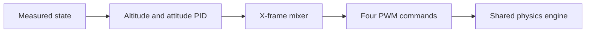

# Topic 11: Control loop, PID, and motor mixing

## By the end, you will be able to

- turn altitude error into collective thrust;
- turn attitude error into body torque;
- explain the 120 Hz controller and 240 Hz physics loop.

Run `uv run python examples/06-autonomous-hover/reduced_order_simulation.py --scenario altitude-pid --interactive`.

---

## Exercise and review

Increase `Kp` until overshoot appears, then increase `Kd`. Which PID term
removes steady error? Why must the mixer preserve total thrust?

Previous: [Topic 10](../10-battery-and-motor-dynamics/index.md). Next: [Topic 12](../12-advanced-forces/index.md).
