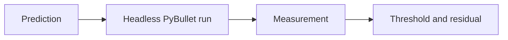

# Topic 13: Physics-engine validation

## By the end, you will be able to

- validate one force or torque at a time;
- compare expected and measured values;
- identify a model error before tuning PID.

Run `uv run python examples/06-autonomous-hover/physics_engine_validation.py --headless`.

---

## Exercise and review

Run the wind scenario, reverse the wind, and compare the residual. Why is the
hover test primed at hover RPM? Which failure indicates a sign error?

Previous: [Topic 12](../12-advanced-forces/index.md). Next: [Topic 14](../14-autonomous-flight/index.md).
