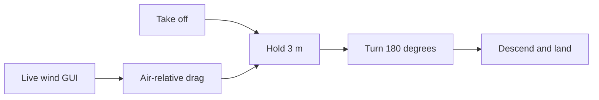

# Topic 14: Integrated autonomous flight

## By the end, you will be able to

- run the validated real-reference drone in PyBullet;
- use altitude and attitude PID to complete a flight sequence;
- explore crosswind behavior with the final-flight GUI.



Run the final flight:

```bash
uv run python examples/06-autonomous-hover/auto_takeoff_and_hover.py --headless
uv run python examples/06-autonomous-hover/auto_takeoff_and_hover.py --wind-gui
```

The wind GUI changes world-frame wind and displays air-relative velocity, drag,
altitude, attitude, and horizontal drift. The controller holds altitude and
attitude; it does not promise zero horizontal drift.

---

## Exercise and review

Run calm air, `+Y` crosswind, and reversed wind. Compare altitude stability and
lateral displacement. Which behavior belongs to the controller and which to
the physics engine?

Previous: [Topic 13](../13-physics-engine-validation/index.md). Next: [Module 7: Optical navigation](../../07-optical-navigation/index.md).
