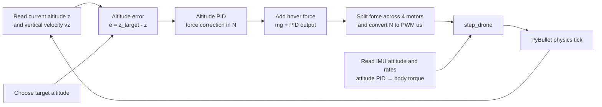

# Module 6: Autonomous takeoff and precision hover

## By the end, you will be able to

- Convert altitude error into high-level control inputs.
- Map PID control output to motor PWM.
- Hold a stable 5 m hover under simulated physical limits.
- Validate gravity, hover, attitude torque, and wind responses before tuning control.

## Lessons

1. Build closed-loop altitude tracking from spatial displacement.
2. Map PID corrections through the mixer to safe motor commands.
3. Verify hover while balancing drag, inertia, and battery depletion.
4. Validate the complete force, torque, and integration pipeline.

---

## Manual takeoff preview

This is an early capstone preview: a complete 650 g drone body on a ground
plane, with four virtual motors and a single collective PWM slider. It is manual
control, not an autonomous controller yet.

```bash
uv run python examples/06-autonomous-hover/manual_takeoff.py
```

In the PyBullet GUI, raise **Collective PWM (us)** slowly from `1000` toward
`1500`. The live display shows the commanded PWM, actual rotor RPM, individual
motor thrusts, total thrust, attitude, body angular rate, and the drone's
`6.38 N` weight.

| PWM range | Expected behavior |
| --- | --- |
| Below `1500 µs` | Total thrust is below weight; the drone stays on the ground or descends. |
| Near `1500 µs` | Total thrust is about equal to weight; the drone hovers. |
| Above `1500 µs` | Total thrust exceeds weight; the drone takes off. |

### Forces in this preview

- **Gravity** pulls the drone down with `W = mg`.
- **Rotor speed** follows PWM through a short motor-response delay, so an abrupt
  command does not create an impossible instant force jump.
- **Four rotor thrusts** use `F = Kf × RPM²` at their own fixed rotor links.
- **CW/CCW reaction torques** use `τ = Km × RPM²` in opposite pairs and cancel
  when all motors run equally.
- **Aerodynamic drag** opposes body-frame velocity and increases with total
  rotor RPM.

### Attitude hold and force view

The GUI starts with **Attitude hold** enabled. Its IMU-style state read supplies
roll, pitch, yaw, and body angular rate to three PID controllers. The X-frame
mixer keeps all motor forces equal while the drone is level, then makes only
small motor-force differences when it must correct a tilt. If a requested
correction would exceed a motor limit, the mixer scales all correction terms
together instead of clipping one motor and creating an unintended spin. Green
lines above each rotor show the current, delayed thrust force.

Attitude hold prevents uncontrolled rotation; it does **not** create lift. If
you reduce collective PWM below hover, the drone still descends because total
thrust is below weight.

The 1500 µs hover point is a teaching calibration, not propeller test data.
The shared constants in `examples/common/drone_control.py` are deliberately
easy to tune.

For a repeatable terminal run:

```bash
uv run python examples/06-autonomous-hover/manual_takeoff.py --headless --pwm 1550
```

Run the motor-lag and equal-force check with:

```bash
uv run python examples/06-autonomous-hover/manual_takeoff.py --self-check
```

---

## Automatic takeoff, yaw, and landing

The automatic example uses the shared `examples/common/pid.py` controller for
altitude, roll, pitch, and yaw. It climbs to `3 m`, hovers for two seconds,
turns `180°`, and then lands. Its vertical gains are deliberately conservative:
the headless check limits the peak altitude to `3.25 m`.

```bash
uv run python examples/06-autonomous-hover/auto_takeoff_and_hover.py
```

Use `--headless` for the repeatable check:

```bash
uv run python examples/06-autonomous-hover/auto_takeoff_and_hover.py --headless
```

Later modules will replace collective throttle with individual motor commands,
add battery and wind effects, and close the loop with altitude control.

---

## One control step: altitude to motor forces

The physics engine advances at **240 Hz**, but the controller makes a new
decision every two physics ticks: **120 Hz**. On each control step, the program
reads the current vertical state, calculates the force needed to correct the
altitude error, and lets the lower-level attitude loop keep the body level.



The altitude calculation is:

\[
F_{\text{total}} = mg + F_{\text{PID}}
\]

`F_PID` is a correction force in newtons. At hover it is near zero, so the
total is near the drone weight `mg`. The example divides this total by four,
converts the requested force for one motor to PWM, and uses the attitude PID's
torque request to make the small motor-to-motor differences needed to stay
level.

### What `step_drone()` does

`step_drone(drone, pwm, torque, motor_rpms)` receives a collective PWM command,
a body-torque request `(roll, pitch, yaw)`, and the motors' actual RPM from the
previous physics tick. It performs the actuator and force part of the loop:

1. Convert the collective PWM to a requested thrust per motor.
2. Mix the roll, pitch, and yaw torque corrections into four bounded motor
   thrust requests.
3. Convert each requested thrust to target RPM using \(T=K_f\,\mathrm{RPM}^2\).
4. Apply first-order motor lag, so actual RPM cannot jump instantly to target
   RPM.
5. Apply each rotor's upward thrust, reaction yaw torque, and rotor-dependent
   body drag as PyBullet external forces and torques.
6. Call `p.stepSimulation()` once to integrate the new motion at 240 Hz.

It returns the new actual motor RPM, the four applied motor thrusts, and their
total. That returned RPM is essential: it becomes the next tick's motor state,
which is why a sudden PWM change produces a smooth force response instead of
an impossible instantaneous jump.

---

## Live altitude PID tuning

`pid_tuning_hover.py` is a separate tuning tool. It keeps the automatic
example unchanged and exposes live sliders for the altitude target, `Kp`, `Ki`,
`Kd`, and altitude-measurement noise. It opens paused. Use the separate
**Simulation controls** window to start, stop, reset, exit, or load a preset.

The response window has two plots: target, true, and measured altitude with
collective thrust on top; the P, I, D, and summed controller terms below.

```bash
uv run python examples/06-autonomous-hover/pid_tuning_hover.py
```

Start with the default gains `(0.7, 0.05, 1.1)`. Change one gain at a time,
then move the target slider to create a step response:

| Gain | What to look for |
| --- | --- |
| `Kp` | More lift response, but excessive values overshoot and oscillate. |
| `Ki` | Removes steady altitude error, but can build up and overshoot. |
| `Kd` | Damps vertical motion; this first version keeps vertical-velocity sensing ideal. |

Changing a gain resets the altitude integrator so the graph shows the new
setting clearly. **Reset** retains your gain, target, and noise sliders while
restarting the vehicle and graph. The presets replace those slider values with
one deliberate scenario: stable, gentle, aggressive, or noisy.

**Units matter:** collective thrust and all four lower PID traces are forces in
newtons. The PID output is a correction force; the controller adds it to the
drone weight `mg` to obtain total thrust. Only after that does the simulation
convert each motor's thrust share to a PWM command in microseconds.

Keep noise at `0` for the first experiment. Then increase **Altitude noise
sigma (m)**: it changes only the measurement given to the PID, not the true
physical altitude or the vertical-velocity input. The seeded noise can be
reproduced with `--seed`.

For a non-interactive run, output a chart and CSV trace:

```bash
uv run python examples/06-autonomous-hover/pid_tuning_hover.py \
  --headless --seconds 12 --output pid-tuning-run
```

In the GUI, add `--output runs/my-tune` before tuning, then press Esc when the
run is finished. It saves `my-tune.csv`, `my-tune.png`, and `my-tune.json`.
The JSON file preserves the final target, PID gains, noise setting, and seed so
you can record or repeat a tuning session.

Run the repeatable controller and noise check with:

```bash
uv run python examples/06-autonomous-hover/pid_tuning_hover.py --self-check
```

---

## Physics-engine capstone and validation

Before tuning an autonomous controller, the simulator must expose a complete
state and pass controlled physics checks. The combined state is:

```text
x = [position, linear_velocity, attitude_quaternion, angular_velocity]
```

Keep the model responsibilities separate:

```text
DroneModel
 ├── mass and inertia
 ├── four motors and propellers
 ├── aerodynamics
 └── physical state

PhysicsEngine
 ├── gravity and thrust
 ├── motor reaction torque
 ├── drag and wind
 ├── force/torque accumulation
 └── numerical integration
```

### Validation checklist

Run each test with one change at a time and compare the measured state with the
prediction:

| Test | Setup | Expected result |
| --- | --- | --- |
| Gravity | Motors off | Free fall near `−9.81 m/s²`. |
| Hover | Equal thrust with `ΣT = mg` | Nearly constant altitude. |
| Vertical acceleration | Increase all four motors equally | Positive vertical acceleration. |
| Roll | Change left/right thrust pair | Roll acceleration in the predicted direction. |
| Pitch | Change front/rear thrust pair | Pitch acceleration in the predicted direction. |
| Yaw | Change CW/CCW pair balance | Yaw acceleration without changing collective much. |
| Wind | Add a lateral relative-air velocity | Lateral drift and drag-limited motion. |

The manual takeoff, force-vector display, automatic hover, and PID tuning
examples provide the first four practical checks. The propeller and mixer
lessons provide the motor-force checks; the wind experiment from Module 4
provides the final environmental check.

Only after these tests pass should the altitude PID be judged. A controller can
hide a physics error for one scenario, while independent force and torque tests
reveal whether the engine itself is correct.

---

Prerequisite: [Module 5: Battery voltage sag](../05-battery-voltage-sag/index.md).
